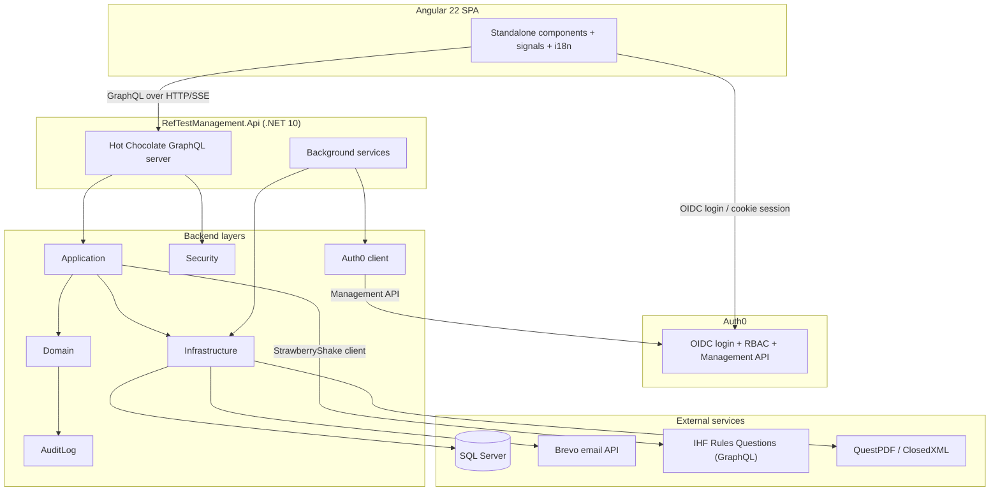

<p align="center">
  
</p>

# RefTest Management Platform

A web application for creating, distributing, and taking IHF (International Handball Federation) RefTests for Handball Belgium referees. Administrators create tests, manage participants, and automate invitations/results; referees get a timed, multilingual, self-contained test-taking experience.

<p>
  <a href="https://github.com/handballbelgium-referees/ref-test-management/releases/latest"></a>
  <a href="https://github.com/handballbelgium-referees/ref-test-management/releases"></a>
  <a href="https://github.com/semantic-release/semantic-release"></a>
</p>

## Table of Contents

- [Features](#features)
- [Tech Stack](#tech-stack)
- [Architecture](#architecture)
- [Getting Started](#getting-started)
- [Background Services](#background-services)
- [Development Workflow](#development-workflow)
- [Deployment](#deployment)
- [Versioning](#versioning)
- [Documentation](#documentation)
- [License](#license)

## Features

### RefTest Lifecycle & Creation

- Create multiple RefTests at once, pulling questions from an external IHF question bank
- Optional randomized answer order per test, configurable time limits with auto-submit
- Instant scoring with a configurable pass threshold and negative-marking strategy
- PDF result reports (QuestPDF) and Excel/PDF system reports (ClosedXML)

### Approval Workflow

- Optional pre-activation review: tests created by users without `ref-tests:approve` land in **Pending Approval**
- Approvers are resolved dynamically via the Auth0 Management API and notified by email
- Bulk approve/reject (rejection requires a reason) from the list view; rejected tests can be re-approved later

### Update, Reset & Revive

- Status-aware update rules — Pending/InProgress/Completed/Expired each allow different edits
- Soft reset (keeps the audit trail) or hard reset (fresh timer) for retakes
- Revive expired tests with automatic token regeneration and invitation resend

### Email Automation

- All email/PDF work runs through an async background job queue — instant API responses, automatic retry (3 attempts)
- Multilingual templates (English, Dutch, French, German) for invitations, results, reports, and approval notifications
- Delivery is tracked precisely — `InvitationSentAt`/`ResultsSentAt` are only set once the email is actually sent

### Real-Time Updates

- GraphQL subscriptions (Server-Sent Events) push list/detail updates, invitation/result events, and time extensions to connected clients instantly

### Authentication & Permissions

- Auth0 OIDC (browser) + JWT Bearer (API), with a task-based permission model — one named permission per GraphQL operation
- `superadmin` bypass and `namespace:*` wildcards; OR-semantics via a dynamic `anyof:` policy provider
- Permissions are auto-synced to the Auth0 API resource on startup, so nothing needs manual registration
- Full reference: [docs/SECURITY.md](docs/SECURITY.md)

### Privacy & GDPR

- Participants must accept the current, versioned privacy notice before starting a test
- Self-service consent withdrawal at any status, using only the invitation token — no identity check needed
- Two-step erasure: anonymize (redact PII, keep the audit trail) → permanent delete, available from the admin UI or self-service
- Automatic retention enforcement with a configurable retention period
- Full reference: [docs/PRIVACY.md](docs/PRIVACY.md)

### Audit Log

- Every meaningful RefTest change raises a typed domain event, persisted as an immutable, append-only audit record
- Viewable in the admin UI behind the `audit-logs:view` permission
- Old events are soft-archived (never hard-deleted) after a configurable retention period

### Internationalization

- Full UI, email, and PDF translations in English, Dutch, French, and German
- Enabled languages are configurable per deployment; language preference persists per user

### User Experience

- Signal-based state management, standalone components, `OnPush` change detection throughout
- Responsive card/table layouts, non-intrusive banner notifications, installable PWA

## Tech Stack

### Backend

<!-- versions:backend:start -->

| Technology | Version | Purpose |
| --- | --- | --- |
| **.NET** | 10.0 | Runtime and framework for the Web API |
| **Hot Chocolate** | 16.6.4 | GraphQL server with authorization, data loaders, and filtering |
| **Entity Framework Core** | 10.0.11 | ORM for data access and migrations |
| **ClosedXML** | 0.105.1 | Excel report generation |
| **QuestPDF** | 2026.8.0 | PDF report generation |
| **Database** | – | SQL Server, PostgreSQL, SQLite, or MySQL (selectable via config) |
| **Auth0** | – | OAuth2 / OpenID Connect authentication |
| **Brevo API** | – | Transactional email delivery |

<!-- versions:backend:end -->

### Frontend

<!-- versions:frontend:start -->

| Technology | Version | Purpose |
| --- | --- | --- |
| **Angular** | 22.1.6 | SPA framework with standalone components and signals |
| **TypeScript** | 6.0.3 | Strict type-checking |
| **Apollo Client** | 4.2.12 | GraphQL client with normalized caching |
| **apollo-angular** | 14.2.0 | Angular integration for Apollo Client |
| **ngx-translate** | 18.0.0 | i18n and localization |
| **Tailwind CSS** | 4.3.3 | Utility-first styling |
| **GraphQL Code Generator** | 7.4.0 | Generates TypeScript types from the GraphQL schema |
| **Vitest** | 4.1.11 | Unit testing framework |
| **RxJS** | 7.8.2 | Reactive programming |

<!-- versions:frontend:end -->

> The tables above are kept in sync automatically — see [scripts/sync-readme-versions.mjs](scripts/sync-readme-versions.mjs).

### DevOps & Tooling

GitHub Actions (CI/CD) · semantic-release (automated versioning) · Renovate (dependency updates) · Husky + commitlint (git hooks & conventional commits) · Azure App Service (hosting)

## Architecture



| Project                            | Role                                                                                            |
| ---------------------------------- | ----------------------------------------------------------------------------------------------- |
| `RefTestManagement.Api`            | ASP.NET Core Web API — GraphQL schema, controllers, background services                         |
| `RefTestManagement.Application`    | Business logic, StrawberryShake IHF client, job payloads, configuration models                  |
| `RefTestManagement.Domain`         | Core entities (`RefTest`, `RefTestTitle`, `Job`) and domain events                              |
| `RefTestManagement.Infrastructure` | EF Core, email (Brevo), PDF/Excel generation, subscriptions, job enqueueing                     |
| `RefTestManagement.Security`       | Permission constants, authorization handlers, dynamic policy provider (no project dependencies) |
| `RefTestManagement.AuditLog`       | Domain-event-driven audit trail — event store, EF Core interceptor, retention                   |
| `RefTestManagement.Auth0`          | Auth0 Management API client — permission sync, approver resolution                              |
| `RefTestManagement.Ui`             | Angular 22 SPA — Apollo Client, GraphQL Codegen, Tailwind CSS, PWA                              |

## Getting Started

### Prerequisites

| Requirement   | Version                                                         |
| ------------- | --------------------------------------------------------------- |
| .NET SDK      | 10.0+                                                           |
| Node.js       | 22.x+                                                           |
| Database      | SQL Server 2019+ / Azure SQL, PostgreSQL, SQLite, or MySQL 8.0+ |
| Auth0 account | –                                                               |
| Brevo account | – (optional, for email)                                         |

### Quick Start

```bash
git clone https://github.com/handballbelgium-referees/ref-test-management.git
cd ref-test-management
```

**1. Database** — set `DatabaseProvider` in your secrets (defaults to `SqlServer`), create a database, and apply migrations:

```bash
cd RefTestManagement.Api
dotnet ef database update --project ../RefTestManagement.Migrations.SqlServer
```

Replace `RefTestManagement.Migrations.SqlServer` with the project matching your chosen `DatabaseProvider` (`RefTestManagement.Migrations.PostgreSQL`, `RefTestManagement.Migrations.SQLite`, `RefTestManagement.Migrations.MySQL`). See [docs/CONFIGURATION.md#databaseprovider](docs/CONFIGURATION.md#databaseprovider) for connection string formats.

**2. Secrets** (development) — configure the minimum required settings via user secrets:

```bash
dotnet user-secrets set "DatabaseProvider" "SqlServer"
dotnet user-secrets set "ConnectionStrings:RefTestManagement" "Server=localhost;Database=RefTestManagement;Trusted_Connection=True;TrustServerCertificate=True;"
dotnet user-secrets set "Auth0:Domain" "your-tenant.auth0.com"
dotnet user-secrets set "Auth0:ClientId" "your-client-id"
dotnet user-secrets set "Auth0:ClientSecret" "your-client-secret"
dotnet user-secrets set "Auth0:Audience" "your-api-identifier"
```

See [docs/CONFIGURATION.md](docs/CONFIGURATION.md) for the full settings reference (email, languages, scoring, retention, and more).

**3. Run the API:**

```bash
dotnet run
```

Available at `https://localhost:7039`, with GraphQL at `/graphql`.

**4. Run the frontend:**

```bash
cd RefTestManagement.Ui
npm install
npm start
```

Available at `http://localhost:4200` (proxies `/graphql`, `/Account`, and `/callback` to the API — see `proxy.conf.json`).

**5. After editing any `.graphql` file**, regenerate TypeScript types:

```bash
npm run codegen
```

## Background Services

Five hosted services run in-process — no extra infrastructure or cost on Azure.

| Service                    | Runs          | Purpose                                                                  |
| -------------------------- | ------------- | ------------------------------------------------------------------------ |
| `BackgroundJobService`     | poll every 5s | Processes the async job queue: invitation/result/report/approval emails  |
| `RefTestExpirationService` | every 5 min   | Auto-expires pending tests, auto-completes overdue in-progress tests     |
| `PrivacyRetentionService`  | daily         | Anonymizes completed/expired RefTests past the retention period          |
| `AuditLogCleanupService`   | every 24h     | Soft-archives audit events past the retention period                     |
| `PermissionSyncService`    | on startup    | Syncs all permissions to the Auth0 API resource (additive, non-blocking) |

For a detailed diagram of the job-queue flow, see [docs/ARCHITECTURE-DIAGRAM.md](docs/ARCHITECTURE-DIAGRAM.md).

## Development Workflow

- **Branches**: `main` (default, protected, every push triggers an automatic pre-release) → `release` (protected, promoted manually for stable releases); use `feat/*`, `fix/*`, `chore/*` for work in progress
- **Commits**: [Conventional Commits](https://www.conventionalcommits.org/), enforced by commitlint via a Husky `commit-msg` hook
- **Pre-commit**: Husky re-syncs the README's dependency-version tables, then builds the Angular app

## Deployment

| Workflow             | Trigger                | Purpose                                                             |
| -------------------- | ---------------------- | ------------------------------------------------------------------- |
| `pr.yml`             | PR → `main`            | Build/lint/test validation                                          |
| `beta-release.yml`   | push → `main`          | semantic-release pre-release (`vX.Y.Z-alpha.N`) + deploy to testing |
| `stable-release.yml` | manual, from `release` | Promote, tag a stable release, deploy to production                 |

## Versioning

[Semantic Versioning](https://semver.org/) via [semantic-release](https://github.com/semantic-release/semantic-release), driven entirely by conventional commit types (`feat` → minor, `fix`/`perf`/`refactor`/etc. → patch, `!` or `BREAKING CHANGE:` → major). The release badges above are regenerated automatically on every release.

## Documentation

| Doc                                                          | Covers                                                     |
| ------------------------------------------------------------ | ---------------------------------------------------------- |
| [docs/SECURITY.md](docs/SECURITY.md)                         | Auth0 setup, full permission reference, suggested roles    |
| [docs/PRIVACY.md](docs/PRIVACY.md)                           | GDPR data flows, retention, erasure, data-subject requests |
| [docs/CONFIGURATION.md](docs/CONFIGURATION.md)               | Full `appsettings.json` reference                          |
| [docs/PROJECT-STRUCTURE.md](docs/PROJECT-STRUCTURE.md)       | Annotated directory tree                                   |
| [docs/ARCHITECTURE-DIAGRAM.md](docs/ARCHITECTURE-DIAGRAM.md) | Background job-queue flow in detail                        |

## License

Copyright (c) 2026 Kristof Gilis. All rights reserved.

This repository is publicly accessible for **educational and reference purposes only**. It is **not open-source** and is governed by a custom [Source Available – Educational Viewing Only License](LICENSE).

**You may:**

- Read and study the source code for personal learning

**You may NOT:**

- Use, copy, or incorporate any part of this code into your own projects
- Deploy or run this software in any production environment
- Distribute, sublicense, or sell this software
- Modify or create derivative works

For any use beyond personal study, contact [kristof.gilis@outlook.be](mailto:kristof.gilis@outlook.be).

## Authors

- **Kristof Gilis** – _Initial work and maintenance_

## Acknowledgments

- Handball Belgium for the requirements and domain expertise
- IHF (International Handball Federation) for the rules content
- The open-source community for the tools and libraries this project builds on

## Support

- **Issues**: [GitHub Issues](https://github.com/handballbelgium-referees/ref-test-management/issues)
- **Discussions**: [GitHub Discussions](https://github.com/handballbelgium-referees/ref-test-management/discussions)

**Made with ❤️ for Handball Belgium**
