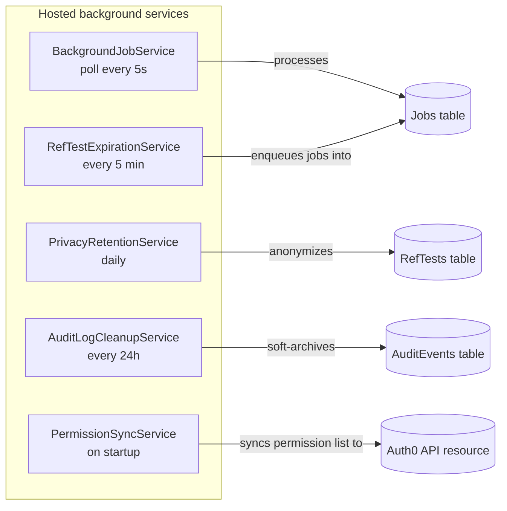
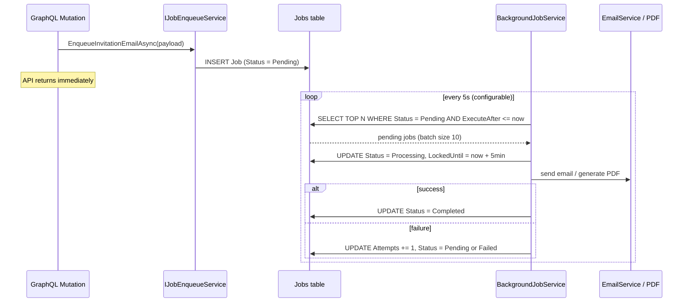
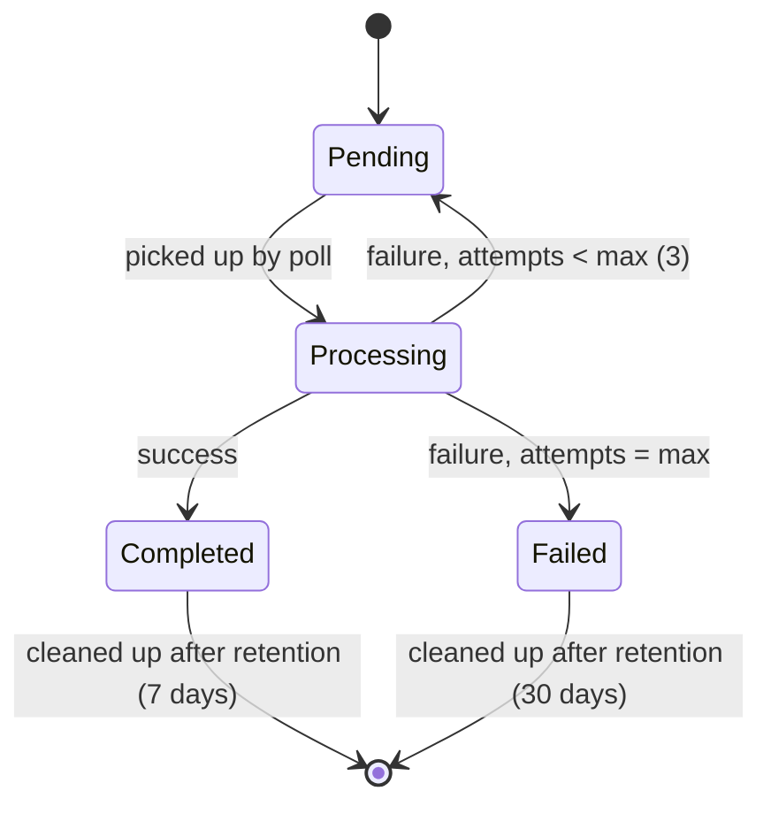
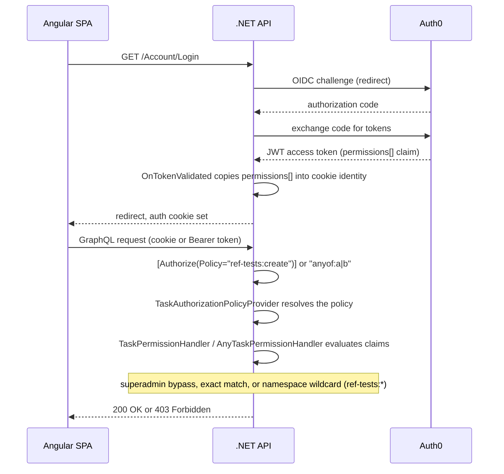
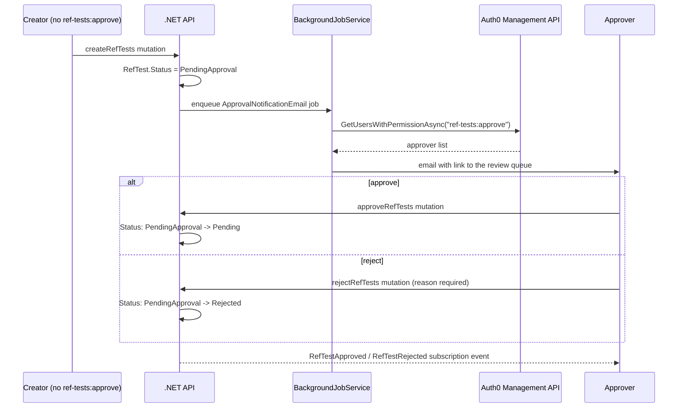
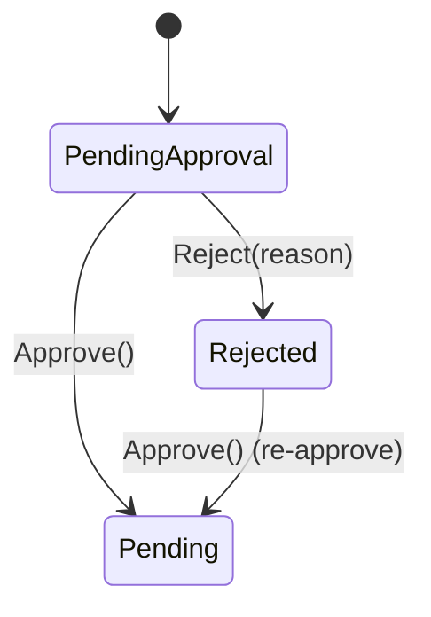

# Architecture Diagrams

Detailed flow diagrams for the background services and authorization system referenced from the [README](../README.md#background-services).

## Background Services Overview

All five hosted services run in-process alongside the API — no extra Azure resources or cost.

## Job Queue Flow (`BackgroundJobService`)

### Job Status Lifecycle

## Authentication & Authorization Flow

See [SECURITY.md](SECURITY.md) for the full permission reference and Auth0 setup.

## Approval Workflow

