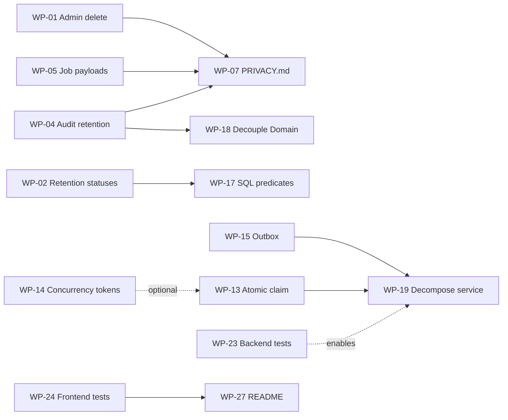

# Audit Remediation Plan

Companion to [docs/AUDIT.md](AUDIT.md). That document says *what* is wrong and *why*; this one
says *what to do about it*, as discrete units of work.

**Source audit:** commit `8763854` (`main`), 18 September 2026
**Coverage:** all 34 audit findings, mapped to 27 work packages across 6 phases
**Status:** not started

---

## How to use this document

Each work package is scoped to a **single reviewable pull request**. Packages within a phase are
mostly independent and can be picked up in any order unless a dependency is stated.

Each package has:

| Field | Meaning |
| --- | --- |
| **Findings** | Back-reference to the numbered findings in `AUDIT.md` §3 |
| **Size** | Relative effort: **S** (an hour or two), **M** (half a day), **L** (multi-day) |
| **Files** | The exact paths to change, with line references as of the audited commit |
| **Change** | What to do |
| **Acceptance** | Observable conditions that must hold when the package is done |
| **Watch out for** | Known traps and side effects specific to this change |

**There is no "tests to add" field.** The repository has no test harness (finding #5), so
acceptance criteria are written to be verifiable by code inspection or by manually exercising the
affected path. Building the harness is itself a work package — see **WP-23** and **WP-24**.

### Sequencing

Phase 1 comes first and is not negotiable: those are **live exposures** on a deployed system
(`v5.5.6`), not latent defects. Specifically, WP-01, WP-02, and WP-03 should ship in the next
release.

Test infrastructure deliberately sits in Phase 5 rather than Phase 0. It is the durable fix —
every Phase 1 finding is one assertion away from being caught automatically — but gating urgent
privacy fixes behind building a test project would delay them without making them safer.

---

## Phase overview

| Phase | Theme | Packages | Size | Why this order |
| --- | --- | --- | --- | --- |
| **1** | GDPR remediation | WP-01 → WP-07 | 1×M, 6×S | Live exposures; the system is processing real data now |
| **2** | Security & assessment integrity | WP-08 → WP-12 | 2×M, 3×S | Hardening; no evidence of exploitation |
| **3** | Correctness under load & architecture | WP-13 → WP-19 | 3×M, 2×L, 2×S | Mostly latent until the app scales out |
| **4** | Frontend, a11y & i18n | WP-20 → WP-22 | 3×S | User-visible quality |
| **5** | Test foundation | WP-23 → WP-24 | 2×L | Stops everything above from regressing |
| **6** | Supply chain & documentation | WP-25 → WP-27 | 3×S | Housekeeping |

---

# Phase 1 — GDPR remediation

> These seven packages close the gaps that make the system **not currently GDPR-compliant**
> (`AUDIT.md` §4). WP-01 through WP-03 are the priority: each is a small, contained change, and
> each currently causes personal data to persist that the privacy notice promises is gone.

## WP-01 — Admin delete must anonymize before deleting

**Findings:** #1 (🟠 High) · **Size:** S · **Priority: ship next release**

### Files
- `RefTestManagement.Api/Graphql/Mutations/Deletion/RefTestDeletionMutations.cs:59`

### Change

`DeleteRefTestsAsync` calls `privacyErasureService.DeleteAsync(refTest, …)` unconditionally,
skipping the anonymization step that redacts personal data from the audit trail. Branch on
`IsAnonymized`, exactly as `docs/PRIVACY.md` already describes the behaviour:

```csharp
if (!refTest.IsAnonymized)
    await privacyErasureService.EraseAsync(refTest, cancellationToken);

await privacyErasureService.DeleteAsync(refTest, cancellationToken);
```

### Acceptance
- Deleting a RefTest that was never anonymized leaves **no** `firstName`, `lastName`, or `email`
  value in any `AuditEvents` row referencing that RefTest — verify by querying `AuditEvents` for
  the RefTest id before and after.
- Deleting an already-anonymized RefTest behaves exactly as before (no double erasure, no error).
- A delete that fails partway leaves the RefTest either fully intact or fully erased, never half.

### Watch out for
- **The response DTO changes.** `result.DeletedRefTests.Add(refTest.ToDto())` runs *after*
  deletion (`:63`). Once `EraseAsync` runs first, `Anonymize()` has mutated the in-memory entity,
  so the returned DTO will contain `***` instead of the participant's name. If the admin UI shows
  the deleted participant's name in its confirmation message, capture the DTO **before** calling
  `EraseAsync`.
- `EraseAsync` opens its own transaction via `CreateExecutionStrategy()`. Do not wrap these two
  calls in an outer transaction — nest and it will throw.
- The loop is per-id with per-id error capture; keep that behaviour so one bad id doesn't abort
  the batch.

---

## WP-02 — Retention must cover `PendingApproval` and `Rejected`

**Findings:** #4 (🟠 High) · **Size:** S · **Priority: ship next release**

### Files
- `RefTestManagement.Api/BackgroundServices/PrivacyRetentionService.cs:47-52`
- `RefTestManagement.Api/BackgroundServices/RefTestExpirationService.cs:120-143` (context only)

### Change

The retention sweep only matches `Completed` and `Expired`:

```csharp
.Where(refTest =>
    (refTest.Status == RefTestStatus.Completed && refTest.CompletedAt < cutoff) ||
    (refTest.Status == RefTestStatus.Expired   && refTest.ExpiredAt   < cutoff))
```

`PendingApproval` and `Rejected` are also terminal — `RefTestExpirationService.IsExpired()`
returns `false` for both, so they never transition into a status the sweep sees. Add them, using
`CreatedAt` as the cutoff basis since neither status sets a completion timestamp:

```csharp
|| ((refTest.Status == RefTestStatus.PendingApproval ||
     refTest.Status == RefTestStatus.Rejected) && refTest.CreatedAt < cutoff)
```

### Acceptance
- A `Rejected` RefTest with `CreatedAt` older than `RetentionYears` is anonymized on the next
  sweep.
- Same for `PendingApproval`.
- `Pending` and `InProgress` are still **not** matched — those are handled by the expiration
  service, which converts them to `Expired`/`Completed` first.
- The sweep's log line reports a non-zero count when such records exist.

### Watch out for
- Decide deliberately whether `CreatedAt` is the right clock for these. If a test can sit in
  `PendingApproval` legitimately for a long time, the retention window starts from creation, which
  may erase it while still pending approval. If that is wrong for the business, the fix is to
  expire `PendingApproval` into `Expired` first and let the existing predicate handle it.
- Consider adding `&& !refTest.IsAnonymized` to the whole predicate while here — see WP-17.

---

## WP-03 — Remove personal data and bearer tokens from logs

**Findings:** #3 (🟠 High) · **Size:** S · **Priority: ship next release**

### Files
- `RefTestManagement.Infrastructure/Logging/ServiceLoggerMessages.cs:31-53, 80-102, 134-141`
- `RefTestManagement.Infrastructure/Services/EmailService.cs:72-74`

### Change

Participant email addresses, assessment scores, and — most seriously — the **full invitation
token and URL** are written at `Information` level. The token is a bearer credential: it grants
access to the participant's test, their results, and their withdraw-consent action.

Rewrite the message templates to carry the RefTest `Guid` instead of identifying data:

| Line | Currently logs | Change to |
| --- | --- | --- |
| `:46-47` | email + token + full URL | RefTest id only — **drop token and URL entirely** |
| `:49-50` | email + scores + percentage | RefTest id only |
| `:31, 34, 37, 40` | email | RefTest id |
| `:80-84` | email | RefTest id |
| `:134-141` | email | RefTest id |
| `:101-102` | creator email | creator id |

### Acceptance
- `grep -ri "token" RefTestManagement.Infrastructure/Logging/` returns no log template that
  interpolates a token value.
- No log template in the file interpolates an email address, first name, last name, or score.
- Operational diagnostics still work: every message retains the RefTest id, so a support request
  can still be traced end to end.

### Watch out for
- These are compile-time `LoggerMessage` source-generated methods — changing a template's
  parameters changes the method signature. Update every call site; the compiler will find them.
- Historical logs already contain this data. Purging Application Insights / App Service log
  history is an **operational** task outside this package, but it should be raised — the code fix
  stops new leakage, it does not undo the old.

---

## WP-04 — Audit events must eventually lose their personal data

**Findings:** #2 (🟠 High) · **Size:** M

### Files
- `RefTestManagement.Api/BackgroundServices/AuditLogCleanupService.cs:60-63`
- `RefTestManagement.AuditLog/AuditLogOptions.cs`

### Change

Cleanup only flips a boolean:

```csharp
.ExecuteUpdateAsync(s => s.SetProperty(e => e.IsArchived, true), cancellationToken);
```

The row — including `Data`, `ActorName`, and `ActorEmail` — persists forever. Pick one:

- **(a) Redact at archive time** *(recommended)* — reuse `RefTestPrivacyErasureService.RedactPii`
  to null the PII fields when setting `IsArchived`. Preserves the accountability trail (who did
  what, when) while dropping the identifying payload.
- **(b) Two-stage retention** — add `HardDeleteAfterDays` to `AuditLogOptions` and `RemoveRange`
  archived events past that second, longer window.

Option (a) is preferred: it keeps the audit trail's purpose intact.

### Acceptance
- An audit event older than `RetentionDays` has no `firstName`/`lastName`/`email` value in `Data`,
  and no `ActorName`/`ActorEmail`, after the next cleanup run.
- The event's `Action`, `Timestamp`, `EntityId`, and `EntityType` are still present.
- Cleanup remains a set-based operation — it must not load the table into memory.

### Watch out for
- `RedactPii` currently handles two JSON shapes (flat and old/new diff) and keys
  `["firstName","lastName","email"]`. **`token` is not in that list.** Audit whether any event
  payload carries a token; if so, add it.
- `ExecuteUpdateAsync` cannot easily rewrite JSON in a provider-portable way. Reading and writing
  in batches is acceptable here given it runs daily — just bound the batch size.
- Four database providers are supported. Whatever you do must work on all of them, not just
  SQL Server.

---

## WP-05 — Erasure must stop in-flight jobs and clear their payloads

**Findings:** #6 (🟡 Medium) · **Size:** S

### Files
- `RefTestManagement.Infrastructure/Services/RefTestPrivacyErasureService.cs:110-120`
- `RefTestManagement.Domain/Jobs/Job.cs:74-80`

### Change

Two problems in one place. The cancellation query only matches `Pending`:

```csharp
.Where(job => job.Status == JobStatus.Pending && job.Payload.Contains(refTestId))
```

so a job already `Processing` still sends its email after the participant withdrew consent. And
`Job.Cancel()` clears `Status`, `ErrorMessage`, `LockedUntil`, and `CompletedAt` — but **not**
`Payload`, which holds full name, email, token, scores, and answers.

1. Widen the predicate to include `JobStatus.Processing`.
2. Clear the payload in `Cancel()`, or add an explicit `RedactPayload()` the erasure service calls.

### Acceptance
- After `EraseAsync`, no `Jobs` row referencing that RefTest has a `Payload` containing the
  participant's name, email, or token — in any status.
- A job that was `Processing` at erasure time is marked terminal and does not deliver its email.
- Job cleanup (`BackgroundJobService.CleanupOldJobsAsync`) still removes these rows on schedule.

### Watch out for
- Cancelling a `Processing` job is inherently racy — the worker may already be mid-send. This
  narrows the window, it cannot close it. Note that honestly rather than claiming otherwise.
- `job.Payload.Contains(refTestId)` is a `LIKE '%guid%'` scan over an unindexed text column on
  every erasure. Not this package's job to fix, but worth flagging if erasure volume grows.
- `Cancel()` sets `Status = Failed` — there is no `Cancelled` state in `JobStatus`. Adding one is
  out of scope here; if you do, it is a migration across four providers.

---

## WP-06 — Preserve consent proof through anonymization

**Findings:** #22 (⚪ Low) · **Size:** S

### Files
- `RefTestManagement.Domain/RefTests/RefTest.cs:570-571`

### Change

`Anonymize()` nulls the consent record:

```csharp
PrivacyNoticeVersion = null;
PrivacyNoticeAcceptedAt = null;
```

GDPR Art. 7(1) requires the controller to demonstrate that consent was obtained. Keep
`PrivacyNoticeVersion` and `PrivacyNoticeAcceptedAt` — neither identifies the participant once
name, email, and token are erased, so retaining them costs nothing in privacy terms and preserves
the accountability evidence.

### Acceptance
- An anonymized RefTest still reports which privacy notice version was accepted and when.
- No other field retains identifying data.

### Watch out for
- Confirm this is a deliberate product decision, not an oversight to reverse blindly. If the
  intent was "an erased record should carry no trace of the person at all", then the accountability
  evidence needs to live somewhere else instead — the audit trail already retains
  `RefTestPrivacyNoticeAcceptedEvent` with its timestamp.

---

## WP-07 — Correct the false claims in `docs/PRIVACY.md`

**Findings:** documentation truth (supports #1, #2, #6) · **Size:** S · **Priority: ship next release**

### Files
- `docs/PRIVACY.md`

### Change

Three published statements are contradicted by the code. Until WP-01, WP-04, and WP-05 ship, the
privacy notice overstates what the system does — which is a distinct exposure from the technical
gap, and the cheaper half to fix.

| Claim | Reality |
| --- | --- |
| "`deleteRefTests` and `withdrawConsent` both use this same erasure path" | Only `withdrawConsent` does (WP-01) |
| Job payloads "are **deleted outright**" | They are marked failed; the payload is retained (WP-05) |
| "Its audit trail no longer contains personal data (it was redacted in step 1)" | Only true if step 1 ran, which the admin path skips (WP-01) |

**If WP-01/04/05 ship in the same release**, update these statements to describe the new, correct
behaviour. **If they do not**, add a "Known gaps" section stating the current limitation plainly —
an accurate disclosure of a gap is defensible; an inaccurate promise is not.

### Acceptance
- Every behavioural claim in `docs/PRIVACY.md` is true of the code at the same commit.
- The document states which statuses are subject to retention erasure, now that WP-02 changes them.
- The document acknowledges that application logs may contain personal data, or WP-03 has shipped
  and they no longer do.

### Watch out for
- This file is participant-facing compliance documentation. Changes should be reviewed by whoever
  owns the controller relationship, not merged as a routine docs tweak.

---

# Phase 2 — Security & assessment integrity

## WP-08 — Enable GraphQL cost limits and add rate limiting

**Findings:** #7 (🟡 Medium) · **Size:** M

### Files
- `RefTestManagement.Api/Program.cs:147-153`

### Change

Cost enforcement is explicitly disabled on a publicly reachable endpoint:

```csharp
.ModifyCostOptions(o => o.EnforceCostLimits = false)
```

and there is no `AddRateLimiter` / `UseRateLimiter` anywhere. Set `EnforceCostLimits = true` and
add ASP.NET rate limiting scoped to the unauthenticated participant operations.

### Acceptance
- A deeply nested or heavily multiplied anonymous query is rejected with a cost error rather than
  executed.
- The legitimate participant flow — welcome, accept notice, start, save progress, complete — still
  works comfortably within the limit.
- Admin operations are unaffected, or have their own higher limit.

### Watch out for
- **Turning this on will break queries that currently work.** Measure the real cost of the admin
  list/detail queries before choosing a ceiling, and roll out to a beta environment first.
- `MaxPageSize = 100` is already set; the gap is query *shape*, not page size.
- Rate limiting keyed on IP is weak behind a proxy — confirm `ForwardedHeaders` is configured
  correctly first or the limiter will see one client.

---

## WP-09 — Enforce the test deadline server-side

**Findings:** #8 (🟡 Medium) · **Size:** S

### Files
- `RefTestManagement.Domain/RefTests/RefTest.cs:230-260`
- `RefTestManagement.Api/Graphql/Mutations/Lifecycle/RefTestLifecycleMutations.cs:147-196`

### Change

`SaveProgress()` and `Complete()` check only `Status == InProgress`. The status changes to
`Expired` only when `RefTestExpirationService` next runs — **every 5 minutes**. A participant who
prevents the client-side auto-submit can therefore submit up to ~5 minutes past their deadline.

Add the deadline check to the domain methods, where the data already lives:

```csharp
if (StartedAt.HasValue && DateTime.UtcNow > StartedAt.Value.AddMinutes(MaxTimeInMinutes))
    throw new RefTestValidationException("The time limit for this test has expired");
```

### Acceptance
- A `completeRefTest` mutation issued after `StartedAt + MaxTimeInMinutes` is rejected, regardless
  of whether the expiration service has run yet.
- Same for `saveRefTestProgress`.
- A submission inside the limit is unaffected.

### Watch out for
- **Add a small grace allowance** (30–60 seconds) for network latency and clock skew, or you will
  reject legitimate submissions made a fraction of a second before the deadline.
- Check whether time extensions (`RefTestTimeExtended`) mutate `MaxTimeInMinutes` — if the
  extension is stored elsewhere, the check must account for it or extended tests will be cut off.

---

## WP-10 — Generate tokens from an explicit CSPRNG

**Findings:** #21 (⚪ Low) · **Size:** S

### Files
- `RefTestManagement.Domain/RefTests/RefTest.cs:40, 428, 476, 517, 530`

### Change

`Guid.NewGuid().ToString("N")` provides 122 bits and is not weak in practice, but carries no
cryptographic guarantee by contract — and this value is a bearer credential. Replace with:

```csharp
Token = RandomNumberGenerator.GetHexString(32, lowercase: true);
```

### Acceptance
- All five token-generation sites use the CSPRNG.
- Token format and length remain compatible with existing stored tokens and the invitation URL
  format.
- `RefTest.cs:569` (`erased-{Guid:N}`) is left alone — that is a uniqueness placeholder, not a
  credential.

### Watch out for
- Existing tokens in the database stay valid; this only affects newly issued ones. No migration.
- Keep the length at 32 hex characters if the invitation URL or any email template assumes it.

---

## WP-11 — Fix the PR-title script injection and pin workflow permissions

**Findings:** #9 (🟡 Medium) · **Size:** S

### Files
- `.github/workflows/pr.yml:29-30`, and workflow-level `permissions`

### Change

```yaml
run: echo "${{ github.event.pull_request.title }}" | npx commitlint
```

`${{ … }}` is substituted by the runner *before* the shell parses the line, so a PR title
containing a backtick or `$(…)` executes on the runner. The workflow triggers on `edited`
(`:4`), so a title can be weaponised after review has started.

```yaml
- name: ✅ Validate PR title
  env:
    PR_TITLE: ${{ github.event.pull_request.title }}
  run: echo "$PR_TITLE" | npx commitlint
```

Also add an explicit least-privilege block at workflow level — neither `validate-pr-title` nor
`validate` declares `permissions:`, so both inherit the repository default:

```yaml
permissions:
  contents: read
```

### Acceptance
- No `${{ github.event.* }}` expression appears inside any `run:` block in any workflow.
- A PR titled ``test `id` `` fails commitlint normally instead of executing anything.
- `validate-pr-title` and `validate` run with `contents: read`; `sync-readme-versions` keeps its
  `contents: write`.

### Watch out for
- Check the repository's default workflow permission setting. If it is "read and write", the
  injected job currently has a writable token for same-repo PRs, which makes this materially worse
  than the Medium rating assumes.
- Audit the other three workflows for the same pattern while here.

---

## WP-12 — Replace `GH_PAT` with a scoped credential

**Findings:** #12 (🟡 Medium) · **Size:** M

### Files
- `.github/workflows/beta-release.yml:24-28`
- `.github/workflows/stable-release.yml:23-27, 54-59, 175-179`

### Change

A long-lived personal access token with repository write is passed to `actions/checkout` so
release jobs can push tags and branch updates past protection rules. Replace with a **GitHub App
installation token** (short-lived, scoped, auditable as its own identity) or at minimum a
fine-grained PAT restricted to this repository and the specific permissions needed.

### Acceptance
- No workflow references `secrets.GH_PAT`.
- Beta and stable releases still tag, push, and deploy successfully end to end.
- The credential's permissions are enumerable and minimal.

### Watch out for
- **Test on the beta pipeline first.** A broken release workflow is worse than the risk being
  fixed.
- semantic-release pushes tags *and* commits (version badges, README sync) — the replacement needs
  `contents: write` at least.
- If a GitHub App is used, its token must be minted per-job; it expires in an hour.

---

# Phase 3 — Correctness under load & architecture

> Most of this phase is latent on a single App Service instance. It becomes real the moment the
> app scales out, which is worth knowing before that happens rather than after.

## WP-13 — Make job claiming atomic

**Findings:** #14 (🟡 Medium) · **Size:** M

### Files
- `RefTestManagement.Api/BackgroundServices/BackgroundJobService.cs:108-115, 142-143`

### Change

The worker reads eligible jobs, then marks one as processing in a separate round trip. Two
instances can read the same job before either persists the lock, producing duplicate invitation
or result emails. Claim in one statement — either a conditional `ExecuteUpdateAsync` that only
succeeds if the row is still `Pending`, or a provider-appropriate `UPDATE … OUTPUT` /
`RETURNING`.

### Acceptance
- Two worker instances running concurrently against the same database never process the same job
  id.
- A job whose lease expires is still reclaimable (the existing `LockedUntil <= now` behaviour must
  survive).
- Throughput does not regress for the single-instance case.

### Watch out for
- Four providers. `UPDATE … OUTPUT` is SQL Server; `RETURNING` is PostgreSQL/SQLite; MySQL has
  neither. A conditional `ExecuteUpdateAsync` returning an affected-row count is the portable
  option.
- Depends on WP-14 if you implement the claim via a version column.

---

## WP-14 — Add concurrency tokens

**Findings:** #15 (🟡 Medium) · **Size:** M

### Files
- `RefTestManagement.Infrastructure/Configurations/RefTestConfiguration.cs:38, 134-135`
- `RefTestManagement.Infrastructure/Configurations/JobConfiguration.cs:43-46`

### Change

Neither `RefTest` nor `Job` has a concurrency token, so concurrent edits are last-write-wins — two
admins editing the same test, or a background service racing an admin action, silently lose one
change. Add a rowversion/xmin-equivalent per provider and handle
`DbUpdateConcurrencyException` at the mutation boundary.

### Acceptance
- A stale update to a `RefTest` fails with a concurrency error rather than overwriting.
- The GraphQL layer surfaces that as a usable error, not a 500.
- Background services that update these entities handle the exception rather than crashing the
  loop.

### Watch out for
- Provider-specific: SQL Server `rowversion`, PostgreSQL `xmin`, SQLite/MySQL need a manual
  `Version` column with `IsConcurrencyToken()`. This is a migration in **all four** migration
  projects.
- Every existing update path needs a retry or a user-facing conflict message. Scoping this to
  `RefTest` first and `Job` second keeps the PR reviewable.

---

## WP-15 — Make write-then-enqueue atomic

**Findings:** #16 (🟡 Medium) · **Size:** M

### Files
- `RefTestManagement.Api/Graphql/Mutations/Creation/RefTestCreationMutations.cs:58-65, 227-243`
- `RefTestManagement.Api/Graphql/Mutations/Approval/RefTestApprovalMutations.cs:64-120`
- `RefTestManagement.Api/Graphql/Mutations/Update/RefTestUpdateMutations.cs:41-64, 247-270`

### Change

The entity is saved, then the job is enqueued separately; a failed enqueue leaves a persisted
RefTest whose invitation never sends. The `Jobs` table is already an outbox — it just needs to
share the unit of work. Insert the job row in the **same** `SaveChangesAsync` as the entity.

### Acceptance
- A failure during enqueue rolls back the entity write; no RefTest exists without its job.
- A successful mutation produces exactly one job row.
- The existing catch-and-report behaviour at `:227-243` becomes unreachable for enqueue failures,
  or is repurposed.

### Watch out for
- Check whether `BackgroundJobService` needs a notification to pick the job up promptly, or whether
  it polls. If it polls, this is purely a persistence change.
- Bulk creation paths enqueue many jobs — keep the batch in one transaction.

---

## WP-16 — Add timeouts and resilience to outbound HTTP

**Findings:** #17 (🟡 Medium) · **Size:** S

### Files
- `RefTestManagement.Auth0/Extensions/Auth0ServiceExtensions.cs:14-24`
- `RefTestManagement.Api/Program.cs:130-136`

### Change

The Auth0 client and the IHF rules/questions client have no timeout and no resilience policy. The
email client correctly sets 30s (`Program.cs:100-106`) — these two do not. The IHF client sits on
the test-creation path, so a transient upstream hang fails test creation with no retry.

```csharp
.AddStandardResilienceHandler();
```

### Acceptance
- Both clients have an explicit timeout.
- A transient upstream failure is retried; a persistent one fails fast rather than hanging.
- Test creation surfaces a clear error when IHF is unreachable.

### Watch out for
- `AddStandardResilienceHandler` needs `Microsoft.Extensions.Http.Resilience` — a new entry in
  `Directory.Packages.props`.
- Retries on a non-idempotent call can double-submit. Confirm the IHF calls are reads before
  enabling retry.

---

## WP-17 — Push retention and expiration predicates into SQL

**Findings:** #18 (🟡 Medium), #23 (⚪ Low), #24 (⚪ Low) · **Size:** M

### Files
- `RefTestManagement.Api/BackgroundServices/RefTestExpirationService.cs:76-94, 120-143`
- `RefTestManagement.Api/BackgroundServices/PrivacyRetentionService.cs:46-53`
- `RefTestManagement.Infrastructure/Configurations/RefTestConfiguration.cs:121, 134-135`

### Change

Three related inefficiencies:

1. The expiration service loads **every** non-`Completed`/non-`Expired` RefTest into memory every
   five minutes, then filters with the in-process `IsExpired()` method. Push the predicate into
   the query.
2. The retention sweep does not exclude `IsAnonymized`, so it reloads every already-erased
   historical record daily forever. `EraseAsync` returns early so it is harmless — just wasteful
   and permanently growing. Add `&& !refTest.IsAnonymized`.
3. Neither query has a supporting composite index. `Status`, `CreatedAt`, and `IsAnonymized` are
   indexed individually; the filters use combinations.

### Acceptance
- Neither background service materialises rows it will discard.
- The generated SQL for both sweeps uses an index seek, not a scan — verify with a query plan.
- Behaviour is unchanged: the same records are expired and erased as before.

### Watch out for
- `IsExpired()` encodes real business logic per status. Translating it to a SQL predicate must
  preserve every branch exactly — this is the part to review carefully.
- Adding indexes is a migration across four providers.
- Item 2 changes which rows the retention sweep sees; pair it with WP-02, which changes the same
  predicate.

---

## WP-18 — Decouple `Domain` from `AuditLog`

**Findings:** #13 (🟡 Medium) · **Size:** L

### Files
- `RefTestManagement.Domain/RefTestManagement.Domain.csproj:11`
- `RefTestManagement.AuditLog/RefTestManagement.AuditLog.csproj:7-11`

### Change

`Domain` references `AuditLog`, which carries an EF Core package reference and contains
`AuditSaveChangesInterceptor`. The domain centre therefore compiles against EF Core — the
dependency direction the rest of the solution is careful to respect.

Extract the audit *abstractions* (`IDomainEvent` and friends) into a dependency-free contracts
project; leave the interceptor and anything EF-aware in `Infrastructure`.

### Acceptance
- `RefTestManagement.Domain` has no transitive reference to `Microsoft.EntityFrameworkCore`
  — verify with `dotnet list package --include-transitive`.
- Audit events are still raised and persisted identically.
- No public API changes outside the moved types.

### Watch out for
- Touches many files by namespace change alone; keep it mechanical and avoid mixing in behaviour
  changes.
- Do this **after** Phase 1 — it would create conflicts with WP-04's changes to the audit path.

---

## WP-19 — Decompose `BackgroundJobService`

**Findings:** #32 (⚪ Low) · **Size:** L

### Files
- `RefTestManagement.Api/BackgroundServices/BackgroundJobService.cs` (530 lines)

### Change

One class owns polling, lease management, dispatch, every job handler, retry policy, and cleanup.
Split into a dispatcher plus per-job-type handlers resolved from DI, keeping the hosted-service
loop thin.

### Acceptance
- Each job type has its own handler class.
- The hosted service loop retains its current guarantees: try/catch around the loop, cancellation
  honoured, fresh DI scope per iteration.
- No behavioural change to retries, leases, or cleanup.

### Watch out for
- **Do this last in the phase.** WP-13 and WP-15 both touch this file; refactoring first
  guarantees conflicts.
- Pure refactor with no test harness to catch mistakes — consider deferring until after Phase 5.

---

# Phase 4 — Frontend, accessibility & i18n

## WP-20 — Accessibility batch

**Findings:** #19 (🟡 Medium), #25 (⚪ Low), #26 (⚪ Low) · **Size:** S

### Files
- `RefTestManagement.Ui/src/app/.../create-ref-tests.html:47, 84, 136, 224, 250, 280, 333, 373, 398, 421`
- `RefTestManagement.Ui/src/app/.../datepicker-calendar.html:3`
- `RefTestManagement.Ui/src/app/.../ref-test-navigation.html:7`
- `RefTestManagement.Ui/src/app/app.html:31-37`

### Change

1. **Remove all positive `tabindex` values** (`1` through `2106`). Any positive tabindex pulls
   those elements ahead of the entire rest of the document, including site navigation. Rely on DOM
   order. *(WCAG 2.4.3)*
2. **Make the datepicker a real dialog** — the backdrop closes on mouse click only. Add
   `role="dialog"`, `aria-modal="true"`, `Escape` to close, and a focus trap. *(WCAG 2.1.1)*
3. **Label the navigation `<select>`** with a visible label or `aria-label`. *(WCAG 1.3.1)*
4. **Give the avatar an accessible name** — initials are conveyed visually with only `title`.

### Acceptance
- No positive `tabindex` remains in `src/app`; tabbing through the create form follows visual order.
- The datepicker can be opened, navigated, and dismissed with the keyboard alone.
- Every interactive control has an accessible name.

### Watch out for
- The tabindex values look deliberate — someone was trying to sequence a long form. Verify the DOM
  order actually matches the intended order before deleting them, and reorder the markup if not.
- **Also check the countdown timer** while here: a purely visual countdown disadvantages
  screen-reader users on a timed assessment. Consider a polite `aria-live` announcement at 5
  minutes and 1 minute remaining — not every second.

---

## WP-21 — i18n batch

**Findings:** #20 (🟡 Medium), #28 (⚪ Low), #29 (⚪ Low) · **Size:** S

### Files
- `RefTestManagement.Ui/src/app/.../can-deactivate-ref-test.guard.ts:6`
- `RefTestManagement.Ui/public/i18n/fr.json`, `de.json`

### Change

1. **Replace the hardcoded English `confirm()`** — `confirm('Are you sure you want to leave the
   test?')` is shown to Dutch, French, and German participants mid-assessment in an untranslatable
   browser dialog. Use the app's own dialog component with a translated string.
2. **Fix two key typos** that cause genuinely missing translations:
   - `fr.json`: `ref_tests.list.dialogs.delete.reftests` → `…delete.ref_tests`
   - `de.json`: `…specific_question_numbers.import_importing` → `…importing`
3. **Remove 5 orphan keys** in `de.json` with no English counterpart:
   `ref_tests.list.filters.score_range`, `.min_score`, `.max_score`, `ref_tests.list.sorting.score`.
4. **Review the identical-to-English strings** — 29 in `nl`, 38 in `fr`, 24 in `de`. Most are
   legitimately identical (`status`, `percentage`, `email`), but `ref_test.instructions_title` and
   `ref_test.participant_name` look untranslated.

### Acceptance
- All four locale files have the same key set (currently 633/633/633/637).
- No user-facing string is hardcoded English in a component or guard.
- Leaving a test mid-assessment prompts in the participant's selected language.

### Watch out for
- The `confirm()` is in a `CanDeactivate` guard, which cannot easily await a component dialog —
  the guard must return an `Observable<boolean>`, not a `boolean`. This is the only non-trivial
  part of the package.

---

## WP-22 — Frontend hygiene batch

**Findings:** #27 (⚪ Low), #30 (⚪ Low), #31 (⚪ Low) · **Size:** S

### Files
- `RefTestManagement.Ui/src/app/core/errors/global-error-handler.ts:17`
- `RefTestManagement.Ui/src/app/app.config.ts:108-155`
- `RefTestManagement.Ui/src/app/.../ref-test.store.ts`

### Change

1. **Gate the production `console.error`** behind `isDevMode()`, or route it to a real telemetry
   sink. If an error object carries participant data it currently lands in the browser console.
2. **Add Apollo entity `keyFields`** — only `relayStylePagination` type policies exist, so entities
   are not normalised across queries.
3. **Add an Apollo `ErrorLink`** — only `RetryLink` is configured, so unrecoverable errors have no
   global surface.
4. **Tie the bare `setTimeout`** in `ref-test.store.ts` to destruction, so it cannot fire after
   navigation.

### Acceptance
- No unconditional `console.*` call in production code paths.
- Network and GraphQL errors surface through one consistent handler.
- No timer outlives the component that scheduled it.

### Watch out for
- Adding `keyFields` changes cache behaviour app-wide and can surface latent bugs where components
  relied on unnormalised copies. Worth its own PR if the other three are trivial.

---

# Phase 5 — Test foundation

> This is the durable fix. Every Phase 1 finding was a single assertion away from being caught
> automatically, and the audit's conclusion is that they existed precisely because nothing could
> catch them. Both packages are **L** — but WP-23 delivers value from the first test onward and
> does not need to be completed in one pass.

## WP-23 — Backend test project and CI wiring

**Findings:** #5 (🟠 High), #10 (🟡 Medium) · **Size:** L

### Files
- New: `RefTestManagement.Tests/` (or per-layer projects)
- `RefTestManagement.slnx:11-21`
- `Directory.Packages.props`
- `.github/workflows/pr.yml:33-70`

### Change

There is no test project in the solution and no test package in `Directory.Packages.props`. Add:

1. A test project registered in `RefTestManagement.slnx`.
2. Test packages centrally versioned — xunit, a mocking library, an assertion library.
   **`Microsoft.EntityFrameworkCore.Sqlite` is already referenced**, so an in-memory SQLite
   harness needs no new provider dependency.
3. A `dotnet test` step in the `validate` job of `pr.yml`, failing the workflow on failure.

Highest-value targets, in order — these are exactly the paths where the audit found defects:

| Target | Why |
| --- | --- |
| `RefTestPrivacyErasureService` | Both erasure paths; the WP-01 defect lives here |
| `PrivacyRetentionService` predicate | Which statuses get erased (WP-02) |
| `RefTest` state machine | Consent gate, anonymized guards, deadline (WP-09) |
| Scoring calculation | Pure logic, high value, easy to cover |
| `BackgroundJobService` lease and retry | Concurrency assumptions (WP-13) |

### Acceptance
- `dotnet test RefTestManagement.slnx` runs and passes locally and in CI.
- A PR with a failing test cannot merge.
- Tests run against SQLite in-memory without external infrastructure.

### Watch out for
- **Do not try to reach a coverage target in this package.** Ship the harness plus the erasure and
  retention tests; grow coverage incrementally.
- The audit's Phase 1 findings make ideal first tests — write them as regression tests *after* the
  corresponding fix ships, so each one demonstrably fails against the old code.
- CI time will grow; the `validate` job already builds both stacks.

---

## WP-24 — Frontend test setup

**Findings:** #5 (🟠 High, frontend half), #11 (🟡 Medium) · **Size:** L

### Files
- `RefTestManagement.Ui/angular.json:71-73`
- `RefTestManagement.Ui/package.json:7-13, 47-61`
- New: Vitest config + first specs

### Change

`vitest` is a devDependency and `"test": "ng test"` exists, but there is no `vitest.config.*` and
no `*.spec.ts` anywhere among 89 components and services. Either wire Vitest up properly or
standardise on the `@angular/build:unit-test` builder — then write specs for the participant flow
first, since that is the path with no server-side safety net.

### Acceptance
- `npm test` runs a real runner and executes at least one meaningful spec.
- The participant test-taking flow has coverage: countdown, auto-submit, deactivation guard.
- A frontend test job runs in `pr.yml`.

### Watch out for
- Pairs with WP-27 — whichever runner you choose, the README must describe it accurately.
- Angular 22 + Vitest wiring is the fiddly part; budget for it.

---

# Phase 6 — Supply chain & documentation

## WP-25 — Add CodeQL and Dependabot

**Findings:** #34 (⚪ Low) · **Size:** S

### Files
- New: `.github/workflows/codeql.yml`, `.github/dependabot.yml`

### Change

Renovate handles dependency updates well (`renovate.json` enables `vulnerabilityAlerts`,
`osvVulnerabilityAlerts`, and digest pinning), but there is no static security analysis in CI. Add
a CodeQL workflow for C# and TypeScript. Dependabot is optional given Renovate — add it only for
security-advisory PRs if you want the GitHub-native path as well.

### Acceptance
- CodeQL runs on PRs to `main` and on a schedule, for both languages.
- Results appear in the Security tab.
- No duplication of Renovate's update PRs.

### Watch out for
- CodeQL on a large solution is slow. Schedule it weekly plus on-PR rather than on every push.

---

## WP-26 — Supply chain housekeeping

**Findings:** #33 (⚪ Low) · **Size:** S

### Files
- `package.json:32-33`
- `.husky/pre-commit:3-13`

### Change

1. **Stale `sharp` pin** — the allow-scripts list permits `sharp@0.34.5` while the lockfile
   resolves `~0.35.4`. Update the pin to the resolved version, or remove the stale entry and
   document why `sharp` needs install scripts.
2. **Pre-commit hook** runs a README sync and a **full Angular production build** — slow enough to
   invite `--no-verify`, and it runs no lint and no tests. Replace the build with lint plus
   (once WP-23 lands) a fast test subset.

### Acceptance
- The allow-scripts entry matches the resolved version.
- The pre-commit hook completes fast enough that developers leave it enabled.

### Watch out for
- Renovate will bump `sharp` again; consider whether the pin should reference a range or be
  removed entirely.

---

## WP-27 — Correct the documented testing story

**Findings:** #11 (🟡 Medium) · **Size:** S

### Files
- `README.md` (tech-stack table)

### Change

The README lists **Vitest 4.1.11** as the frontend "Unit testing framework". No Vitest config
exists and there are no specs. A reader reasonably concludes the project has unit tests; it has
none.

Either update the README to state the actual position, or — once WP-23/WP-24 land — describe the
real setup.

### Acceptance
- Every tool listed in the README tech-stack table is actually configured and usable.
- The testing section matches reality at the same commit.

### Watch out for
- `.husky/pre-commit` runs a README sync script; check whether the tech-stack table is
  generated before editing it by hand.

---

# Coverage matrix

Every finding in `AUDIT.md` §3 maps to exactly one work package.

| # | Severity | Finding | Package |
|---|---|---|---|
| 1 | 🟠 High | Admin delete skips anonymization | WP-01 |
| 2 | 🟠 High | Audit events never deleted | WP-04 |
| 3 | 🟠 High | PII and tokens in logs | WP-03 |
| 4 | 🟠 High | `PendingApproval`/`Rejected` never erased | WP-02 |
| 5 | 🟠 High | No automated tests | WP-23, WP-24 |
| 6 | 🟡 Medium | Job payload PII / in-flight sends | WP-05 |
| 7 | 🟡 Medium | Cost limits disabled, no rate limiting | WP-08 |
| 8 | 🟡 Medium | Post-deadline submission window | WP-09 |
| 9 | 🟡 Medium | PR-title script injection | WP-11 |
| 10 | 🟡 Medium | PR workflow runs no tests | WP-23 |
| 11 | 🟡 Medium | README overstates testing | WP-24, WP-27 |
| 12 | 🟡 Medium | Long-lived `GH_PAT` | WP-12 |
| 13 | 🟡 Medium | Domain depends on EF Core | WP-18 |
| 14 | 🟡 Medium | Job claim not atomic | WP-13 |
| 15 | 🟡 Medium | No concurrency token | WP-14 |
| 16 | 🟡 Medium | Write and enqueue not atomic | WP-15 |
| 17 | 🟡 Medium | No HTTP timeout or resilience | WP-16 |
| 18 | 🟡 Medium | Expiration evaluates client-side | WP-17 |
| 19 | 🟡 Medium | Positive `tabindex` | WP-20 |
| 20 | 🟡 Medium | Hardcoded English `confirm()` | WP-21 |
| 21 | ⚪ Low | `Guid.NewGuid()` tokens | WP-10 |
| 22 | ⚪ Low | Consent proof nulled | WP-06 |
| 23 | ⚪ Low | Missing composite index | WP-17 |
| 24 | ⚪ Low | Retention re-scans anonymized rows | WP-17 |
| 25 | ⚪ Low | Datepicker keyboard access | WP-20 |
| 26 | ⚪ Low | Unlabelled `<select>` | WP-20 |
| 27 | ⚪ Low | Production `console.error` | WP-22 |
| 28 | ⚪ Low | i18n key typos | WP-21 |
| 29 | ⚪ Low | Untranslated strings | WP-21 |
| 30 | ⚪ Low | No Apollo `keyFields`/`ErrorLink` | WP-22 |
| 31 | ⚪ Low | Bare `setTimeout` | WP-22 |
| 32 | ⚪ Low | `BackgroundJobService` god class | WP-19 |
| 33 | ⚪ Low | Stale `sharp` pin | WP-26 |
| 34 | ⚪ Low | No Dependabot/CodeQL | WP-25 |

**34 findings · 27 work packages · none dropped.**

---

## Dependencies between packages

Most packages are independent. The exceptions:



- **WP-07 last in Phase 1** — the documentation should describe the code as it will be after
  WP-01, WP-04, and WP-05 land.
- **WP-17 after WP-02** — both edit the same retention predicate.
- **WP-19 last in Phase 3** — WP-13 and WP-15 both touch `BackgroundJobService`.
- **WP-18 after Phase 1** — it moves types that WP-04 modifies.
- **WP-19 ideally after WP-23** — a large pure refactor with no tests is the one place where the
  missing harness genuinely raises risk.

---

## Suggested first release

If only one release is possible before the next scheduled deployment, it should contain:

| Package | Why |
| --- | --- |
| **WP-01** | Admin deletions currently leave participant PII in `AuditEvents` permanently |
| **WP-02** | Rejected and unapproved tests accumulate PII and live tokens with no expiry |
| **WP-03** | Invitation tokens — bearer credentials — are in Application Insights at default verbosity |
| **WP-07** | The privacy notice must not promise behaviour the code does not deliver |

All four are **S**. Together they move the GDPR status in `AUDIT.md` §4 from ❌ to a defensible
position, and they are the only findings in the report that are actively accumulating exposure
while the system runs.
