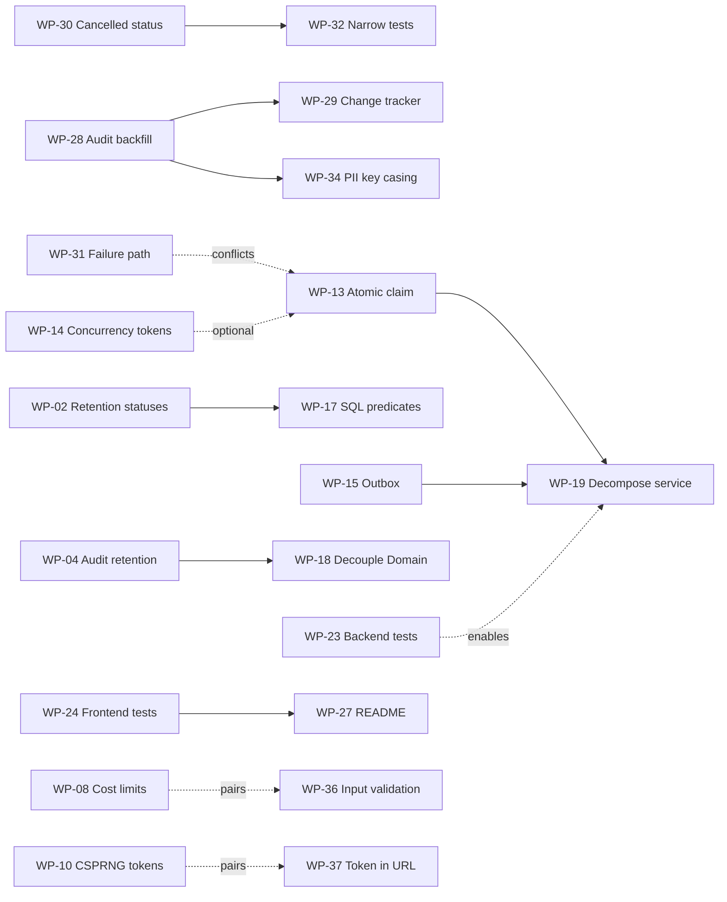

# Audit Remediation Plan

Companion to [docs/AUDIT.md](AUDIT.md) and its re-audit [docs/AUDIT-R2.md](AUDIT-R2.md). Those
documents say *what* is wrong and *why*; this one says *what to do about it*, as discrete units
of work.

**Source audits:** commit `8763854` ([`AUDIT.md`](AUDIT.md)) and commit `6c574ce`
([`AUDIT-R2.md`](AUDIT-R2.md)), 18 September 2026
**Coverage:** all 46 findings — the original 34 plus 12 from the re-audit — mapped to 39 work
packages across 7 phases
**Status:** Phase 1 complete (WP-01 → WP-07). Phase 1b complete (WP-28 → WP-32, WP-35). Phase 2
onward is open.

---

## How to use this document

Each work package is scoped to a **single reviewable pull request**. Packages within a phase are
mostly independent and can be picked up in any order unless a dependency is stated.

Each package has:

| Field | Meaning |
| --- | --- |
| **Findings** | Back-reference to the numbered findings in `AUDIT.md` §3 (`#n`) or `AUDIT-R2.md` §3.1 (`Nn`) |
| **Size** | Relative effort: **S** (an hour or two), **M** (half a day), **L** (multi-day) |
| **Files** | The exact paths to change, with line references as of the audited commit |
| **Change** | What to do |
| **Acceptance** | Observable conditions that must hold when the package is done |
| **Watch out for** | Known traps and side effects specific to this change |

**There is no "tests to add" field.** When this plan was written the repository had no test
harness (finding #5), so acceptance criteria are written to be verifiable by code inspection or
by manually exercising the affected path. WP-32 has since shipped a narrow xUnit project covering
redaction and the job state machine; broadening it is still its own work — see **WP-23** and
**WP-24**.

### Sequencing

Phase 1, Phase 1b and Phase 2 have shipped. Phase 1b existed because the re-audit found that the
Phase 1 change set introduced two High-severity regressions, one of which silently prevented its
own fix from applying to data that already existed.

Phase 3 onward is unchanged in intent: correctness under load, frontend quality, test coverage
and housekeeping — none of which are actively accumulating exposure.

Test infrastructure deliberately sits in Phase 5 rather than Phase 0. It is the durable fix —
every Phase 1 finding was one assertion away from being caught automatically — but gating urgent
privacy fixes behind building a test project would delay them without making them safer. **WP-32
was the exception**: a deliberately narrow package covering only the pure logic the two
regressions live in, so that Phase 1b cannot silently regress again. It shipped a real test
project and wired `dotnet test` into the PR workflow, so WP-23 and WP-24 now extend a harness
that exists rather than creating one.

---

## Phase overview

| Phase | Theme | Packages | Size | Why this order |
| --- | --- | --- | --- | --- |
| **1** ✅ | GDPR remediation | WP-01 → WP-07 | 1×M, 6×S | **Done** — shipped in `29dba7c` |
| **1b** ✅ | Phase 1 regression fixes | WP-28 → WP-32, WP-35 | 3×M, 3×S | **Done** — regressions introduced by Phase 1 |
| **2** ✅ | Security & assessment integrity | WP-08 → WP-12, WP-33 → WP-34, WP-36 → WP-39 | 4×M, 7×S | **Done** — hardening; no evidence of exploitation |
| **3** | Correctness under load & architecture | WP-13 → WP-19 | 3×M, 2×L, 2×S | Mostly latent until the app scales out |
| **4** | Frontend, a11y & i18n | WP-20 → WP-22 | 3×S | User-visible quality |
| **5** | Test foundation | WP-23 → WP-24 | 2×L | Stops everything above from regressing |
| **6** | Supply chain & documentation | WP-25 → WP-27 | 3×S | Housekeeping |

---

# Phase 1 — GDPR remediation ✅ Complete

> Shipped in commit `29dba7c`. These seven packages closed five of the six GDPR gaps in
> `AUDIT.md` §4 outright and partially closed the sixth. **WP-04's fix is incomplete** — it does
> not reach audit rows a previous deployment had already archived. That remaining exposure is
> tracked as finding N1 and fixed by **WP-28**. See `AUDIT-R2.md` §4.1 for the verification of
> each gap.

## WP-01 — Admin delete must anonymize before deleting

**Findings:** #1 (🟠 High) · **Size:** S · **Priority: ship next release**

### Files
- `RefTestManagement.Api/Graphql/Mutations/Deletion/RefTestDeletionMutations.cs:59`

### Change

`DeleteRefTestsAsync` calls `privacyErasureService.DeleteAsync(refTest, …)` unconditionally,
skipping the anonymization step that redacts personal data from the audit trail. Branch on
`IsAnonymized`, exactly as `docs/PRIVACY.md` already describes the behaviour:

```csharp
if (!refTest.IsAnonymized)
    await privacyErasureService.EraseAsync(refTest, cancellationToken);

await privacyErasureService.DeleteAsync(refTest, cancellationToken);
```

### Acceptance
- Deleting a RefTest that was never anonymized leaves **no** `firstName`, `lastName`, or `email`
  value in any `AuditEvents` row referencing that RefTest — verify by querying `AuditEvents` for
  the RefTest id before and after.
- Deleting an already-anonymized RefTest behaves exactly as before (no double erasure, no error).
- A delete that fails partway leaves the RefTest either fully intact or fully erased, never half.

### Watch out for
- **The response DTO changes.** `result.DeletedRefTests.Add(refTest.ToDto())` runs *after*
  deletion (`:63`). Once `EraseAsync` runs first, `Anonymize()` has mutated the in-memory entity,
  so the returned DTO will contain `***` instead of the participant's name. If the admin UI shows
  the deleted participant's name in its confirmation message, capture the DTO **before** calling
  `EraseAsync`.
- `EraseAsync` opens its own transaction via `CreateExecutionStrategy()`. Do not wrap these two
  calls in an outer transaction — nest and it will throw.
- The loop is per-id with per-id error capture; keep that behaviour so one bad id doesn't abort
  the batch.

---

## WP-02 — Retention must cover `PendingApproval` and `Rejected`

**Findings:** #4 (🟠 High) · **Size:** S · **Priority: ship next release**

### Files
- `RefTestManagement.Api/BackgroundServices/PrivacyRetentionService.cs:47-52`
- `RefTestManagement.Api/BackgroundServices/RefTestExpirationService.cs:120-143` (context only)

### Change

The retention sweep only matches `Completed` and `Expired`:

```csharp
.Where(refTest =>
    (refTest.Status == RefTestStatus.Completed && refTest.CompletedAt < cutoff) ||
    (refTest.Status == RefTestStatus.Expired   && refTest.ExpiredAt   < cutoff))
```

`PendingApproval` and `Rejected` are also terminal — `RefTestExpirationService.IsExpired()`
returns `false` for both, so they never transition into a status the sweep sees. Add them, using
`CreatedAt` as the cutoff basis since neither status sets a completion timestamp:

```csharp
|| ((refTest.Status == RefTestStatus.PendingApproval ||
     refTest.Status == RefTestStatus.Rejected) && refTest.CreatedAt < cutoff)
```

### Acceptance
- A `Rejected` RefTest with `CreatedAt` older than `RetentionYears` is anonymized on the next
  sweep.
- Same for `PendingApproval`.
- `Pending` and `InProgress` are still **not** matched — those are handled by the expiration
  service, which converts them to `Expired`/`Completed` first.
- The sweep's log line reports a non-zero count when such records exist.

### Watch out for
- Decide deliberately whether `CreatedAt` is the right clock for these. If a test can sit in
  `PendingApproval` legitimately for a long time, the retention window starts from creation, which
  may erase it while still pending approval. If that is wrong for the business, the fix is to
  expire `PendingApproval` into `Expired` first and let the existing predicate handle it.
- Consider adding `&& !refTest.IsAnonymized` to the whole predicate while here — see WP-17.

---

## WP-03 — Remove personal data and bearer tokens from logs

**Findings:** #3 (🟠 High) · **Size:** S · **Priority: ship next release**

### Files
- `RefTestManagement.Infrastructure/Logging/ServiceLoggerMessages.cs:31-53, 80-102, 134-141`
- `RefTestManagement.Infrastructure/Services/EmailService.cs:72-74`

### Change

Participant email addresses, assessment scores, and — most seriously — the **full invitation
token and URL** are written at `Information` level. The token is a bearer credential: it grants
access to the participant's test, their results, and their withdraw-consent action.

Rewrite the message templates to carry the RefTest `Guid` instead of identifying data:

| Line | Currently logs | Change to |
| --- | --- | --- |
| `:46-47` | email + token + full URL | RefTest id only — **drop token and URL entirely** |
| `:49-50` | email + scores + percentage | RefTest id only |
| `:31, 34, 37, 40` | email | RefTest id |
| `:80-84` | email | RefTest id |
| `:134-141` | email | RefTest id |
| `:101-102` | creator email | creator id |

### Acceptance
- `grep -ri "token" RefTestManagement.Infrastructure/Logging/` returns no log template that
  interpolates a token value.
- No log template in the file interpolates an email address, first name, last name, or score.
- Operational diagnostics still work: every message retains the RefTest id, so a support request
  can still be traced end to end.

### Watch out for
- These are compile-time `LoggerMessage` source-generated methods — changing a template's
  parameters changes the method signature. Update every call site; the compiler will find them.
- Historical logs already contain this data. Purging Application Insights / App Service log
  history is an **operational** task outside this package, but it should be raised — the code fix
  stops new leakage, it does not undo the old.

---

## WP-04 — Audit events must eventually lose their personal data

**Findings:** #2 (🟠 High) · **Size:** M

### Files
- `RefTestManagement.Api/BackgroundServices/AuditLogCleanupService.cs:60-63`
- `RefTestManagement.AuditLog/AuditLogOptions.cs`

### Change

Cleanup only flips a boolean:

```csharp
.ExecuteUpdateAsync(s => s.SetProperty(e => e.IsArchived, true), cancellationToken);
```

The row — including `Data`, `ActorName`, and `ActorEmail` — persists forever. Pick one:

- **(a) Redact at archive time** *(recommended)* — reuse `RefTestPrivacyErasureService.RedactPii`
  to null the PII fields when setting `IsArchived`. Preserves the accountability trail (who did
  what, when) while dropping the identifying payload.
- **(b) Two-stage retention** — add `HardDeleteAfterDays` to `AuditLogOptions` and `RemoveRange`
  archived events past that second, longer window.

Option (a) is preferred: it keeps the audit trail's purpose intact.

### Acceptance
- An audit event older than `RetentionDays` has no `firstName`/`lastName`/`email` value in `Data`,
  and no `ActorName`/`ActorEmail`, after the next cleanup run.
- The event's `Action`, `Timestamp`, `EntityId`, and `EntityType` are still present.
- Cleanup remains a set-based operation — it must not load the table into memory.

### Watch out for
- `RedactPii` currently handles two JSON shapes (flat and old/new diff) and keys
  `["firstName","lastName","email"]`. **`token` is not in that list.** Audit whether any event
  payload carries a token; if so, add it.
- `ExecuteUpdateAsync` cannot easily rewrite JSON in a provider-portable way. Reading and writing
  in batches is acceptable here given it runs daily — just bound the batch size.
- Four database providers are supported. Whatever you do must work on all of them, not just
  SQL Server.

---

## WP-05 — Erasure must stop in-flight jobs and clear their payloads

**Findings:** #6 (🟡 Medium) · **Size:** S

### Files
- `RefTestManagement.Infrastructure/Services/RefTestPrivacyErasureService.cs:110-120`
- `RefTestManagement.Domain/Jobs/Job.cs:74-80`

### Change

Two problems in one place. The cancellation query only matches `Pending`:

```csharp
.Where(job => job.Status == JobStatus.Pending && job.Payload.Contains(refTestId))
```

so a job already `Processing` still sends its email after the participant withdrew consent. And
`Job.Cancel()` clears `Status`, `ErrorMessage`, `LockedUntil`, and `CompletedAt` — but **not**
`Payload`, which holds full name, email, token, scores, and answers.

1. Widen the predicate to include `JobStatus.Processing`.
2. Clear the payload in `Cancel()`, or add an explicit `RedactPayload()` the erasure service calls.

### Acceptance
- After `EraseAsync`, no `Jobs` row referencing that RefTest has a `Payload` containing the
  participant's name, email, or token — in any status.
- A job that was `Processing` at erasure time is marked terminal and does not deliver its email.
- Job cleanup (`BackgroundJobService.CleanupOldJobsAsync`) still removes these rows on schedule.

### Watch out for
- Cancelling a `Processing` job is inherently racy — the worker may already be mid-send. This
  narrows the window, it cannot close it. Note that honestly rather than claiming otherwise.
- `job.Payload.Contains(refTestId)` is a `LIKE '%guid%'` scan over an unindexed text column on
  every erasure. Not this package's job to fix, but worth flagging if erasure volume grows.
- `Cancel()` sets `Status = Failed` — there is no `Cancelled` state in `JobStatus`. Adding one is
  out of scope here; if you do, it is a migration across four providers.

---

## WP-06 — Preserve consent proof through anonymization

**Findings:** #22 (⚪ Low) · **Size:** S

### Files
- `RefTestManagement.Domain/RefTests/RefTest.cs:570-571`

### Change

`Anonymize()` nulls the consent record:

```csharp
PrivacyNoticeVersion = null;
PrivacyNoticeAcceptedAt = null;
```

GDPR Art. 7(1) requires the controller to demonstrate that consent was obtained. Keep
`PrivacyNoticeVersion` and `PrivacyNoticeAcceptedAt` — neither identifies the participant once
name, email, and token are erased, so retaining them costs nothing in privacy terms and preserves
the accountability evidence.

### Acceptance
- An anonymized RefTest still reports which privacy notice version was accepted and when.
- No other field retains identifying data.

### Watch out for
- Confirm this is a deliberate product decision, not an oversight to reverse blindly. If the
  intent was "an erased record should carry no trace of the person at all", then the accountability
  evidence needs to live somewhere else instead — the audit trail already retains
  `RefTestPrivacyNoticeAcceptedEvent` with its timestamp.

---

## WP-07 — Correct the false claims in `docs/PRIVACY.md`

**Findings:** documentation truth (supports #1, #2, #6) · **Size:** S · **Priority: ship next release**

### Files
- `docs/PRIVACY.md`

### Change

Three published statements are contradicted by the code. Until WP-01, WP-04, and WP-05 ship, the
privacy notice overstates what the system does — which is a distinct exposure from the technical
gap, and the cheaper half to fix.

| Claim | Reality |
| --- | --- |
| "`deleteRefTests` and `withdrawConsent` both use this same erasure path" | Only `withdrawConsent` does (WP-01) |
| Job payloads "are **deleted outright**" | They are marked failed; the payload is retained (WP-05) |
| "Its audit trail no longer contains personal data (it was redacted in step 1)" | Only true if step 1 ran, which the admin path skips (WP-01) |

**If WP-01/04/05 ship in the same release**, update these statements to describe the new, correct
behaviour. **If they do not**, add a "Known gaps" section stating the current limitation plainly —
an accurate disclosure of a gap is defensible; an inaccurate promise is not.

### Acceptance
- Every behavioural claim in `docs/PRIVACY.md` is true of the code at the same commit.
- The document states which statuses are subject to retention erasure, now that WP-02 changes them.
- The document acknowledges that application logs may contain personal data, or WP-03 has shipped
  and they no longer do.

### Watch out for
- This file is participant-facing compliance documentation. Changes should be reviewed by whoever
  owns the controller relationship, not merged as a routine docs tweak.

---

# Phase 1b — Phase 1 regression fixes ✅ Complete

> **This phase exists because Phase 1 introduced it.** The re-audit (`AUDIT-R2.md`) found that
> commit `29dba7c` shipped two High-severity regressions. WP-28 was the more serious: the audit
> redaction it added never reached rows that a previous deployment had already archived, so the
> headline GDPR fix worked only for data created from that commit onward.
>
> All six packages have shipped. WP-32 also left the repository with its first test project and a
> `dotnet test` step in the PR workflow.

## WP-28 — Redact audit events a previous deployment already archived ✅

**Findings:** N1 (🟠 High), and the open half of #2 · **Size:** M

### Files
- `RefTestManagement.AuditLog/AuditEvent.cs:15`
- `RefTestManagement.AuditLog/AuditEventConfiguration.cs:43,50`
- `RefTestManagement.Api/BackgroundServices/AuditLogCleanupService.cs:77-101`
- A migration in **all four** provider projects (`SqlServer`, `PostgreSQL`, `MySQL`, `SQLite`)

### Change
The cleanup loop currently selects `a.Timestamp < cutoff && !a.IsArchived`. The implementation it
replaced set `IsArchived = true` and redacted nothing, so every row archived by an earlier
deployment is permanently excluded from redaction.

The root cause is that `IsArchived` is doing double duty: "retention applied" and "redaction
applied". Split them.

- Add `RedactedAt` (`DateTime?`) to `AuditEvent` and configure it, with an index on `RedactedAt`
  or a composite `(Timestamp, RedactedAt)`.
- Change the loop's cursor to `a.Timestamp < cutoff && a.RedactedAt == null`.
- Keep setting `IsArchived = true`, and additionally stamp `RedactedAt` on every row redacted.
- Add the migration to each provider project.

### Acceptance
- A row with `IsArchived = true`, `RedactedAt == null` and a timestamp past the cutoff has its
  `Data`, `ActorName` and `ActorEmail` redacted on the next run.
- After a full sweep, no `AuditEvents` row older than the retention window contains a participant
  name or email address.
- The admin audit log UI shows exactly the same rows as before the change.

### Watch out for
- **Do not reset `IsArchived`.** `AuditLogQueries.cs:21` filters `!a.IsArchived`, so archived
  events are deliberately hidden from the admin UI. Flipping the flag back to sweep old rows
  would resurface 90-day-old audit events in the UI — a visible behaviour change.
- `AuditEvent` properties are `init`-only. Write through
  `context.Entry(x).Property(...).CurrentValue`, as the existing loop already does.
- The first run after deployment processes the entire historical backlog in one pass. Ship
  **WP-29** with this package, not after it.
- All four provider projects must stay in lockstep; a migration in only `SqlServer` will break the
  others at startup.

---

## WP-29 — Make the redaction loop safe at backlog scale ✅

**Findings:** N3 (🟡 Medium) · **Size:** S · **Depends on:** WP-28 (same loop)

### Files
- `RefTestManagement.Api/BackgroundServices/AuditLogCleanupService.cs:74-101`

### Change
The batched loop reuses one `DbContext` and never clears it, so tracked entities accumulate across
every batch and `DetectChanges` degrades to O(N²/500) with memory growing for the whole run. Call
`context.ChangeTracker.Clear()` after each batch's `SaveChangesAsync`.

### Acceptance
- Per-batch duration and process memory stay flat while redacting a multi-thousand-row backlog.

### Watch out for
- Clear **after** saving, never mid-batch — clearing first discards the pending modifications.
- This replaced a single `ExecuteUpdateAsync`, so it is a genuine regression rather than a
  pre-existing weakness. Consider a per-run batch cap so the first run cannot monopolise the
  daily window.

---

## WP-30 — Stop a cancelled job's empty payload from breaking mutations ✅

**Findings:** N2 (🟠 High) · **Size:** M

### Files
- `RefTestManagement.Domain/Jobs/JobStatus.cs`
- `RefTestManagement.Domain/Jobs/Job.cs:61-67,77-84`
- `RefTestManagement.Infrastructure/Services/JobEnqueueService.cs:124-152,178-190`
- `RefTestManagement.Api/BackgroundServices/BackgroundJobService.cs:477-496,514-515`

### Change
`Cancel()` now clears `Payload`, but `MarkAsFailed` returns a job to `Pending` whenever
`Attempts < MaxAttempts`. A job cancelled while a worker holds it can therefore end up `Pending`
with an empty payload, and both `JobEnqueueService` loops deserialize the payload of every
`Pending`/`Processing` job of the relevant type with no error handling.

- Append `Cancelled` to `JobStatus` and have `Cancel()` set it.
- Make `MarkAsFailed` refuse to move a `Cancelled` job back to `Pending`.
- Skip empty payloads defensively at the top of both `JobEnqueueService` loops.
- Make `DeserializePayload` fail safe rather than burning all three retry attempts.
- Extend `CleanupOldJobsAsync` to delete `Cancelled` jobs.

### Acceptance
- Cancelling a job that is mid-`Processing` and then failing it cannot leave a `Pending` row with
  an empty payload.
- `resetRefTest` and `reviveRefTest` succeed even with an empty-payload row already in the table.
- Cancelled jobs are deleted on the same retention schedule as failed ones.

### Watch out for
- **Append `Cancelled` at the end of the enum.** `JobStatus` declares no explicit values, so EF
  stores it as an ordinal `int`; inserting a value anywhere else silently reinterprets every
  existing row.
- `CleanupOldJobsAsync:514-515` matches only `Completed`/`Failed`. Without the new status added,
  cancelled jobs are retained forever — the opposite of what WP-05 intended.
- Check whether `JobStatus` is projected through GraphQL before changing its shape.

---

## WP-31 — Never let the failure path throw ✅

**Findings:** N4 (🟡 Medium) · **Size:** S

### Files
- `RefTestManagement.Api/BackgroundServices/BackgroundJobService.cs:110-112,186-192`

### Change
`LogRedaction.MaskEmailsInText(ex.Message)` is the first statement in the `catch` block and can
throw `RegexMatchTimeoutException`. If it does, `MarkAsFailed` and the save never run and the row
is stranded at `Status = Processing` — which nothing recovers, because the claim query selects
only `Pending` and cleanup deletes only `Completed`/`Failed`.

- Wrap the masking call in its own try/catch with a constant fallback message so `MarkAsFailed`
  always runs.
- Extend the claim predicate to also reclaim `Processing` jobs whose `LockedUntil` has expired.

### Acceptance
- An exception thrown while masking still results in a saved, failed job.
- A job orphaned in `Processing` is picked up on a later poll rather than stranded forever.

### Watch out for
- Reclaim must respect `Attempts`/`MaxAttempts`, or a half-sent email can be re-sent repeatedly.
- This overlaps **WP-13** (atomic claim), which rewrites the same predicate. Sequence the two
  deliberately rather than letting them conflict.

---

## WP-32 — Narrow unit tests for redaction and the job state machine ✅

**Findings:** supports N1–N4; a deliberate subset of #5 (🟠 High) · **Size:** M

### Files
- A new test project
- `RefTestManagement.slnx`
- `.github/workflows/pr.yml`

### Change
Both Phase 1b regressions live in pure, dependency-free logic, which is the cheapest possible
place to start testing. Cover only:

- `AuditPiiRedactor.RedactData` — flat and diff payload shapes, key casing, null `Data`.
- `LogRedaction.MaskEmail` and `MaskEmailsInText` — plus-addressing, embedded JSON, null/empty.
- The `Job` state machine — specifically that `Cancel()` followed by `MarkAsFailed` cannot produce
  a `Pending` job with an empty payload.
- `RefTest.Anonymize()` — that consent version and timestamp survive.

Wire `dotnet test` into the PR workflow.

### Acceptance
- The suite fails if WP-30's state-machine guard is reverted.
- The PR workflow runs the suite and fails the check on a failing test.

### Watch out for
- **Keep it narrow.** No database, no host, no fixtures. Integration and frontend coverage remain
  WP-23 and WP-24; this package exists so Phase 1b cannot regress, not to build the harness.
- Adding a test project changes the solution build — confirm the pre-commit hook and release
  workflows still succeed.

---

## WP-35 — Disclose staff and approver recipients in the privacy notice ✅

**Findings:** N7 (🟡 Medium) · **Size:** S

### Files
- `docs/PRIVACY.md:36-42`
- Evidence only: `BackgroundJobService.cs:435-470`, `EmailService.cs:186-216`

### Change
The notice lists the three processors (Auth0, Brevo, IHF) but never states that participant names,
email addresses, scheduled times and scores are emailed to internal staff — approval-request and
approval-decision notifications, and batch staff reports. That is an **Art. 13(1)(e)** omission.

Add a "Recipients" subsection naming the category (assessment administrators and approvers within
Handball Belgium) and the purpose for which they receive the data.

### Acceptance
- Every outbound email path that carries participant data maps to a disclosed recipient category.

### Watch out for
- The **published** notice must be updated too, not only the file in this repository.
- Same review rule as WP-07: this is participant-facing compliance text, not a routine docs tweak.

---

# Phase 2 — Security & assessment integrity ✅ Complete

> All eleven packages have shipped. Two of them changed in substance while being implemented, and
> both changes are worth knowing about:
>
> - **WP-08's limits were measured, not guessed.** The first attempt set `MaxTypeCost` to 50,000
>   and left `MaxFieldCost` at HotChocolate's 1,000,000 default, reasoning about query shape
>   rather than measuring it. Running the real schema showed the heaviest legitimate query costs
>   303 type / 3,667 field, and an amplification query built from 141 aliased 100-item pages
>   passed those limits comfortably. The limits are now 5,000 / 20,000, which that same
>   amplification query fails. The measurements are recorded in `docs/CONFIGURATION.md` so the
>   next person to hit a cost error can tune from data.
> - **WP-09 nearly broke test completion entirely.** The expiration background job auto-completes
>   overdue tests through the same mutation a participant uses, and it runs *after* the deadline
>   by definition. An unconditional deadline check would have made every overdue test permanently
>   unfinishable. The check is therefore scoped by a `RefTestCompletionSource` that only the
>   internal path can supply, and `RefTestDeadlineTests` guards the distinction.
>
> Three fixes outside the plan were made along the way:
>
> - **The test project ran zero tests.** `dotnet test` reported "Zero tests ran" and exit code 5,
>   because the project referenced `Microsoft.NET.Test.Sdk` without a runner the
>   `Microsoft.Testing.Platform` setting in `global.json` could use. The PR workflow's test step
>   would have failed on the next run. Fixed in the test `.csproj`.
> - **A failed submission was silent in the UI.** The complete-test mutation returning a null
>   payload left the participant looking at an unchanged screen. The facade now raises
>   `submit_failed`.
> - **Two security `<meta>` tags did nothing.** `X-Frame-Options` and `X-Content-Type-Options` are
>   ignored by browsers when they appear in markup, so `index.html` looked protected without being
>   protected. All three headers are now sent by the API as real response headers.

## WP-08 — Enable GraphQL cost limits and add rate limiting ✅

**Findings:** #7 (🟡 Medium) · **Size:** M

### Files
- `RefTestManagement.Api/Program.cs:147-153`

### Change

Cost enforcement is explicitly disabled on a publicly reachable endpoint:

```csharp
.ModifyCostOptions(o => o.EnforceCostLimits = false)
```

and there is no `AddRateLimiter` / `UseRateLimiter` anywhere. Set `EnforceCostLimits = true` and
add ASP.NET rate limiting scoped to the unauthenticated participant operations.

### Acceptance
- A deeply nested or heavily multiplied anonymous query is rejected with a cost error rather than
  executed.
- The legitimate participant flow — welcome, accept notice, start, save progress, complete — still
  works comfortably within the limit.
- Admin operations are unaffected, or have their own higher limit.

### Watch out for
- **Turning this on will break queries that currently work.** Measure the real cost of the admin
  list/detail queries before choosing a ceiling, and roll out to a beta environment first.
- `MaxPageSize = 100` is already set; the gap is query *shape*, not page size.
- Rate limiting keyed on IP is weak behind a proxy — confirm `ForwardedHeaders` is configured
  correctly first or the limiter will see one client.

---

## WP-09 — Enforce the test deadline server-side ✅

**Findings:** #8 (🟡 Medium) · **Size:** S

### Files
- `RefTestManagement.Domain/RefTests/RefTest.cs:230-260`
- `RefTestManagement.Api/Graphql/Mutations/Lifecycle/RefTestLifecycleMutations.cs:147-196`

### Change

`SaveProgress()` and `Complete()` check only `Status == InProgress`. The status changes to
`Expired` only when `RefTestExpirationService` next runs — **every 5 minutes**. A participant who
prevents the client-side auto-submit can therefore submit up to ~5 minutes past their deadline.

Add the deadline check to the domain methods, where the data already lives:

```csharp
if (StartedAt.HasValue && DateTime.UtcNow > StartedAt.Value.AddMinutes(MaxTimeInMinutes))
    throw new RefTestValidationException("The time limit for this test has expired");
```

### Acceptance
- A `completeRefTest` mutation issued after `StartedAt + MaxTimeInMinutes` is rejected, regardless
  of whether the expiration service has run yet.
- Same for `saveRefTestProgress`.
- A submission inside the limit is unaffected.

### Watch out for
- **Add a small grace allowance** (30–60 seconds) for network latency and clock skew, or you will
  reject legitimate submissions made a fraction of a second before the deadline.
- Check whether time extensions (`RefTestTimeExtended`) mutate `MaxTimeInMinutes` — if the
  extension is stored elsewhere, the check must account for it or extended tests will be cut off.

---

## WP-10 — Generate tokens from an explicit CSPRNG ✅

**Findings:** #21 (⚪ Low) · **Size:** S

### Files
- `RefTestManagement.Domain/RefTests/RefTest.cs:40, 428, 476, 517, 530`

### Change

`Guid.NewGuid().ToString("N")` provides 122 bits and is not weak in practice, but carries no
cryptographic guarantee by contract — and this value is a bearer credential. Replace with:

```csharp
Token = RandomNumberGenerator.GetHexString(32, lowercase: true);
```

### Acceptance
- All five token-generation sites use the CSPRNG.
- Token format and length remain compatible with existing stored tokens and the invitation URL
  format.
- `RefTest.cs:569` (`erased-{Guid:N}`) is left alone — that is a uniqueness placeholder, not a
  credential.

### Watch out for
- Existing tokens in the database stay valid; this only affects newly issued ones. No migration.
- Keep the length at 32 hex characters if the invitation URL or any email template assumes it.

---

## WP-11 — Fix the PR-title script injection and pin workflow permissions ✅

**Findings:** #9 (🟡 Medium) · **Size:** S

### Files
- `.github/workflows/pr.yml:29-30`, and workflow-level `permissions`

### Change

```yaml
run: echo "${{ github.event.pull_request.title }}" | npx commitlint
```

`${{ … }}` is substituted by the runner *before* the shell parses the line, so a PR title
containing a backtick or `$(…)` executes on the runner. The workflow triggers on `edited`
(`:4`), so a title can be weaponised after review has started.

```yaml
- name: ✅ Validate PR title
  env:
    PR_TITLE: ${{ github.event.pull_request.title }}
  run: echo "$PR_TITLE" | npx commitlint
```

Also add an explicit least-privilege block at workflow level — neither `validate-pr-title` nor
`validate` declares `permissions:`, so both inherit the repository default:

```yaml
permissions:
  contents: read
```

### Acceptance
- No `${{ github.event.* }}` expression appears inside any `run:` block in any workflow.
- A PR titled ``test `id` `` fails commitlint normally instead of executing anything.
- `validate-pr-title` and `validate` run with `contents: read`; `sync-readme-versions` keeps its
  `contents: write`.

### Watch out for
- Check the repository's default workflow permission setting. If it is "read and write", the
  injected job currently has a writable token for same-repo PRs, which makes this materially worse
  than the Medium rating assumes.
- Audit the other three workflows for the same pattern while here.

---

## WP-12 — Replace `GH_PAT` with a scoped credential ✅

**Findings:** #12 (🟡 Medium) · **Size:** M

### Files
- `.github/workflows/beta-release.yml:24-28`
- `.github/workflows/stable-release.yml:23-27, 54-59, 175-179`

### Change

A long-lived personal access token with repository write is passed to `actions/checkout` so
release jobs can push tags and branch updates past protection rules. Replace with a **GitHub App
installation token** (short-lived, scoped, auditable as its own identity) or at minimum a
fine-grained PAT restricted to this repository and the specific permissions needed.

### Acceptance
- No workflow references `secrets.GH_PAT`.
- Beta and stable releases still tag, push, and deploy successfully end to end.
- The credential's permissions are enumerable and minimal.

### Watch out for
- **Test on the beta pipeline first.** A broken release workflow is worse than the risk being
  fixed.
- semantic-release pushes tags *and* commits (version badges, README sync) — the replacement needs
  `contents: write` at least.
- If a GitHub App is used, its token must be minted per-job; it expires in an hour.

### Outcome
Both workflows now mint a GitHub App installation token per job and use it for `actions/checkout`.
Because the App itself has to be created and installed in the organisation — which cannot be done
from the repository — the change is gated on a `RELEASE_APP_ID` repository variable and falls back
to `GH_PAT` until that variable is set. Setting the variable and the private key secret is
therefore the whole switch-over; no workflow edit is needed, and releases keep working in the
meantime. The one-time setup, including the branch-protection bypass and the order in which to
revoke `GH_PAT`, is written up in `docs/CONFIGURATION.md` § Release Credentials.

**This package is not finished until that setup is done.** The repository side is complete; the
organisation side is a manual step for a maintainer with admin rights.

---

## WP-33 — Make erase-then-delete atomic ✅

**Findings:** N6 (🟡 Medium) · **Size:** S

### Files
- `RefTestManagement.Api/Graphql/Mutations/Deletion/RefTestDeletionMutations.cs:70-72`
- `RefTestManagement.Infrastructure/Services/RefTestPrivacyErasureService.cs:63,110`

### Change
WP-01 made admin delete call `EraseAsync` then `DeleteAsync`. Each opens its **own** execution-
strategy transaction, so a delete that fails on a constraint, a transient fault or cancellation
leaves the record anonymized but present, showing `***` in the admin UI, while the mutation
returns only a generic failure for that id.

Either combine the two into a single `EraseAndDeleteAsync` sharing one transaction, or surface the
half-done state explicitly in `DeleteRefTestError` so staff know the data was already destroyed.

### Acceptance
- A failed delete either rolls the erasure back, or reports unambiguously that the record was
  erased but not removed.

### Watch out for
- `EraseAsync` creates its own execution strategy and calls `ReloadAsync` per attempt. Do not
  simply wrap the existing calls in an outer transaction — that conflicts with the retry strategy.

---

## WP-34 — Match audit PII keys case-insensitively ✅

**Findings:** N5 (🟡 Medium) · **Size:** S

### Files
- `RefTestManagement.AuditLog/AuditPiiRedactor.cs:25,52`

### Change
`PiiKeys` holds camelCase names and `JsonObject.TryGetPropertyValue` is case-sensitive, but the
audit interceptor's property-diff path writes raw PascalCase EF property names, and `JsonOptions`
sets `PropertyNamingPolicy` without `DictionaryKeyPolicy`. Match case-insensitively, or add the
PascalCase variants.

### Acceptance
- A diff payload containing `"FirstName"` or `"Email"` is redacted identically to one containing
  `"firstName"` or `"email"`.

### Watch out for
- This is **latent, not active**: every audited entity currently implements `IHasDomainEvents`, so
  the diff path is unreachable, and `Job` is excluded from auditing entirely (`Program.cs:53`).
  The trap is the next audited entity that carries a name or address.
- Naturally pairs with WP-28/WP-29 — same file family, same review.

---

## WP-36 — Validate the public participant mutation inputs ✅

**Findings:** N8 (🟡 Medium) · **Size:** S

### Files
- `RefTestManagement.Api/Graphql/Mutations/Lifecycle/SaveRefTestProgressInput.cs`
- `RefTestManagement.Api/Graphql/Mutations/Lifecycle/CompleteRefTestInput.cs`
- `RefTestManagement.Api/Graphql/Mutations/Lifecycle/RefTestLifecycleMutations.cs:147-182`

### Change
Both inputs accept `SelectedAnswerIds`, `CurrentQuestionIndex` and `Token` with no length, size or
range validation, and are reachable anonymously with only an invitation token. Bound the
collection size, validate the question index against the actual question count, and constrain the
token to its expected length before it reaches the database.

### Acceptance
- An oversized `SelectedAnswerIds` list is rejected at the input boundary, not after the query.
- An out-of-range `CurrentQuestionIndex` is rejected rather than persisted.

### Watch out for
- Pairs with **WP-08**: cost limits and rate limiting are the other half of this exposure, and
  neither alone is sufficient.
- Reject with a typed GraphQL error, not an unhandled exception — this is a participant-facing
  path and the message is visible.

---

## WP-37 — Reduce invitation-token exposure in the URL ✅

**Findings:** N9 (🟡 Medium) · **Size:** M

### Files
- `RefTestManagement.Ui/src/app/app.routes.ts:60-65`
- `RefTestManagement.Ui/src/app/ref-test/welcome/ref-test-welcome.ts:106`
- `RefTestManagement.Ui/src/app/ref-test/take/take-ref-test.ts:49`
- `RefTestManagement.Ui/src/app/ref-test/take/state/ref-test.store.ts:12`

### Change
The participant route is `/ref-test/:token` and the token is a bearer credential granting full
access to the assessment. In the path it is exposed to browser history, shoulder surfing,
screenshots and `Referer` headers.

At minimum set a strict `Referrer-Policy` and remove outbound links from token-bearing pages.
Ideally exchange the token for a short-lived session on first load and drop it from the URL.

### Acceptance
- No outbound request from a token-bearing page carries the token in `Referer`.
- If the session exchange is implemented, the token no longer appears in browser history.

### Watch out for
- This is inherent to emailing a clickable link and is a common, accepted design. Treat it as a
  deliberate decision to record, not an automatic rewrite.
- Pairs with **WP-10** (CSPRNG tokens) — both concern the same credential.

### Outcome
Taken as the recorded decision rather than the rewrite. The API now sends
`Referrer-Policy: no-referrer` on every response, so the token cannot reach another site's logs,
and the only link on a token-bearing page was already same-origin with `rel="noreferrer"`.

Two things turned up while confirming this. The policy was previously set only through a
`<meta http-equiv>` tag, which applies from the point the parser reaches it rather than to the
document request itself; and the neighbouring `X-Frame-Options` and `X-Content-Type-Options` meta
tags were doing nothing at all, because browsers ignore both outside a real HTTP header. All three
are now response headers set by the API, with the meta tags kept only as a fallback for hosts that
do not set them.

The residual risk — the token in browser history and in access logs that record full paths — is
accepted and written up in `docs/SECURITY.md` § The Participant Invitation Token, together with
what a real fix would involve if that ever stops being acceptable.

---

## WP-38 — Preserve admin accountability on erasure, and correct the retention comment ✅

**Findings:** N10, N11 (⚪ Low) · **Size:** S

### Files
- `RefTestManagement.Infrastructure/Services/RefTestPrivacyErasureService.cs:55`
- `RefTestManagement.Api/BackgroundServices/PrivacyRetentionService.cs:54-58`

### Change
Two small corrections left by Phase 1:

- `ParticipantActorEventTypes` includes `RefTestAnonymizedEvent`, so a staff-initiated delete now
  overwrites the **admin's** actor with `***`, losing the "who erased this" record. Redact the
  actor only when the request was anonymous.
- The comment justifying WP-02's new clause claims `PendingApproval` and `Rejected` are terminal.
  `RefTest.Approve()` explicitly accepts a `Rejected` test and returns it to `Pending`
  (`RefTest.cs:163`), so `Rejected` is **not** terminal. Correct the comment and confirm the
  intent.

### Acceptance
- After an admin delete, the audit trail still identifies which administrator performed it.
- No comment in the retention predicate asserts something the domain model contradicts.

### Watch out for
- The actor loss is currently mitigated because the later `RefTestDeleted` event keeps the admin
  identity — verify that still holds before deciding the severity.
- The retention behaviour itself is defensible; only the stated reasoning is wrong. Note that once
  erased, `Approve()` throws on `IsAnonymized`, so revival becomes impossible.

---

## WP-39 — Mask exceptions logged as objects ✅

**Findings:** N12 (⚪ Low) · **Size:** S

### Files
- `RefTestManagement.Infrastructure/Services/EmailService.cs:179`
- `RefTestManagement.Api/BackgroundServices/BackgroundJobService.cs:81,486`

### Change
WP-03 scrubbed exception *message strings*, but the full exception object is still passed to
`ILogger` and its `ToString()` is not masked. Apply the same treatment to exceptions logged as
objects, or stop passing the raw exception on paths that can carry an address.

### Acceptance
- No log sink receives an unmasked email address from an exception on the email or job paths.

### Watch out for
- Whether a provider exception can actually carry an address is provider-dependent — this is a
  completeness gap rather than a confirmed leak. Verify before expanding the scope.
- Removing the exception argument entirely loses the stack trace; mask rather than drop.

---

# Phase 3 — Correctness under load & architecture

> Most of this phase is latent on a single App Service instance. It becomes real the moment the
> app scales out, which is worth knowing before that happens rather than after.

## WP-13 — Make job claiming atomic ✅

**Findings:** #14 (🟡 Medium) · **Size:** M

### Files
- `RefTestManagement.Api/BackgroundServices/BackgroundJobService.cs:108-115, 142-143`

### Change

The worker reads eligible jobs, then marks one as processing in a separate round trip. Two
instances can read the same job before either persists the lock, producing duplicate invitation
or result emails. Claim in one statement — either a conditional `ExecuteUpdateAsync` that only
succeeds if the row is still `Pending`, or a provider-appropriate `UPDATE … OUTPUT` /
`RETURNING`.

### Acceptance
- Two worker instances running concurrently against the same database never process the same job
  id.
- A job whose lease expires is still reclaimable (the existing `LockedUntil <= now` behaviour must
  survive).
- Throughput does not regress for the single-instance case.

### Watch out for
- Four providers. `UPDATE … OUTPUT` is SQL Server; `RETURNING` is PostgreSQL/SQLite; MySQL has
  neither. A conditional `ExecuteUpdateAsync` returning an affected-row count is the portable
  option.
- Depends on WP-14 if you implement the claim via a version column.

### Outcome

`ProcessJobsAsync` now selects candidate **ids** only, then claims each one through a new
`ClaimJobAsync` that issues a single conditional `ExecuteUpdateAsync`. The claim re-checks every
eligibility condition in the `WHERE` clause, so a row another worker took between the candidate
query and the claim simply reports zero affected rows and is skipped. `MarkAsProcessing` +
`SaveChangesAsync` were removed from `ProcessJobAsync`; `Job.MarkAsProcessing` is kept for
completeness with a `<remarks>` noting the worker no longer calls it.

The attempt counter is incremented conditionally inside the same statement —
`SetProperty(j => j.Attempts, j => j.Status == JobStatus.Processing ? j.Attempts + 1 : j.Attempts)`.
SQL evaluates all right-hand sides against pre-update values, so a first claim of a `Pending` job
spends no attempt while reclaiming an expired lease does. That preserves the previous retry
semantics exactly.

`ExecuteUpdateAsync` was chosen over `UPDATE … OUTPUT` / `RETURNING` because MySQL supports
neither. The existing `IX_Jobs_Status_ExecuteAfter_LockedUntil` index already serves the candidate
query, so no migration was needed.

**A real bug surfaced while testing this.** `ExecuteUpdateAsync` bypasses the change tracker, so
re-querying the row afterwards returns the *stale tracked* instance from EF's identity map — the
claimed job reported `Attempts = 0` while the database held `1`. `ClaimJobAsync` now looks for an
existing `ChangeTracker.Entries<Job>()` entry and `ReloadAsync`es it before returning. Worth
remembering anywhere else `ExecuteUpdateAsync` is followed by a read in the same context.

Seven tests in `JobClaimTests.cs` cover this against a real SQLite database (new
`SqliteTestDatabase` helper hands out independent contexts over one shared in-memory connection,
which is what makes the two-worker race testable). Verified live: the boot log shows the new
`SELECT "j"."Id" FROM "Jobs" …` candidate query running on the five-second cadence.

---

## WP-14 — Add concurrency tokens ✅

**Findings:** #15 (🟡 Medium) · **Size:** M

### Files
- `RefTestManagement.Infrastructure/Configurations/RefTestConfiguration.cs:38, 134-135`
- `RefTestManagement.Infrastructure/Configurations/JobConfiguration.cs:43-46`

### Change

Neither `RefTest` nor `Job` has a concurrency token, so concurrent edits are last-write-wins — two
admins editing the same test, or a background service racing an admin action, silently lose one
change. Add a rowversion/xmin-equivalent per provider and handle
`DbUpdateConcurrencyException` at the mutation boundary.

### Acceptance
- A stale update to a `RefTest` fails with a concurrency error rather than overwriting.
- The GraphQL layer surfaces that as a usable error, not a 500.
- Background services that update these entities handle the exception rather than crashing the
  loop.

### Watch out for
- Provider-specific: SQL Server `rowversion`, PostgreSQL `xmin`, SQLite/MySQL need a manual
  `Version` column with `IsConcurrencyToken()`. This is a migration in **all four** migration
  projects.
- Every existing update path needs a retry or a user-facing conflict message. Scoping this to
  `RefTest` first and `Job` second keeps the PR reviewable.

### Outcome

Both entities carry a `long Version` marked `IsConcurrencyToken()`. The plan suggested a native
token per provider; that was rejected. `rowversion` is SQL Server only and `xmin` is PostgreSQL
only, so a native token would have meant four mappings and four migration shapes for one
behaviour. A counter column is identical everywhere — `bigint` on three providers, `INTEGER` on
SQLite — and the migration is the same `AddColumn` in all four projects.

A counter rather than a random value because the safety does not come from the value being
unguessable. EF compares the **original** value it loaded, so two writers who both read version 5
both emit `WHERE Version = 5` and only one can match; the next value they intend is irrelevant. A
counter is half the width of a GUID, orders naturally, and says something useful when read.

Nothing advances the token by itself, so `ConcurrencyTokenInterceptor` does it for every `Modified`
entry during `SavingChanges`. Putting it in an interceptor rather than in each domain method means
a mutation written later cannot forget. It derives the next value from `OriginalValue`, so the
counter advances exactly once per save even if something had already touched the property.

**The claim path needed doing by hand.** `BackgroundJobService.ClaimJobAsync` uses
`ExecuteUpdateAsync`, which bypasses the change tracker and therefore every interceptor. It now
sets `Version = Version + 1` in the same statement. Without that, a context that had loaded the job
before the claim could still have saved over it. The existing `ReloadAsync` after a successful
claim already re-reads every column, so the worker's later completion write carries the post-claim
version.

Conflicts reach the client through `ConcurrencyErrorFilter` as code `CONCURRENT_MODIFICATION` with
a message that says what to do, instead of HotChocolate's masked "Unexpected Execution Error". It
is registered **before** the logging filter and clears the exception, so contention is logged at
warning level — it is expected behaviour under load, not a fault. The worker's outer `catch` already
swallows and continues, so a conflict there just lets the lease expire and the job retry.

`ConcurrencyTokenTests` covers it: a stale write throws `DbUpdateConcurrencyException`, the first
writer's values are the ones that survive, the version advances by exactly one per save, an
unchanged entity does not advance it, and a bulk claim still advances the job's token. The test
harness registers the interceptor for the same reason production does — without it the tests would
have reported success for something that does not work.

One trap worth recording: the first version of the stale-write test passed values the second
context had already loaded. EF saw nothing modified, issued no `UPDATE`, and no conflict could
occur. A concurrency test has to change the value to something genuinely different or it proves
nothing.

---

## WP-15 — Make write-then-enqueue atomic ✅

**Findings:** #16 (🟡 Medium) · **Size:** M

### Files
- `RefTestManagement.Api/Graphql/Mutations/Creation/RefTestCreationMutations.cs:58-65, 227-243`
- `RefTestManagement.Api/Graphql/Mutations/Approval/RefTestApprovalMutations.cs:64-120`
- `RefTestManagement.Api/Graphql/Mutations/Update/RefTestUpdateMutations.cs:41-64, 247-270`

### Change

The entity is saved, then the job is enqueued separately; a failed enqueue leaves a persisted
RefTest whose invitation never sends. The `Jobs` table is already an outbox — it just needs to
share the unit of work. Insert the job row in the **same** `SaveChangesAsync` as the entity.

### Acceptance
- A failure during enqueue rolls back the entity write; no RefTest exists without its job.
- A successful mutation produces exactly one job row.
- The existing catch-and-report behaviour at `:227-243` becomes unreachable for enqueue failures,
  or is repurposed.

### Watch out for
- Check whether `BackgroundJobService` needs a notification to pick the job up promptly, or whether
  it polls. If it polls, this is purely a persistence change.
- Bulk creation paths enqueue many jobs — keep the batch in one transaction.

### Outcome

`IJobEnqueueService` gained a trailing optional `saveChanges` flag (default `true`). Callers that
also persist an entity pass `false` and let their own `SaveChangesWithRetryAsync` commit the entity
and its job rows in one transaction. The flag is last in the signature deliberately so adding it
disturbed no existing positional call site.

Converted paths: creation (invitations and approval notifications), approval and rejection
(invitations plus the creator's decision email), update (email change with resend, notification
settings enabling an invitation or result email, token regeneration), completion (the result
email), and reset/revive.

Two paths were deliberately left on the immediate default: `RefTestEmailMutations`, `RefTestQueries`
and `RefTestExpirationService` only ask for an email — they have no accompanying entity write, so
there is nothing to be atomic with.

**Reset turned out to be worse than the finding described.** Its loop processes several RefTests
and saves once at the end, but each `Enqueue`/`Cancel` call inside the loop was issuing its own
`SaveChanges` — which committed the partially-mutated reset state of every RefTest handled so far.
A failure midway through left some tests reset and some not, with no error surfaced for the
committed ones. Deferring those saves fixed it as a side effect, so `CancelPendingJobsForRefTestAsync`
and `CancelPendingResultEmailsAsync` gained the same flag.

The catch blocks in creation are now only reachable for payload serialization, so their messages
changed from "RefTest created but … enqueue failed" to "… could not be prepared" — the old wording
described a state that can no longer occur. A commit failure now fails the whole mutation, which
is the point.

`JobEnqueueUnitOfWorkTests` covers this against real SQLite: a staged job is invisible to a second
connection until the caller saves, entity and job land together, a failed commit leaves neither,
immediate mode still writes on its own, and staged cancellation defers too. One wrinkle worth
noting for future tests — the RefTest → RefTestTitle foreign key is enforced, so the title must be
seeded first.

---

## WP-16 — Add timeouts and resilience to outbound HTTP ✅

**Findings:** #17 (🟡 Medium) · **Size:** S

### Files
- `RefTestManagement.Auth0/Extensions/Auth0ServiceExtensions.cs:14-24`
- `RefTestManagement.Api/Program.cs:130-136`

### Change

The Auth0 client and the IHF rules/questions client have no timeout and no resilience policy. The
email client correctly sets 30s (`Program.cs:100-106`) — these two do not. The IHF client sits on
the test-creation path, so a transient upstream hang fails test creation with no retry.

```csharp
.AddStandardResilienceHandler();
```

### Acceptance
- Both clients have an explicit timeout.
- A transient upstream failure is retried; a persistent one fails fast rather than hanging.
- Test creation surfaces a clear error when IHF is unreachable.

### Watch out for
- `AddStandardResilienceHandler` needs `Microsoft.Extensions.Http.Resilience` — a new entry in
  `Directory.Packages.props`.
- Retries on a non-idempotent call can double-submit. Confirm the IHF calls are reads before
  enabling retry.

### Outcome

`Microsoft.Extensions.Http.Resilience` 10.10.0 was added centrally and referenced by the Api and
Auth0 projects. Three clients now carry an explicit timeout plus `AddStandardResilienceHandler()`:
Auth0 management (30s), the logo client (15s) and the IHF GraphQL client (30s).

**Brevo was deliberately left without retry.** It keeps its timeout, but sending email is the one
outbound call here that is not safe to repeat — a retry after a response that was sent but never
received delivers the message twice. The job queue already owns retry at a layer that can tell the
difference, and a comment in `Program.cs` records that reasoning so it is not "fixed" later.

Retry was confirmed safe for the other two: IHF only issues GraphQL queries, and the Auth0 PATCH
sends the complete desired scope set rather than a delta, so replaying it is idempotent.

One snag worth recording: StrawberryShake's `ConfigureHttpClient` returns `IClientBuilder<T>`, not
`IHttpClientBuilder`, so the handler cannot be chained onto it (CS1929). The two-argument overload
takes a `configureClientBuilder` lambda, which is where the resilience handler belongs.

Verified live against real Auth0 calls — the boot log shows
`Polly … Source: 'IAuth0ManagementService-standard//Standard-Retry'` on the pipeline.

Note for later: the standard handler's defaults are 30s total / 10s per attempt, so the logo
client's 15s `HttpClient.Timeout` sits *below* the pipeline's total budget. Startup does not fail
and the effective behaviour is simply the tighter limit, but if that client ever needs real retry
headroom the client timeout has to rise first.

---

## WP-17 — Push retention and expiration predicates into SQL ✅

**Findings:** #18 (🟡 Medium), #23 (⚪ Low), #24 (⚪ Low) · **Size:** M

### Files
- `RefTestManagement.Api/BackgroundServices/RefTestExpirationService.cs:76-94, 120-143`
- `RefTestManagement.Api/BackgroundServices/PrivacyRetentionService.cs:46-53`
- `RefTestManagement.Infrastructure/Configurations/RefTestConfiguration.cs:121, 134-135`

### Change

Three related inefficiencies:

1. The expiration service loads **every** non-`Completed`/non-`Expired` RefTest into memory every
   five minutes, then filters with the in-process `IsExpired()` method. Push the predicate into
   the query.
2. The retention sweep does not exclude `IsAnonymized`, so it reloads every already-erased
   historical record daily forever. `EraseAsync` returns early so it is harmless — just wasteful
   and permanently growing. Add `&& !refTest.IsAnonymized`.
3. Neither query has a supporting composite index. `Status`, `CreatedAt`, and `IsAnonymized` are
   indexed individually; the filters use combinations.

### Acceptance
- Neither background service materialises rows it will discard.
- The generated SQL for both sweeps uses an index seek, not a scan — verify with a query plan.
- Behaviour is unchanged: the same records are expired and erased as before.

### Watch out for
- `IsExpired()` encodes real business logic per status. Translating it to a SQL predicate must
  preserve every branch exactly — this is the part to review carefully.
- Adding indexes is a migration across four providers.
- Item 2 changes which rows the retention sweep sees; pair it with WP-02, which changes the same
  predicate.

### Outcome

All three items are done.

**1 — expiration predicate.** The in-process `IsExpired()` method is gone. Its logic now lives in
`RefTestManagement.Infrastructure/Queries/RefTestExpirationQueries.IsDueForExpiration(now,
unstartedCutoff)`, which returns an `Expression<Func<RefTest, bool>>` the sweep composes into its
query and projects down to `{ Id, Status }`. Translating it preserved each branch exactly, and the
`<remarks>` on the method spells out why every *excluded* status is excluded — that list is the
part a future reader is most likely to get wrong.

**2 — retention sweep.** The `&& !refTest.IsAnonymized` clause turned out to be already present;
WP-02 added it in Phase 1. Verified rather than re-applied.

**3 — indexes.** Four composite indexes were added to `RefTestConfiguration`
(`Status, IsAnonymized` + `StartedAt` / `CreatedAt` / `CompletedAt` / `ExpiredAt`), each with an
explicit `HasDatabaseName`, and migrations were generated in **all four** migration projects.

Verified two ways. `RefTestExpirationQueriesTests.cs` asserts the behaviour on SQLite and then
runs a `[Theory]` that calls `ToQueryString()` against SQL Server, PostgreSQL, MySQL and SQLite —
this needs no live database, only a syntactically valid connection string, and it is the cheapest
way to prove a background-sweep predicate never silently falls back to client evaluation. Then a
live SQLite boot confirmed the migrations apply and the sweep now emits a single
`SELECT "r"."Id", "r"."Status" FROM "RefTests" WHERE NOT ("r"."IsAnonymized") AND (…)` instead of
materialising the table. Full suite: 97 passing.

---

## WP-18 — Decouple `Domain` from `AuditLog` ✅

**Findings:** #13 (🟡 Medium) · **Size:** L

### Files
- `RefTestManagement.Domain/RefTestManagement.Domain.csproj:11`
- `RefTestManagement.AuditLog/RefTestManagement.AuditLog.csproj:7-11`

### Change

`Domain` references `AuditLog`, which carries an EF Core package reference and contains
`AuditSaveChangesInterceptor`. The domain centre therefore compiles against EF Core — the
dependency direction the rest of the solution is careful to respect.

Extract the audit *abstractions* (`IDomainEvent` and friends) into a dependency-free contracts
project; leave the interceptor and anything EF-aware in `Infrastructure`.

### Acceptance
- `RefTestManagement.Domain` has no transitive reference to `Microsoft.EntityFrameworkCore`
  — verify with `dotnet list package --include-transitive`.
- Audit events are still raised and persisted identically.
- No public API changes outside the moved types.

### Watch out for
- Touches many files by namespace change alone; keep it mechanical and avoid mixing in behaviour
  changes.
- Do this **after** Phase 1 — it would create conflicts with WP-04's changes to the audit path.

### Outcome

Smaller than the plan estimated. The five abstractions the domain actually needed —
`IDomainEvent`, `DomainEventBase`, `IHasDomainEvents`, `IDomainEventWithResolution` and
`IHasParticipantIdentity` — were nothing but contracts with no dependencies of their own, so
instead of creating a third project they moved *into* `Domain` as `Domain.Events` and the project
reference was reversed: `AuditLog` now references `Domain`.

That is the right direction anyway. The audit trail is a consumer of domain events; the domain has
no reason to know an audit trail exists. `AuditSaveChangesInterceptor` and everything EF-aware
stayed where they were, so no behaviour moved.

`Domain.csproj` now has **no** `ItemGroup` at all — no project references, no packages. The
transitive EF Core and ASP.NET Core HTTP dependencies are gone.

`DomainDependencyTests` asserts this from the compiled assembly's reference list, covering both
`RefTestManagement.AuditLog` and the two infrastructure packages it dragged in. The guard matters
because the regression is a two-second accident: add one `using`, accept the IDE's offer to add the
project reference, and the cycle is back with nothing to notice it.

---

## WP-19 — Decompose `BackgroundJobService`

**Findings:** #32 (⚪ Low) · **Size:** L

### Files
- `RefTestManagement.Api/BackgroundServices/BackgroundJobService.cs` (530 lines)

### Change

One class owns polling, lease management, dispatch, every job handler, retry policy, and cleanup.
Split into a dispatcher plus per-job-type handlers resolved from DI, keeping the hosted-service
loop thin.

### Acceptance
- Each job type has its own handler class.
- The hosted service loop retains its current guarantees: try/catch around the loop, cancellation
  honoured, fresh DI scope per iteration.
- No behavioural change to retries, leases, or cleanup.

### Watch out for
- **Do this last in the phase.** WP-13 and WP-15 both touch this file; refactoring first
  guarantees conflicts.
- Pure refactor with no test harness to catch mistakes — consider deferring until after Phase 5.

---

# Phase 4 — Frontend, accessibility & i18n

## WP-20 — Accessibility batch

**Findings:** #19 (🟡 Medium), #25 (⚪ Low), #26 (⚪ Low) · **Size:** S

### Files
- `RefTestManagement.Ui/src/app/.../create-ref-tests.html:47, 84, 136, 224, 250, 280, 333, 373, 398, 421`
- `RefTestManagement.Ui/src/app/.../datepicker-calendar.html:3`
- `RefTestManagement.Ui/src/app/.../ref-test-navigation.html:7`
- `RefTestManagement.Ui/src/app/app.html:31-37`

### Change

1. **Remove all positive `tabindex` values** (`1` through `2106`). Any positive tabindex pulls
   those elements ahead of the entire rest of the document, including site navigation. Rely on DOM
   order. *(WCAG 2.4.3)*
2. **Make the datepicker a real dialog** — the backdrop closes on mouse click only. Add
   `role="dialog"`, `aria-modal="true"`, `Escape` to close, and a focus trap. *(WCAG 2.1.1)*
3. **Label the navigation `<select>`** with a visible label or `aria-label`. *(WCAG 1.3.1)*
4. **Give the avatar an accessible name** — initials are conveyed visually with only `title`.

### Acceptance
- No positive `tabindex` remains in `src/app`; tabbing through the create form follows visual order.
- The datepicker can be opened, navigated, and dismissed with the keyboard alone.
- Every interactive control has an accessible name.

### Watch out for
- The tabindex values look deliberate — someone was trying to sequence a long form. Verify the DOM
  order actually matches the intended order before deleting them, and reorder the markup if not.
- **Also check the countdown timer** while here: a purely visual countdown disadvantages
  screen-reader users on a timed assessment. Consider a polite `aria-live` announcement at 5
  minutes and 1 minute remaining — not every second.

---

## WP-21 — i18n batch

**Findings:** #20 (🟡 Medium), #28 (⚪ Low), #29 (⚪ Low) · **Size:** S

### Files
- `RefTestManagement.Ui/src/app/.../can-deactivate-ref-test.guard.ts:6`
- `RefTestManagement.Ui/public/i18n/fr.json`, `de.json`

### Change

1. **Replace the hardcoded English `confirm()`** — `confirm('Are you sure you want to leave the
   test?')` is shown to Dutch, French, and German participants mid-assessment in an untranslatable
   browser dialog. Use the app's own dialog component with a translated string.
2. **Fix two key typos** that cause genuinely missing translations:
   - `fr.json`: `ref_tests.list.dialogs.delete.reftests` → `…delete.ref_tests`
   - `de.json`: `…specific_question_numbers.import_importing` → `…importing`
3. **Remove 5 orphan keys** in `de.json` with no English counterpart:
   `ref_tests.list.filters.score_range`, `.min_score`, `.max_score`, `ref_tests.list.sorting.score`.
4. **Review the identical-to-English strings** — 29 in `nl`, 38 in `fr`, 24 in `de`. Most are
   legitimately identical (`status`, `percentage`, `email`), but `ref_test.instructions_title` and
   `ref_test.participant_name` look untranslated.

### Acceptance
- All four locale files have the same key set (currently 633/633/633/637).
- No user-facing string is hardcoded English in a component or guard.
- Leaving a test mid-assessment prompts in the participant's selected language.

### Watch out for
- The `confirm()` is in a `CanDeactivate` guard, which cannot easily await a component dialog —
  the guard must return an `Observable<boolean>`, not a `boolean`. This is the only non-trivial
  part of the package.

---

## WP-22 — Frontend hygiene batch

**Findings:** #27 (⚪ Low), #30 (⚪ Low), #31 (⚪ Low) · **Size:** S

### Files
- `RefTestManagement.Ui/src/app/core/errors/global-error-handler.ts:17`
- `RefTestManagement.Ui/src/app/app.config.ts:108-155`
- `RefTestManagement.Ui/src/app/.../ref-test.store.ts`

### Change

1. **Gate the production `console.error`** behind `isDevMode()`, or route it to a real telemetry
   sink. If an error object carries participant data it currently lands in the browser console.
2. **Add Apollo entity `keyFields`** — only `relayStylePagination` type policies exist, so entities
   are not normalised across queries.
3. **Add an Apollo `ErrorLink`** — only `RetryLink` is configured, so unrecoverable errors have no
   global surface.
4. **Tie the bare `setTimeout`** in `ref-test.store.ts` to destruction, so it cannot fire after
   navigation.

### Acceptance
- No unconditional `console.*` call in production code paths.
- Network and GraphQL errors surface through one consistent handler.
- No timer outlives the component that scheduled it.

### Watch out for
- Adding `keyFields` changes cache behaviour app-wide and can surface latent bugs where components
  relied on unnormalised copies. Worth its own PR if the other three are trivial.

---

# Phase 5 — Test foundation

> This is the durable fix. Every Phase 1 finding was a single assertion away from being caught
> automatically, and the audit's conclusion is that they existed precisely because nothing could
> catch them. Both packages are **L** — but WP-23 delivers value from the first test onward and
> does not need to be completed in one pass.
>
> **Partly started.** WP-32 already created `RefTestManagement.UnitTests` (xUnit v3, running on
> Microsoft.Testing.Platform via `global.json`) and added a `dotnet test` step to `pr.yml`. WP-23
> is now about breadth — integration coverage over the DbContext, GraphQL resolvers and the
> background services — not about standing the harness up.

## WP-23 — Backend test project and CI wiring

**Findings:** #5 (🟠 High), #10 (🟡 Medium) · **Size:** L

### Files
- New: `RefTestManagement.Tests/` (or per-layer projects)
- `RefTestManagement.slnx:11-21`
- `Directory.Packages.props`
- `.github/workflows/pr.yml:33-70`

### Change

There is no test project in the solution and no test package in `Directory.Packages.props`. Add:

1. A test project registered in `RefTestManagement.slnx`.
2. Test packages centrally versioned — xunit, a mocking library, an assertion library.
   **`Microsoft.EntityFrameworkCore.Sqlite` is already referenced**, so an in-memory SQLite
   harness needs no new provider dependency.
3. A `dotnet test` step in the `validate` job of `pr.yml`, failing the workflow on failure.

Highest-value targets, in order — these are exactly the paths where the audit found defects:

| Target | Why |
| --- | --- |
| `RefTestPrivacyErasureService` | Both erasure paths; the WP-01 defect lives here |
| `PrivacyRetentionService` predicate | Which statuses get erased (WP-02) |
| `RefTest` state machine | Consent gate, anonymized guards, deadline (WP-09) |
| Scoring calculation | Pure logic, high value, easy to cover |
| `BackgroundJobService` lease and retry | Concurrency assumptions (WP-13) |

### Acceptance
- `dotnet test RefTestManagement.slnx` runs and passes locally and in CI.
- A PR with a failing test cannot merge.
- Tests run against SQLite in-memory without external infrastructure.

### Watch out for
- **Do not try to reach a coverage target in this package.** Ship the harness plus the erasure and
  retention tests; grow coverage incrementally.
- The audit's Phase 1 findings make ideal first tests — write them as regression tests *after* the
  corresponding fix ships, so each one demonstrably fails against the old code.
- CI time will grow; the `validate` job already builds both stacks.

---

## WP-24 — Frontend test setup

**Findings:** #5 (🟠 High, frontend half), #11 (🟡 Medium) · **Size:** L

### Files
- `RefTestManagement.Ui/angular.json:71-73`
- `RefTestManagement.Ui/package.json:7-13, 47-61`
- New: Vitest config + first specs

### Change

`vitest` is a devDependency and `"test": "ng test"` exists, but there is no `vitest.config.*` and
no `*.spec.ts` anywhere among 89 components and services. Either wire Vitest up properly or
standardise on the `@angular/build:unit-test` builder — then write specs for the participant flow
first, since that is the path with no server-side safety net.

### Acceptance
- `npm test` runs a real runner and executes at least one meaningful spec.
- The participant test-taking flow has coverage: countdown, auto-submit, deactivation guard.
- A frontend test job runs in `pr.yml`.

### Watch out for
- Pairs with WP-27 — whichever runner you choose, the README must describe it accurately.
- Angular 22 + Vitest wiring is the fiddly part; budget for it.

---

# Phase 6 — Supply chain & documentation

## WP-25 — Add CodeQL and Dependabot

**Findings:** #34 (⚪ Low) · **Size:** S

### Files
- New: `.github/workflows/codeql.yml`, `.github/dependabot.yml`

### Change

Renovate handles dependency updates well (`renovate.json` enables `vulnerabilityAlerts`,
`osvVulnerabilityAlerts`, and digest pinning), but there is no static security analysis in CI. Add
a CodeQL workflow for C# and TypeScript. Dependabot is optional given Renovate — add it only for
security-advisory PRs if you want the GitHub-native path as well.

### Acceptance
- CodeQL runs on PRs to `main` and on a schedule, for both languages.
- Results appear in the Security tab.
- No duplication of Renovate's update PRs.

### Watch out for
- CodeQL on a large solution is slow. Schedule it weekly plus on-PR rather than on every push.

---

## WP-26 — Supply chain housekeeping

**Findings:** #33 (⚪ Low) · **Size:** S

### Files
- `package.json:32-33`
- `.husky/pre-commit:3-13`

### Change

1. **Stale `sharp` pin** — the allow-scripts list permits `sharp@0.34.5` while the lockfile
   resolves `~0.35.4`. Update the pin to the resolved version, or remove the stale entry and
   document why `sharp` needs install scripts.
2. **Pre-commit hook** runs a README sync and a **full Angular production build** — slow enough to
   invite `--no-verify`, and it runs no lint and no tests. Replace the build with lint plus
   (once WP-23 lands) a fast test subset.

### Acceptance
- The allow-scripts entry matches the resolved version.
- The pre-commit hook completes fast enough that developers leave it enabled.

### Watch out for
- Renovate will bump `sharp` again; consider whether the pin should reference a range or be
  removed entirely.

---

## WP-27 — Correct the documented testing story

**Findings:** #11 (🟡 Medium) · **Size:** S

### Files
- `README.md` (tech-stack table)

### Change

The README lists **Vitest 4.1.11** as the frontend "Unit testing framework". No Vitest config
exists and there are no specs. A reader reasonably concludes the project has unit tests; it has
none.

Either update the README to state the actual position, or — once WP-23/WP-24 land — describe the
real setup.

### Acceptance
- Every tool listed in the README tech-stack table is actually configured and usable.
- The testing section matches reality at the same commit.

### Watch out for
- `.husky/pre-commit` runs a README sync script; check whether the tech-stack table is
  generated before editing it by hand.

---

# Coverage matrix

Every finding in `AUDIT.md` §3 and `AUDIT-R2.md` §3.1 maps to at least one work package.

### Original audit (`AUDIT.md`)

| # | Severity | Finding | Package | Status |
|---|---|---|---|---|
| 1 | 🟠 High | Admin delete skips anonymization | WP-01 | ✅ Done |
| 2 | 🟠 High | Audit events never deleted | WP-04, **WP-28** | ✅ Done |
| 3 | 🟠 High | PII and tokens in logs | WP-03 | ✅ Done |
| 4 | 🟠 High | `PendingApproval`/`Rejected` never erased | WP-02 | ✅ Done |
| 5 | 🟠 High | No automated tests | WP-32, WP-23, WP-24 | 🟡 Partial |
| 6 | 🟡 Medium | Job payload PII / in-flight sends | WP-05 | ✅ Done |
| 7 | 🟡 Medium | Cost limits disabled, no rate limiting | WP-08 | Fixed |
| 8 | 🟡 Medium | Post-deadline submission window | WP-09 | Fixed |
| 9 | 🟡 Medium | PR-title script injection | WP-11 | Fixed |
| 10 | 🟡 Medium | PR workflow runs no tests | WP-32, WP-23 | ✅ Done |
| 11 | 🟡 Medium | README overstates testing | WP-24, WP-27 | Open |
| 12 | 🟡 Medium | Long-lived `GH_PAT` | WP-12 | Fixed — org setup pending |
| 13 | 🟡 Medium | Domain depends on EF Core | WP-18 | Open |
| 14 | 🟡 Medium | Job claim not atomic | WP-13 | Open |
| 15 | 🟡 Medium | No concurrency token | WP-14 | Open |
| 16 | 🟡 Medium | Write and enqueue not atomic | WP-15 | Open |
| 17 | 🟡 Medium | No HTTP timeout or resilience | WP-16 | Open |
| 18 | 🟡 Medium | Expiration evaluates client-side | WP-17 | Open |
| 19 | 🟡 Medium | Positive `tabindex` | WP-20 | Open |
| 20 | 🟡 Medium | Hardcoded English `confirm()` | WP-21 | Open |
| 21 | ⚪ Low | `Guid.NewGuid()` tokens | WP-10 | Fixed |
| 22 | ⚪ Low | Consent proof nulled | WP-06 | ✅ Done |
| 23 | ⚪ Low | Missing composite index | WP-17 | Open |
| 24 | ⚪ Low | Retention re-scans anonymized rows | WP-02 (delivered) | ✅ Done |
| 25 | ⚪ Low | Datepicker keyboard access | WP-20 | Open |
| 26 | ⚪ Low | Unlabelled `<select>` | WP-20 | Open |
| 27 | ⚪ Low | Production `console.error` | WP-22 | Open |
| 28 | ⚪ Low | i18n key typos | WP-21 | Open |
| 29 | ⚪ Low | Untranslated strings | WP-21 | Open |
| 30 | ⚪ Low | No Apollo `keyFields`/`ErrorLink` | WP-22 | Open |
| 31 | ⚪ Low | Bare `setTimeout` | WP-22 | Open |
| 32 | ⚪ Low | `BackgroundJobService` god class | WP-19 | Open |
| 33 | ⚪ Low | Stale `sharp` pin | WP-26 | Open |
| 34 | ⚪ Low | No Dependabot/CodeQL | WP-25 | Open |

### Re-audit (`AUDIT-R2.md`)

| # | Severity | Finding | Package | Status |
|---|---|---|---|---|
| N1 | 🟠 High | Historical audit rows never redacted | WP-28 | ✅ Done |
| N2 | 🟠 High | Cleared payload breaks reset/revive | WP-30 | ✅ Done |
| N3 | 🟡 Medium | Redaction loop never clears change tracker | WP-29 | ✅ Done |
| N4 | 🟡 Medium | Regex timeout strands a job in `Processing` | WP-31 | ✅ Done |
| N5 | 🟡 Medium | PII key matching is case-sensitive | WP-34 | Fixed |
| N6 | 🟡 Medium | Erase and delete not atomic | WP-33 | Fixed |
| N7 | 🟡 Medium | Undisclosed email recipients | WP-35 | ✅ Done |
| N8 | 🟡 Medium | Unbounded participant mutation inputs | WP-36 | Fixed |
| N9 | 🟡 Medium | Invitation token in the URL | WP-37 | Fixed |
| N10 | ⚪ Low | Erasure actor redacted, accountability lost | WP-38 | Fixed |
| N11 | ⚪ Low | Wrong `Rejected`-is-terminal comment | WP-38 | Fixed |
| N12 | ⚪ Low | Exceptions logged as objects unmasked | WP-39 | Fixed |

**46 findings · 39 work packages · none dropped.**
**13 closed · 1 partially closed (#5 — a narrow suite now exists; WP-23 and WP-24 remain) · 32 open.**
**24 of 39 work packages shipped: WP-01 → WP-12, WP-28 → WP-39.**

---

## Dependencies between packages

Most packages are independent. The exceptions:



- **WP-29 with WP-28, not after it** — WP-28's first run sweeps the entire historical backlog,
  which is exactly the case WP-29 makes safe. Shipping WP-28 alone turns a correctness fix into a
  performance incident.
- **WP-32 after WP-30** — the state-machine test only has something to assert once `Cancelled`
  exists.
- **WP-31 and WP-13 conflict** — both rewrite the job claim predicate. Sequence them; do not
  develop them in parallel.
- **WP-34 with WP-28/WP-29** — same file family, same reviewer, same release.
- **WP-17 after WP-02** — both edit the same retention predicate.
- **WP-19 last in Phase 3** — WP-13 and WP-15 both touch `BackgroundJobService`.
- **WP-18 after Phase 1** — it moves types that WP-04 and WP-28 modify.
- **WP-19 ideally after WP-23** — a large pure refactor with no tests is the one place where the
  missing harness genuinely raises risk.

---

## Suggested next release

Phases 1, 1b and 2 have shipped: every finding from `AUDIT.md` and `AUDIT-R2.md` rated Medium or
above in the GDPR, security and assessment-integrity categories is now closed, along with the
regressions Phase 1 introduced. One package carries a manual follow-up: **WP-12** is complete in
the repository but only takes effect once a maintainer creates the GitHub App and sets
`RELEASE_APP_ID` (see `docs/CONFIGURATION.md` § Release Credentials).

Two behavioural changes in this release deserve a beta soak before a stable promotion, because
they change how requests are handled for every caller:

- **GraphQL cost limits and rate limiting** (WP-08). The limits were measured against the real
  schema and leave roughly 5× headroom, but a query shape nobody exercised during measurement
  could still be rejected. The error carries the measured cost, so tuning is mechanical.
- **The server-side deadline** (WP-09). Submissions more than 60 seconds past the deadline are now
  refused rather than silently accepted until the expiration sweep.

The next release should start Phase 3. Suggested first cut:

| Package | Why |
| --- | --- |
| **WP-13** | Job claiming is not atomic; this is the root of the remaining correctness risk under load |
| **WP-14** | Concurrency tokens make WP-13 verifiable rather than merely likely-correct |
| **WP-17** | Small, and the retention predicate it fixes was already touched by WP-02 |

**WP-19** (decomposing `BackgroundJobService`) should wait for **WP-23**. It is a large pure
refactor, and it is the one place in the plan where the thin test coverage genuinely raises risk.
