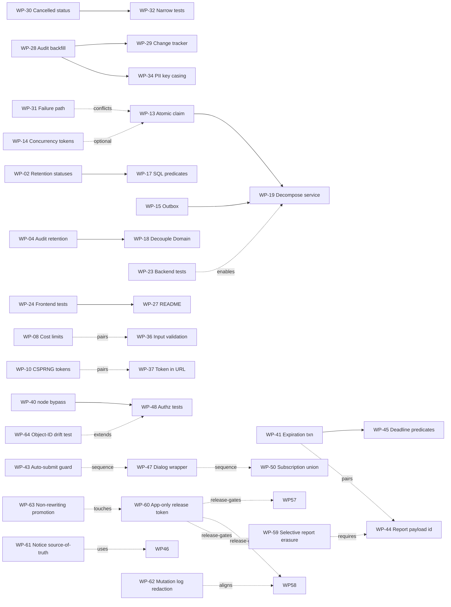

# Audit Remediation Plan

> **Status at a glance —** Phases 1 → 11 have shipped in code. The third audit
> ([`AUDIT-R3.md`](AUDIT-R3.md)) identified gaps in three previously shipped work packages; the
> replacement packages are complete. The R4 follow-up packages (WP-52 → WP-56) are reflected in
> the current source, and the R5 wave (WP-57 → WP-60) is implemented. The R6 audit adds four new
> follow-up packages (WP-61 → WP-64) for remaining transparency, logging, CI/CD integrity and
> regression-safety gaps.
> A staging anonymous-GraphQL verification and the controller's external processor/DPA checks
> remain release evidence, not open code findings.
>
> **Updated for [`AUDIT-R6.md`](./AUDIT-R6.md)** — R5 packages WP-57 → WP-60 are closed in code;
> the R6 follow-up packages WP-61 → WP-64 are now implemented in the current source.
>
> **R7 tracking note:** Round 7 findings are tracked separately in
> [`AUDIT-R7-REMEDIATION.md`](./AUDIT-R7-REMEDIATION.md).

Companion to [docs/AUDIT.md](AUDIT.md), its re-audit [docs/AUDIT-R2.md](AUDIT-R2.md), later rounds
[`AUDIT-R3.md`](AUDIT-R3.md), [`AUDIT-R4.md`](./AUDIT-R4.md), [`AUDIT-R5.md`](./AUDIT-R5.md), and
[`AUDIT-R6.md`](./AUDIT-R6.md). Those documents say *what* is wrong and *why*; this one says *what
to do about it*, as discrete units of work.

**Source audits:** commit `d7dfc1e` ([`AUDIT.md`](AUDIT.md)), commit `4424c02`
([`AUDIT-R2.md`](AUDIT-R2.md)), commit `2466551` ([`AUDIT-R3.md`](AUDIT-R3.md)),
[`AUDIT-R4.md`](./AUDIT-R4.md), [`AUDIT-R5.md`](./AUDIT-R5.md), and [`AUDIT-R6.md`](./AUDIT-R6.md)
**Coverage:** 60 historical findings, 5 R4 follow-up findings, 4 R5 findings, and 4 R6 findings,
mapped to 51 historical work packages, 5 R4 follow-up packages, 4 R5 packages, and 4 R6 packages
**Status:** Phases 1, 1b, 2, 3, 4, 5, 6, 7, 8, 9, 10 and 11 are complete in code (WP-01 → WP-64);
the remaining staging anonymous-GraphQL verification and controller-owned processor/DPA checks are
release evidence, not open code findings.
**73 findings closed (60 historical + 5 R4 + 4 R5 + 4 R6) · 0 re-opened · 0 open code findings.**

---

## How to use this document

Each work package is scoped to a **single reviewable pull request**. Packages within a phase are
mostly independent and can be picked up in any order unless a dependency is stated.

Each package has:

| Field | Meaning |
| --- | --- |
| **Findings** | Back-reference to findings in `AUDIT.md` (`#n`), `AUDIT-R2.md` (`Nn`), and later rounds (`R3-nn`, `A-nn`, `R5-nn`, `R6-nn`) |
| **Size** | Relative effort: **S** (an hour or two), **M** (half a day), **L** (multi-day) |
| **Files** | The exact paths to change, with line references as of the audited commit |
| **Change** | What to do |
| **Acceptance** | Observable conditions that must hold when the package is done |
| **Watch out for** | Known traps and side effects specific to this change |

**There is no "tests to add" field.** When this plan was written the repository had no test
harness (finding #5), so acceptance criteria are written to be verifiable by code inspection or
by manually exercising the affected path. WP-32 shipped a narrow xUnit project covering
redaction and the job state machine; WP-23 and WP-24 broadened it to 160 backend and 33 frontend
tests. The gaps that remain are now themselves work packages — see **WP-48** and **WP-49**.

### Sequencing

Phases 1 through 6 have shipped — WP-01 → WP-39. Phase 1b existed because the re-audit found that
the Phase 1 change set introduced two High-severity regressions, one of which silently prevented
its own fix from applying to data that already existed.

Phases 7 → 9 come from the third audit. The ordering principle changed here, because the exposure
profile changed: **Phase 7 blocked production.** WP-40 closed an unauthenticated read path to
participant names, e-mail addresses, scores and submitted answers; WP-48 shipped alongside it so
the fix cannot silently regress. The rest of Phase 7 was small and mechanical, so it shipped in
the same release.

Phase 8 is correctness and privacy parity — real defects, none of them externally exploitable.
Phase 9 is the durable half: the tests that would have caught Phase 7's findings automatically,
plus CI and logging hygiene.

**WP-48 ships *with* WP-40, not after it.** This is the same argument the plan already made for
pairing WP-29 with WP-28. R3-01 is not a coding mistake; it is authorization drift — `ImplementsNode`
was added in one change, per-field `.Authorize()` in another, and nothing held the two together.
A snapshot test of what an anonymous caller can reach is the only thing that stops the same drift
recurring, and it is worth far less if it lands a phase later.

Test infrastructure deliberately sat in Phase 5 rather than Phase 0. It is the durable fix —
every Phase 1 finding was one assertion away from being caught automatically — but gating urgent
privacy fixes behind building a test project would delay them without making them safer. **WP-32
was the exception**: a deliberately narrow package covering only the pure logic the two
regressions live in, so that Phase 1b cannot silently regress again. It shipped a real test
project and wired `dotnet test` into the PR workflow, so WP-23 and WP-24 extended a harness that
existed rather than creating one — and WP-48 → WP-50 now extend it again.

---

## R5 remediation wave (2026-09-21)

The R5 review found no Critical or High-severity code issue, but four medium- and low-risk
findings remain. They should be closed before declaring the application release-ready.
WP-52 → WP-56 are retained in the historical plan and are implemented in the current source;
the packages below are the active work for [`AUDIT-R5.md`](AUDIT-R5.md).

### WP-57 — Align withdrawal wording with the anonymization lifecycle ✅

**Findings:** R5-01 (🟡 Medium)
**Size:** S
**Priority:** P1
**Dependencies:** None

**Files**
- `RefTestManagement.Ui/public/i18n/en.json`
- `RefTestManagement.Ui/public/i18n/nl.json`
- `RefTestManagement.Ui/public/i18n/fr.json`
- `RefTestManagement.Ui/public/i18n/de.json`
- withdrawal dialog template and its UI tests
- `docs/PRIVACY.md` if wording needs reconciliation

**Change**
- Replace “delete my data” and “permanently delete” claims with accurate withdrawal,
  anonymization/redaction, and retained-audit wording.
- Keep the existing anonymize-and-retain implementation; do not silently change it to
  hard deletion.
- Add a regression test covering the rendered withdrawal copy and locale key parity.

**Acceptance**
- No participant-facing withdrawal copy promises permanent deletion when the path calls
  `EraseAsync()`.
- All four locales explain the result consistently and match `docs/PRIVACY.md`.
- Automated UI/i18n checks fail if the inaccurate wording returns.

**Watch out for**

- Do not change the administrative hard-delete wording to describe self-service withdrawal.
- Keep the copy understandable to participants without exposing internal audit terminology.

### WP-58 — Normalize batch mutation errors and preserve server diagnostics ✅

**Findings:** R5-02 (🟡 Medium)
**Size:** M
**Priority:** P1
**Dependencies:** Existing logging/redaction helpers; coordinate with the prior report-mutation fix

**Files**
- `RefTestManagement.Api/Graphql/Mutations/Approval/RefTestApprovalMutations.cs`
- `RefTestManagement.Api/Graphql/Mutations/Creation/RefTestCreationMutations.cs`
- `RefTestManagement.Api/Graphql/Mutations/Reset/RefTestResetMutations.cs`
- shared GraphQL error/result models and logging helpers
- focused backend mutation tests

**Change**
- Replace arbitrary `ex.Message` response fields with stable, user-safe messages or typed
  domain errors.
- Log the exception server-side after email/PII redaction, with a correlation identifier
  that support staff can use without exposing internals to the client.
- Preserve deliberate validation/business messages only when they originate from an explicit
  safe exception/result contract.
- Cover approval, rejection, creation, reset, invitation-preparation, and notification-preparation
  failure branches.

**Acceptance**

- No caller-visible batch mutation result serializes arbitrary provider, database, filesystem,
  configuration, or third-party exception text.
- Each failure retains a server-side diagnostic and correlation identifier.
- Regression tests prove raw sentinel exception text is absent from every affected response.
- Existing successful result shapes and safe domain validation behavior remain unchanged.

**Watch out for**

- Do not replace useful domain validation with an opaque generic error.
- Do not log unredacted exception text or recipient data while fixing response disclosure.

### WP-59 — Make report-job erasure selective and legacy-safe ✅

**Findings:** R5-03 (🟡 Medium)
**Size:** L
**Priority:** P1
**Dependencies:** WP-44 provides legacy payload reachability but not a precise per-participant
association. This package must add or normalize that association before selective matching can
work. Coordinate with job schema/migration and report-generation review.

**Files**
- `RefTestManagement.Application/Models/JobPayloads.cs`
- `RefTestManagement.Api/Graphql/Mutations/Email/RefTestEmailMutations.cs`
- `RefTestManagement.Api/BackgroundServices/JobHandlers/ReportEmailJobHandler.cs`
- `RefTestManagement.Infrastructure/Services/RefTestPrivacyErasureService.cs`
- job persistence/configuration and migrations as required
- erasure and report-job tests

**Change**
- Add a precise participant association to report rows/jobs, preferably a normalized
  job-to-RefTest relation; a `RefTestId` inside each report row is the minimum compatible shape.
- Update report creation, serialization, handler processing, and erasure to cancel only jobs
  containing the withdrawn participant.
- Define an explicit migration/quarantine policy for existing payloads that cannot identify
  their participants. Do not silently cancel every legacy report job on every erasure.
- Clear retained payload data when a matching job is cancelled and document the limitation that
  externally transmitted email cannot be recalled.

**Acceptance**

- Erasing participant A cancels and clears A's queued/processing report work but leaves an
  unrelated participant B report job untouched.
- New report payloads are unambiguously attributable to every included RefTest.
- Legacy payload handling is explicit, observable, and tested rather than relying on a broad
  “all report jobs” fallback.
- Privacy erasure tests cover mixed reports, legacy rows, cancellation, and payload clearing.

**Watch out for**

- Preserve report delivery for unaffected participants.
- Avoid matching on names or email addresses as a substitute for a stable identifier.
- Check all supported database providers and migration paths before changing job persistence.

### WP-60 — Remove the long-lived release-token fallback ✅

**Findings:** R5-04 (⚪ Low)
**Size:** S
**Priority:** P2
**Dependencies:** GitHub App permissions and installation verified in beta and stable environments

**Files**
- `.github/workflows/beta-release.yml`
- `.github/workflows/stable-release.yml`
- `docs/CONFIGURATION.md`
- release-validation documentation or environment configuration as needed

**Change**
- Require the short-lived GitHub App installation token for checkout and release operations.
- Remove `|| secrets.GH_PAT` and stale fallback comments.
- Fail early with a clear configuration error when App credentials are missing rather than
  silently selecting a long-lived personal token.
- Verify the App has the minimum required repository permissions for contents, issues, and
  pull requests before removing the fallback.

**Acceptance**

- Neither release workflow references `GH_PAT`.
- Beta and stable release dry runs or controlled runs succeed with the App token only.
- Missing App credentials fail closed before checkout or release mutation.
- Configuration documentation describes only the supported App-token setup.

**Watch out for**

- Do not revoke the existing PAT until both environments have been verified; coordinate the
  secret removal with the release owner.
- Keep workflow permissions least-privilege and continue pinning actions by SHA.

---

## R6 remediation wave (2026-09-22)

The R6 review found no Critical or High-severity issue. The four medium/low findings below are now
implemented in code and should be carried as closed in the tracker; remaining staging verification
and controller-owned checks are release evidence rather than open remediation work.

### WP-61 — Unify published privacy notice metadata with enforced consent version

**Findings:** R6-01 (🟡 Medium)  
**Status:** ✅ Implemented  
**Size:** M  
**Priority:** P1  
**Dependencies:** Privacy notice GraphQL contract and locale/i18n content

**Files**
- `RefTestManagement.Api/Graphql/Queries/RefTestQueries.cs:26-33`
- `RefTestManagement.Api/appsettings.json:39-45`
- `RefTestManagement.Ui/src/app/privacy/privacy-notice.ts:1-12`
- `RefTestManagement.Ui/src/app/privacy/privacy-notice.html:1-42`
- `RefTestManagement.Ui/src/app/ref-test/welcome/ref-test-welcome.ts:116-129`
- `RefTestManagement.Ui/public/i18n/en.json:678-706` (+ `nl/fr/de` equivalents)
- privacy-notice frontend tests

**Change**
- Drive public notice metadata (controller identity/contact, notice version/effective date,
  retention years) from the backend `privacyNotice` payload rather than static locale literals.
- Keep translated explanatory copy in locale files, but interpolate dynamic backend metadata.
- Add regression coverage that fails when published notice metadata diverges from the backend
  contract used during consent acceptance.

**Acceptance**
- `/privacy` shows the same notice version/effective date/controller metadata as
  `getPrivacyNotice`.
- Participant consent acceptance still uses the fetched backend version and no longer relies on a
  separate static metadata source.
- Tests fail when backend notice metadata and published notice metadata diverge.

**Watch out for**
- Preserve multi-language support while removing duplicated metadata literals.
- Do not regress accessibility/semantics of the privacy page while introducing dynamic content.

### WP-62 — Apply redacted exception logging to staff email mutations

**Findings:** R6-02 (🟡 Medium)  
**Status:** ✅ Implemented  
**Size:** S  
**Priority:** P1  
**Dependencies:** Existing redaction helper (`MutationErrorHandling` / `LogRedaction`)

**Files**
- `RefTestManagement.Api/Graphql/Mutations/Email/RefTestEmailMutations.cs:79-82`
- `RefTestManagement.Api/Graphql/Mutations/Email/RefTestEmailMutations.cs:163-166`
- `RefTestManagement.Api/Graphql/Mutations/Email/RefTestEmailMutations.cs:265-268`
- `RefTestManagement.Api/Graphql/Mutations/Shared/MutationErrorHandling.cs:23-36`
- focused mutation logging tests

**Change**
- Replace direct `logger.LogError(ex, ...)` calls in invitation/result/report email mutation catch
  paths with redacted exception logging (email/PII masking + correlation id).
- Keep current stable user-facing error messages unchanged.

**Acceptance**
- No raw exception object is logged from these three mutation paths.
- Redaction is consistent with other mutation families and preserves support diagnostics.
- Regression tests cover representative exception text containing email addresses.

**Watch out for**
- Do not reduce actionable diagnostics to the point on-call triage becomes impossible.
- Keep mutation result contracts backward-compatible.

### WP-63 — Remove force-push promotion of `main` in stable release workflow

**Findings:** R6-03 (🟡 Medium)  
**Status:** ✅ Implemented  
**Size:** M  
**Priority:** P1  
**Dependencies:** Branch-protection policy and release governance decisions

**Files**
- `.github/workflows/stable-release.yml:252-257`
- release process documentation (`README.md` / `docs/CONFIGURATION.md` as needed)

**Change**
- Replace `rebase + push --force-with-lease` main sync with a non-history-rewriting promotion path
  (fast-forward-only merge, or explicit merge commit flow).
- Ensure the workflow fails closed if promotion cannot proceed without rewriting protected history.
- Document the expected release-branch/main promotion invariant.

**Acceptance**
- Stable release automation no longer force-pushes `main`.
- Promotion fails rather than rewriting history when divergence exists.
- Documentation matches the implemented non-rewriting strategy.

**Watch out for**
- Avoid introducing an implicit bypass of branch protection through alternate credentials.
- Verify semantic-release/tagging steps remain compatible with the promotion change.

### WP-64 — Add production-configuration guard for Relay object-identification drift

**Findings:** R6-04 (⚪ Low)  
**Status:** ✅ Implemented  
**Size:** S  
**Priority:** P2  
**Dependencies:** Existing authorization/schema test harness

**Files**
- `RefTestManagement.Api/Program.cs:237`
- `RefTestManagement.Api/Graphql/Types/RefTestType.cs:21-24`
- `RefTestManagement.UnitTests/AuthorizationSchemaTests.cs:62-75`
- new/updated GraphQL integration authorization test(s)

**Change**
- Add a regression test bootstrapping production-equivalent GraphQL wiring and asserting anonymous
  `node(id:)` access for `RefTest` stays unavailable while global object identification is disabled.
- Keep current participant token flow behavior unchanged.

**Acceptance**
- A configuration drift that re-enables global object identification without corresponding
  authorization hardening fails tests.
- Existing anonymous participant contract tests still pass.

**Watch out for**
- Ensure tests assert runtime behavior, not just type metadata in an isolated schema.
- Avoid introducing brittle tests coupled to unrelated schema ordering.

---

## Phase overview

| Phase | Theme | Packages | Size | Why this order |
| --- | --- | --- | --- | --- |
| **1** ✅ | GDPR remediation | WP-01 → WP-07 | 1×M, 6×S | **Done** — shipped in `29dba7c` |
| **1b** ✅ | Phase 1 regression fixes | WP-28 → WP-32, WP-35 | 3×M, 3×S | **Done** — regressions introduced by Phase 1 |
| **2** ✅ | Security & assessment integrity | WP-08 → WP-12, WP-33 → WP-34, WP-36 → WP-39 | 4×M, 7×S | **Done** — hardening; no evidence of exploitation |
| **3** ✅ | Correctness under load & architecture | WP-13 → WP-19 | 3×M, 2×L, 2×S | **Done** |
| **4** ✅ | Frontend, a11y & i18n | WP-20 → WP-22 | 3×S | **Done** — user-visible quality |
| **5** ✅ | Test foundation | WP-23 → WP-24 | 2×L | **Done** — 110 → 151 backend, 0 → 33 frontend |
| **6** ✅ | Supply chain & documentation | WP-25 → WP-27 | 3×S | **Done** — CodeQL, hook split, README |
| **7** ✅ | Exposure — blocks production | WP-40 → WP-43 | 1×M, 3×S | **Done** — global node access removed and the adjacent hardening shipped |
| **8** ✅ | Correctness & privacy parity | WP-44 → WP-47 | 2×M, 2×S | **Done** — deadline, erasure, privacy notice and dialog parity fixed |
| **9** ✅ | Tests & hygiene | WP-48 → WP-51 | 1×M, 3×S | **Done** — authorization, retention, frontend-union and logging/CI coverage shipped |
| **10** ✅ | R5 privacy, error handling & release hardening | WP-57 → WP-60 | 1×L, 2×S, 1×M | **Done in code** — deployment handover evidence remains |
| **11** ✅ | R6 transparency, logging and release-integrity hardening | WP-61 → WP-64 | 2×M, 2×S | **Done** — privacy notice, logging, release promotion and regression guard shipped |

---

# Phase 1 — GDPR remediation ✅ Complete

> Shipped in commit `29dba7c`. These seven packages closed five of the six GDPR gaps in
> `AUDIT.md` §4 outright and partially closed the sixth. **WP-04's fix is incomplete** — it does
> not reach audit rows a previous deployment had already archived. That remaining exposure is
> tracked as finding N1 and fixed by **WP-28**. See `AUDIT-R2.md` §4.1 for the verification of
> each gap.

## WP-01 — Admin delete must anonymize before deleting

**Findings:** #1 (🟠 High) · **Size:** S · **Priority: ship next release**

### Files
- `RefTestManagement.Api/Graphql/Mutations/Deletion/RefTestDeletionMutations.cs:59`

### Change

`DeleteRefTestsAsync` calls `privacyErasureService.DeleteAsync(refTest, …)` unconditionally,
skipping the anonymization step that redacts personal data from the audit trail. Branch on
`IsAnonymized`, exactly as `docs/PRIVACY.md` already describes the behaviour:

```csharp
if (!refTest.IsAnonymized)
    await privacyErasureService.EraseAsync(refTest, cancellationToken);

await privacyErasureService.DeleteAsync(refTest, cancellationToken);
```

### Acceptance
- Deleting a RefTest that was never anonymized leaves **no** `firstName`, `lastName`, or `email`
  value in any `AuditEvents` row referencing that RefTest — verify by querying `AuditEvents` for
  the RefTest id before and after.
- Deleting an already-anonymized RefTest behaves exactly as before (no double erasure, no error).
- A delete that fails partway leaves the RefTest either fully intact or fully erased, never half.

### Watch out for
- **The response DTO changes.** `result.DeletedRefTests.Add(refTest.ToDto())` runs *after*
  deletion (`:63`). Once `EraseAsync` runs first, `Anonymize()` has mutated the in-memory entity,
  so the returned DTO will contain `***` instead of the participant's name. If the admin UI shows
  the deleted participant's name in its confirmation message, capture the DTO **before** calling
  `EraseAsync`.
- `EraseAsync` opens its own transaction via `CreateExecutionStrategy()`. Do not wrap these two
  calls in an outer transaction — nest and it will throw.
- The loop is per-id with per-id error capture; keep that behaviour so one bad id doesn't abort
  the batch.

---

## WP-02 — Retention must cover `PendingApproval` and `Rejected`

**Findings:** #4 (🟠 High) · **Size:** S · **Priority: ship next release**

### Files
- `RefTestManagement.Api/BackgroundServices/PrivacyRetentionService.cs:47-52`
- `RefTestManagement.Api/BackgroundServices/RefTestExpirationService.cs:120-143` (context only)

### Change

The retention sweep only matches `Completed` and `Expired`:

```csharp
.Where(refTest =>
    (refTest.Status == RefTestStatus.Completed && refTest.CompletedAt < cutoff) ||
    (refTest.Status == RefTestStatus.Expired   && refTest.ExpiredAt   < cutoff))
```

`PendingApproval` and `Rejected` are also terminal — `RefTestExpirationService.IsExpired()`
returns `false` for both, so they never transition into a status the sweep sees. Add them, using
`CreatedAt` as the cutoff basis since neither status sets a completion timestamp:

```csharp
|| ((refTest.Status == RefTestStatus.PendingApproval ||
     refTest.Status == RefTestStatus.Rejected) && refTest.CreatedAt < cutoff)
```

### Acceptance
- A `Rejected` RefTest with `CreatedAt` older than `RetentionYears` is anonymized on the next
  sweep.
- Same for `PendingApproval`.
- `Pending` and `InProgress` are still **not** matched — those are handled by the expiration
  service, which converts them to `Expired`/`Completed` first.
- The sweep's log line reports a non-zero count when such records exist.

### Watch out for
- Decide deliberately whether `CreatedAt` is the right clock for these. If a test can sit in
  `PendingApproval` legitimately for a long time, the retention window starts from creation, which
  may erase it while still pending approval. If that is wrong for the business, the fix is to
  expire `PendingApproval` into `Expired` first and let the existing predicate handle it.
- Consider adding `&& !refTest.IsAnonymized` to the whole predicate while here — see WP-17.

---

## WP-03 — Remove personal data and bearer tokens from logs

**Findings:** #3 (🟠 High) · **Size:** S · **Priority: ship next release**

### Files
- `RefTestManagement.Infrastructure/Logging/ServiceLoggerMessages.cs:31-53, 80-102, 134-141`
- `RefTestManagement.Infrastructure/Services/EmailService.cs:72-74`

### Change

Participant email addresses, assessment scores, and — most seriously — the **full invitation
token and URL** are written at `Information` level. The token is a bearer credential: it grants
access to the participant's test, their results, and their withdraw-consent action.

Rewrite the message templates to carry the RefTest `Guid` instead of identifying data:

| Line | Currently logs | Change to |
| --- | --- | --- |
| `:46-47` | email + token + full URL | RefTest id only — **drop token and URL entirely** |
| `:49-50` | email + scores + percentage | RefTest id only |
| `:31, 34, 37, 40` | email | RefTest id |
| `:80-84` | email | RefTest id |
| `:134-141` | email | RefTest id |
| `:101-102` | creator email | creator id |

### Acceptance
- `grep -ri "token" RefTestManagement.Infrastructure/Logging/` returns no log template that
  interpolates a token value.
- No log template in the file interpolates an email address, first name, last name, or score.
- Operational diagnostics still work: every message retains the RefTest id, so a support request
  can still be traced end to end.

### Watch out for
- These are compile-time `LoggerMessage` source-generated methods — changing a template's
  parameters changes the method signature. Update every call site; the compiler will find them.
- Historical logs already contain this data. Purging Application Insights / App Service log
  history is an **operational** task outside this package, but it should be raised — the code fix
  stops new leakage, it does not undo the old.

---

## WP-04 — Audit events must eventually lose their personal data

**Findings:** #2 (🟠 High) · **Size:** M

### Files
- `RefTestManagement.Api/BackgroundServices/AuditLogCleanupService.cs:60-63`
- `RefTestManagement.AuditLog/AuditLogOptions.cs`

### Change

Cleanup only flips a boolean:

```csharp
.ExecuteUpdateAsync(s => s.SetProperty(e => e.IsArchived, true), cancellationToken);
```

The row — including `Data`, `ActorName`, and `ActorEmail` — persists forever. Pick one:

- **(a) Redact at archive time** *(recommended)* — reuse `RefTestPrivacyErasureService.RedactPii`
  to null the PII fields when setting `IsArchived`. Preserves the accountability trail (who did
  what, when) while dropping the identifying payload.
- **(b) Two-stage retention** — add `HardDeleteAfterDays` to `AuditLogOptions` and `RemoveRange`
  archived events past that second, longer window.

Option (a) is preferred: it keeps the audit trail's purpose intact.

### Acceptance
- An audit event older than `RetentionDays` has no `firstName`/`lastName`/`email` value in `Data`,
  and no `ActorName`/`ActorEmail`, after the next cleanup run.
- The event's `Action`, `Timestamp`, `EntityId`, and `EntityType` are still present.
- Cleanup remains a set-based operation — it must not load the table into memory.

### Watch out for
- `RedactPii` currently handles two JSON shapes (flat and old/new diff) and keys
  `["firstName","lastName","email"]`. **`token` is not in that list.** Audit whether any event
  payload carries a token; if so, add it.
- `ExecuteUpdateAsync` cannot easily rewrite JSON in a provider-portable way. Reading and writing
  in batches is acceptable here given it runs daily — just bound the batch size.
- Four database providers are supported. Whatever you do must work on all of them, not just
  SQL Server.

---

## WP-05 — Erasure must stop in-flight jobs and clear their payloads

**Findings:** #6 (🟡 Medium) · **Size:** S

### Files
- `RefTestManagement.Infrastructure/Services/RefTestPrivacyErasureService.cs:110-120`
- `RefTestManagement.Domain/Jobs/Job.cs:74-80`

### Change

Two problems in one place. The cancellation query only matches `Pending`:

```csharp
.Where(job => job.Status == JobStatus.Pending && job.Payload.Contains(refTestId))
```

so a job already `Processing` still sends its email after the participant withdrew consent. And
`Job.Cancel()` clears `Status`, `ErrorMessage`, `LockedUntil`, and `CompletedAt` — but **not**
`Payload`, which holds full name, email, token, scores, and answers.

1. Widen the predicate to include `JobStatus.Processing`.
2. Clear the payload in `Cancel()`, or add an explicit `RedactPayload()` the erasure service calls.

### Acceptance
- After `EraseAsync`, no `Jobs` row referencing that RefTest has a `Payload` containing the
  participant's name, email, or token — in any status.
- A job that was `Processing` at erasure time is marked terminal and does not deliver its email.
- Job cleanup (`BackgroundJobService.CleanupOldJobsAsync`) still removes these rows on schedule.

### Watch out for
- Cancelling a `Processing` job is inherently racy — the worker may already be mid-send. This
  narrows the window, it cannot close it. Note that honestly rather than claiming otherwise.
- `job.Payload.Contains(refTestId)` is a `LIKE '%guid%'` scan over an unindexed text column on
  every erasure. Not this package's job to fix, but worth flagging if erasure volume grows.
- `Cancel()` sets `Status = Failed` — there is no `Cancelled` state in `JobStatus`. Adding one is
  out of scope here; if you do, it is a migration across four providers.

---

## WP-06 — Preserve consent proof through anonymization

**Findings:** #22 (⚪ Low) · **Size:** S

### Files
- `RefTestManagement.Domain/RefTests/RefTest.cs:570-571`

### Change

`Anonymize()` nulls the consent record:

```csharp
PrivacyNoticeVersion = null;
PrivacyNoticeAcceptedAt = null;
```

GDPR Art. 7(1) requires the controller to demonstrate that consent was obtained. Keep
`PrivacyNoticeVersion` and `PrivacyNoticeAcceptedAt` — neither identifies the participant once
name, email, and token are erased, so retaining them costs nothing in privacy terms and preserves
the accountability evidence.

### Acceptance
- An anonymized RefTest still reports which privacy notice version was accepted and when.
- No other field retains identifying data.

### Watch out for
- Confirm this is a deliberate product decision, not an oversight to reverse blindly. If the
  intent was "an erased record should carry no trace of the person at all", then the accountability
  evidence needs to live somewhere else instead — the audit trail already retains
  `RefTestPrivacyNoticeAcceptedEvent` with its timestamp.

---

## WP-07 — Correct the false claims in `docs/PRIVACY.md`

**Findings:** documentation truth (supports #1, #2, #6) · **Size:** S · **Priority: ship next release**

### Files
- `docs/PRIVACY.md`

### Change

Three published statements are contradicted by the code. Until WP-01, WP-04, and WP-05 ship, the
privacy notice overstates what the system does — which is a distinct exposure from the technical
gap, and the cheaper half to fix.

| Claim | Reality |
| --- | --- |
| "`deleteRefTests` and `withdrawConsent` both use this same erasure path" | Only `withdrawConsent` does (WP-01) |
| Job payloads "are **deleted outright**" | They are marked failed; the payload is retained (WP-05) |
| "Its audit trail no longer contains personal data (it was redacted in step 1)" | Only true if step 1 ran, which the admin path skips (WP-01) |

**If WP-01/04/05 ship in the same release**, update these statements to describe the new, correct
behaviour. **If they do not**, add a "Known gaps" section stating the current limitation plainly —
an accurate disclosure of a gap is defensible; an inaccurate promise is not.

### Acceptance
- Every behavioural claim in `docs/PRIVACY.md` is true of the code at the same commit.
- The document states which statuses are subject to retention erasure, now that WP-02 changes them.
- The document acknowledges that application logs may contain personal data, or WP-03 has shipped
  and they no longer do.

### Watch out for
- This file is participant-facing compliance documentation. Changes should be reviewed by whoever
  owns the controller relationship, not merged as a routine docs tweak.

---

# Phase 1b — Phase 1 regression fixes ✅ Complete

> **This phase exists because Phase 1 introduced it.** The re-audit (`AUDIT-R2.md`) found that
> commit `29dba7c` shipped two High-severity regressions. WP-28 was the more serious: the audit
> redaction it added never reached rows that a previous deployment had already archived, so the
> headline GDPR fix worked only for data created from that commit onward.
>
> All six packages have shipped. WP-32 also left the repository with its first test project and a
> `dotnet test` step in the PR workflow.

## WP-28 — Redact audit events a previous deployment already archived ✅

**Findings:** N1 (🟠 High), and the open half of #2 · **Size:** M

### Files
- `RefTestManagement.AuditLog/AuditEvent.cs:15`
- `RefTestManagement.AuditLog/AuditEventConfiguration.cs:43,50`
- `RefTestManagement.Api/BackgroundServices/AuditLogCleanupService.cs:77-101`
- A migration in **all four** provider projects (`SqlServer`, `PostgreSQL`, `MySQL`, `SQLite`)

### Change
The cleanup loop currently selects `a.Timestamp < cutoff && !a.IsArchived`. The implementation it
replaced set `IsArchived = true` and redacted nothing, so every row archived by an earlier
deployment is permanently excluded from redaction.

The root cause is that `IsArchived` is doing double duty: "retention applied" and "redaction
applied". Split them.

- Add `RedactedAt` (`DateTime?`) to `AuditEvent` and configure it, with an index on `RedactedAt`
  or a composite `(Timestamp, RedactedAt)`.
- Change the loop's cursor to `a.Timestamp < cutoff && a.RedactedAt == null`.
- Keep setting `IsArchived = true`, and additionally stamp `RedactedAt` on every row redacted.
- Add the migration to each provider project.

### Acceptance
- A row with `IsArchived = true`, `RedactedAt == null` and a timestamp past the cutoff has its
  `Data`, `ActorName` and `ActorEmail` redacted on the next run.
- After a full sweep, no `AuditEvents` row older than the retention window contains a participant
  name or email address.
- The admin audit log UI shows exactly the same rows as before the change.

### Watch out for
- **Do not reset `IsArchived`.** `AuditLogQueries.cs:21` filters `!a.IsArchived`, so archived
  events are deliberately hidden from the admin UI. Flipping the flag back to sweep old rows
  would resurface 90-day-old audit events in the UI — a visible behaviour change.
- `AuditEvent` properties are `init`-only. Write through
  `context.Entry(x).Property(...).CurrentValue`, as the existing loop already does.
- The first run after deployment processes the entire historical backlog in one pass. Ship
  **WP-29** with this package, not after it.
- All four provider projects must stay in lockstep; a migration in only `SqlServer` will break the
  others at startup.

---

## WP-29 — Make the redaction loop safe at backlog scale ✅

**Findings:** N3 (🟡 Medium) · **Size:** S · **Depends on:** WP-28 (same loop)

### Files
- `RefTestManagement.Api/BackgroundServices/AuditLogCleanupService.cs:74-101`

### Change
The batched loop reuses one `DbContext` and never clears it, so tracked entities accumulate across
every batch and `DetectChanges` degrades to O(N²/500) with memory growing for the whole run. Call
`context.ChangeTracker.Clear()` after each batch's `SaveChangesAsync`.

### Acceptance
- Per-batch duration and process memory stay flat while redacting a multi-thousand-row backlog.

### Watch out for
- Clear **after** saving, never mid-batch — clearing first discards the pending modifications.
- This replaced a single `ExecuteUpdateAsync`, so it is a genuine regression rather than a
  pre-existing weakness. Consider a per-run batch cap so the first run cannot monopolise the
  daily window.

---

## WP-30 — Stop a cancelled job's empty payload from breaking mutations ✅

**Findings:** N2 (🟠 High) · **Size:** M

### Files
- `RefTestManagement.Domain/Jobs/JobStatus.cs`
- `RefTestManagement.Domain/Jobs/Job.cs:61-67,77-84`
- `RefTestManagement.Infrastructure/Services/JobEnqueueService.cs:124-152,178-190`
- `RefTestManagement.Api/BackgroundServices/BackgroundJobService.cs:477-496,514-515`

### Change
`Cancel()` now clears `Payload`, but `MarkAsFailed` returns a job to `Pending` whenever
`Attempts < MaxAttempts`. A job cancelled while a worker holds it can therefore end up `Pending`
with an empty payload, and both `JobEnqueueService` loops deserialize the payload of every
`Pending`/`Processing` job of the relevant type with no error handling.

- Append `Cancelled` to `JobStatus` and have `Cancel()` set it.
- Make `MarkAsFailed` refuse to move a `Cancelled` job back to `Pending`.
- Skip empty payloads defensively at the top of both `JobEnqueueService` loops.
- Make `DeserializePayload` fail safe rather than burning all three retry attempts.
- Extend `CleanupOldJobsAsync` to delete `Cancelled` jobs.

### Acceptance
- Cancelling a job that is mid-`Processing` and then failing it cannot leave a `Pending` row with
  an empty payload.
- `resetRefTest` and `reviveRefTest` succeed even with an empty-payload row already in the table.
- Cancelled jobs are deleted on the same retention schedule as failed ones.

### Watch out for
- **Append `Cancelled` at the end of the enum.** `JobStatus` declares no explicit values, so EF
  stores it as an ordinal `int`; inserting a value anywhere else silently reinterprets every
  existing row.
- `CleanupOldJobsAsync:514-515` matches only `Completed`/`Failed`. Without the new status added,
  cancelled jobs are retained forever — the opposite of what WP-05 intended.
- Check whether `JobStatus` is projected through GraphQL before changing its shape.

---

## WP-31 — Never let the failure path throw ✅

**Findings:** N4 (🟡 Medium) · **Size:** S

### Files
- `RefTestManagement.Api/BackgroundServices/BackgroundJobService.cs:110-112,186-192`

### Change
`LogRedaction.MaskEmailsInText(ex.Message)` is the first statement in the `catch` block and can
throw `RegexMatchTimeoutException`. If it does, `MarkAsFailed` and the save never run and the row
is stranded at `Status = Processing` — which nothing recovers, because the claim query selects
only `Pending` and cleanup deletes only `Completed`/`Failed`.

- Wrap the masking call in its own try/catch with a constant fallback message so `MarkAsFailed`
  always runs.
- Extend the claim predicate to also reclaim `Processing` jobs whose `LockedUntil` has expired.

### Acceptance
- An exception thrown while masking still results in a saved, failed job.
- A job orphaned in `Processing` is picked up on a later poll rather than stranded forever.

### Watch out for
- Reclaim must respect `Attempts`/`MaxAttempts`, or a half-sent email can be re-sent repeatedly.
- This overlaps **WP-13** (atomic claim), which rewrites the same predicate. Sequence the two
  deliberately rather than letting them conflict.

---

## WP-32 — Narrow unit tests for redaction and the job state machine ✅

**Findings:** supports N1–N4; a deliberate subset of #5 (🟠 High) · **Size:** M

### Files
- A new test project
- `RefTestManagement.slnx`
- `.github/workflows/pr.yml`

### Change
Both Phase 1b regressions live in pure, dependency-free logic, which is the cheapest possible
place to start testing. Cover only:

- `AuditPiiRedactor.RedactData` — flat and diff payload shapes, key casing, null `Data`.
- `LogRedaction.MaskEmail` and `MaskEmailsInText` — plus-addressing, embedded JSON, null/empty.
- The `Job` state machine — specifically that `Cancel()` followed by `MarkAsFailed` cannot produce
  a `Pending` job with an empty payload.
- `RefTest.Anonymize()` — that consent version and timestamp survive.

Wire `dotnet test` into the PR workflow.

### Acceptance
- The suite fails if WP-30's state-machine guard is reverted.
- The PR workflow runs the suite and fails the check on a failing test.

### Watch out for
- **Keep it narrow.** No database, no host, no fixtures. Integration and frontend coverage remain
  WP-23 and WP-24; this package exists so Phase 1b cannot regress, not to build the harness.
- Adding a test project changes the solution build — confirm the pre-commit hook and release
  workflows still succeed.

---

## WP-35 — Disclose staff and approver recipients in the privacy notice ✅

> ℹ️ **Superseded after R3 ([R3-09](AUDIT-R3.md)) by [WP-46](#wp-46--bring-the-in-app-privacy-notice-to-parity).**
> `docs/PRIVACY.md` was updated as specified. The
> participant-facing in-app notice was not — it still omits the internal recipient categories that
> `PRIVACY.md` itself now says Art. 13(1)(e) requires. The document a participant is actually
> shown is the one the Article governs. **Fixed by [WP-46](#wp-46--bring-the-in-app-privacy-notice-to-parity).**

**Findings:** N7 (🟡 Medium) · **Size:** S

### Files
- `docs/PRIVACY.md:36-42`
- Evidence only: `BackgroundJobService.cs:435-470`, `EmailService.cs:186-216`

### Change
The notice lists the three processors (Auth0, Brevo, IHF) but never states that participant names,
email addresses, scheduled times and scores are emailed to internal staff — approval-request and
approval-decision notifications, and batch staff reports. That is an **Art. 13(1)(e)** omission.

Add a "Recipients" subsection naming the category (assessment administrators and approvers within
Handball Belgium) and the purpose for which they receive the data.

### Acceptance
- Every outbound email path that carries participant data maps to a disclosed recipient category.

### Watch out for
- The **published** notice must be updated too, not only the file in this repository.
- Same review rule as WP-07: this is participant-facing compliance text, not a routine docs tweak.

---

# Phase 2 — Security & assessment integrity ✅ Complete

> All eleven packages have shipped. Two of them changed in substance while being implemented, and
> both changes are worth knowing about:
>
> - **WP-08's limits were measured, not guessed.** The first attempt set `MaxTypeCost` to 50,000
>   and left `MaxFieldCost` at HotChocolate's 1,000,000 default, reasoning about query shape
>   rather than measuring it. Running the real schema showed the heaviest legitimate query costs
>   303 type / 3,667 field, and an amplification query built from 141 aliased 100-item pages
>   passed those limits comfortably. The limits are now 5,000 / 20,000, which that same
>   amplification query fails. The measurements are recorded in `docs/CONFIGURATION.md` so the
>   next person to hit a cost error can tune from data.
> - **WP-09 nearly broke test completion entirely.** The expiration background job auto-completes
>   overdue tests through the same mutation a participant uses, and it runs *after* the deadline
>   by definition. An unconditional deadline check would have made every overdue test permanently
>   unfinishable. The check is therefore scoped by a `RefTestCompletionSource` that only the
>   internal path can supply, and `RefTestDeadlineTests` guards the distinction.
>
> Three fixes outside the plan were made along the way:
>
> - **The test project ran zero tests.** `dotnet test` reported "Zero tests ran" and exit code 5,
>   because the project referenced `Microsoft.NET.Test.Sdk` without a runner the
>   `Microsoft.Testing.Platform` setting in `global.json` could use. The PR workflow's test step
>   would have failed on the next run. Fixed in the test `.csproj`.
> - **A failed submission was silent in the UI.** The complete-test mutation returning a null
>   payload left the participant looking at an unchanged screen. The facade now raises
>   `submit_failed`.
> - **Two security `<meta>` tags did nothing.** `X-Frame-Options` and `X-Content-Type-Options` are
>   ignored by browsers when they appear in markup, so `index.html` looked protected without being
>   protected. All three headers are now sent by the API as real response headers.

## WP-08 — Enable GraphQL cost limits and add rate limiting ✅

**Findings:** #7 (🟡 Medium) · **Size:** M

### Files
- `RefTestManagement.Api/Program.cs:147-153`

### Change

Cost enforcement is explicitly disabled on a publicly reachable endpoint:

```csharp
.ModifyCostOptions(o => o.EnforceCostLimits = false)
```

and there is no `AddRateLimiter` / `UseRateLimiter` anywhere. Set `EnforceCostLimits = true` and
add ASP.NET rate limiting scoped to the unauthenticated participant operations.

### Acceptance
- A deeply nested or heavily multiplied anonymous query is rejected with a cost error rather than
  executed.
- The legitimate participant flow — welcome, accept notice, start, save progress, complete — still
  works comfortably within the limit.
- Admin operations are unaffected, or have their own higher limit.

### Watch out for
- **Turning this on will break queries that currently work.** Measure the real cost of the admin
  list/detail queries before choosing a ceiling, and roll out to a beta environment first.
- `MaxPageSize = 100` is already set; the gap is query *shape*, not page size.
- Rate limiting keyed on IP is weak behind a proxy — confirm `ForwardedHeaders` is configured
  correctly first or the limiter will see one client.

---

## WP-09 — Enforce the test deadline server-side ✅

**Findings:** #8 (🟡 Medium) · **Size:** S

### Files
- `RefTestManagement.Domain/RefTests/RefTest.cs:230-260`
- `RefTestManagement.Api/Graphql/Mutations/Lifecycle/RefTestLifecycleMutations.cs:147-196`

### Change

`SaveProgress()` and `Complete()` check only `Status == InProgress`. The status changes to
`Expired` only when `RefTestExpirationService` next runs — **every 5 minutes**. A participant who
prevents the client-side auto-submit can therefore submit up to ~5 minutes past their deadline.

Add the deadline check to the domain methods, where the data already lives:

```csharp
if (StartedAt.HasValue && DateTime.UtcNow > StartedAt.Value.AddMinutes(MaxTimeInMinutes))
    throw new RefTestValidationException("The time limit for this test has expired");
```

### Acceptance
- A `completeRefTest` mutation issued after `StartedAt + MaxTimeInMinutes` is rejected, regardless
  of whether the expiration service has run yet.
- Same for `saveRefTestProgress`.
- A submission inside the limit is unaffected.

### Watch out for
- **Add a small grace allowance** (30–60 seconds) for network latency and clock skew, or you will
  reject legitimate submissions made a fraction of a second before the deadline.
- Check whether time extensions (`RefTestTimeExtended`) mutate `MaxTimeInMinutes` — if the
  extension is stored elsewhere, the check must account for it or extended tests will be cut off.

---

## WP-10 — Generate tokens from an explicit CSPRNG ✅

**Findings:** #21 (⚪ Low) · **Size:** S

### Files
- `RefTestManagement.Domain/RefTests/RefTest.cs:40, 428, 476, 517, 530`

### Change

`Guid.NewGuid().ToString("N")` provides 122 bits and is not weak in practice, but carries no
cryptographic guarantee by contract — and this value is a bearer credential. Replace with:

```csharp
Token = RandomNumberGenerator.GetHexString(32, lowercase: true);
```

### Acceptance
- All five token-generation sites use the CSPRNG.
- Token format and length remain compatible with existing stored tokens and the invitation URL
  format.
- `RefTest.cs:569` (`erased-{Guid:N}`) is left alone — that is a uniqueness placeholder, not a
  credential.

### Watch out for
- Existing tokens in the database stay valid; this only affects newly issued ones. No migration.
- Keep the length at 32 hex characters if the invitation URL or any email template assumes it.

---

## WP-11 — Fix the PR-title script injection and pin workflow permissions ✅

**Findings:** #9 (🟡 Medium) · **Size:** S

### Files
- `.github/workflows/pr.yml:29-30`, and workflow-level `permissions`

### Change

```yaml
run: echo "${{ github.event.pull_request.title }}" | npx commitlint
```

`${{ … }}` is substituted by the runner *before* the shell parses the line, so a PR title
containing a backtick or `$(…)` executes on the runner. The workflow triggers on `edited`
(`:4`), so a title can be weaponised after review has started.

```yaml
- name: ✅ Validate PR title
  env:
    PR_TITLE: ${{ github.event.pull_request.title }}
  run: echo "$PR_TITLE" | npx commitlint
```

Also add an explicit least-privilege block at workflow level — neither `validate-pr-title` nor
`validate` declares `permissions:`, so both inherit the repository default:

```yaml
permissions:
  contents: read
```

### Acceptance
- No `${{ github.event.* }}` expression appears inside any `run:` block in any workflow.
- A PR titled ``test `id` `` fails commitlint normally instead of executing anything.
- `validate-pr-title` and `validate` run with `contents: read`; `sync-readme-versions` keeps its
  `contents: write`.

### Watch out for
- Check the repository's default workflow permission setting. If it is "read and write", the
  injected job currently has a writable token for same-repo PRs, which makes this materially worse
  than the Medium rating assumes.
- Audit the other three workflows for the same pattern while here.

---

## WP-12 — Replace `GH_PAT` with a scoped credential ✅

**Findings:** #12 (🟡 Medium) · **Size:** M

### Files
- `.github/workflows/beta-release.yml:24-28`
- `.github/workflows/stable-release.yml:23-27, 54-59, 175-179`

### Change

A long-lived personal access token with repository write is passed to `actions/checkout` so
release jobs can push tags and branch updates past protection rules. Replace with a **GitHub App
installation token** (short-lived, scoped, auditable as its own identity) or at minimum a
fine-grained PAT restricted to this repository and the specific permissions needed.

### Acceptance
- No workflow references `secrets.GH_PAT`.
- Beta and stable releases still tag, push, and deploy successfully end to end.
- The credential's permissions are enumerable and minimal.

### Watch out for
- **Test on the beta pipeline first.** A broken release workflow is worse than the risk being
  fixed.
- semantic-release pushes tags *and* commits (version badges, README sync) — the replacement needs
  `contents: write` at least.
- If a GitHub App is used, its token must be minted per-job; it expires in an hour.

### Outcome
Both workflows now mint a GitHub App installation token per job and use it for `actions/checkout`.
Because the App itself has to be created and installed in the organisation — which cannot be done
from the repository — the change is gated on a `RELEASE_APP_CLIENT_ID` repository secret and falls back
to `GH_PAT` until that variable is set. Setting the variable and the private key secret is
therefore the whole switch-over; no workflow edit is needed, and releases keep working in the
meantime. The one-time setup, including the branch-protection bypass and the order in which to
revoke `GH_PAT`, is written up in `docs/CONFIGURATION.md` § Release Credentials.

**This package is not finished until that setup is done.** The repository side is complete; the
organisation side is a manual step for a maintainer with admin rights.

---

## WP-33 — Make erase-then-delete atomic ✅

**Findings:** N6 (🟡 Medium) · **Size:** S

### Files
- `RefTestManagement.Api/Graphql/Mutations/Deletion/RefTestDeletionMutations.cs:70-72`
- `RefTestManagement.Infrastructure/Services/RefTestPrivacyErasureService.cs:63,110`

### Change
WP-01 made admin delete call `EraseAsync` then `DeleteAsync`. Each opens its **own** execution-
strategy transaction, so a delete that fails on a constraint, a transient fault or cancellation
leaves the record anonymized but present, showing `***` in the admin UI, while the mutation
returns only a generic failure for that id.

Either combine the two into a single `EraseAndDeleteAsync` sharing one transaction, or surface the
half-done state explicitly in `DeleteRefTestError` so staff know the data was already destroyed.

### Acceptance
- A failed delete either rolls the erasure back, or reports unambiguously that the record was
  erased but not removed.

### Watch out for
- `EraseAsync` creates its own execution strategy and calls `ReloadAsync` per attempt. Do not
  simply wrap the existing calls in an outer transaction — that conflicts with the retry strategy.

---

## WP-34 — Match audit PII keys case-insensitively ✅

**Findings:** N5 (🟡 Medium) · **Size:** S

### Files
- `RefTestManagement.AuditLog/AuditPiiRedactor.cs:25,52`

### Change
`PiiKeys` holds camelCase names and `JsonObject.TryGetPropertyValue` is case-sensitive, but the
audit interceptor's property-diff path writes raw PascalCase EF property names, and `JsonOptions`
sets `PropertyNamingPolicy` without `DictionaryKeyPolicy`. Match case-insensitively, or add the
PascalCase variants.

### Acceptance
- A diff payload containing `"FirstName"` or `"Email"` is redacted identically to one containing
  `"firstName"` or `"email"`.

### Watch out for
- This is **latent, not active**: every audited entity currently implements `IHasDomainEvents`, so
  the diff path is unreachable, and `Job` is excluded from auditing entirely (`Program.cs:53`).
  The trap is the next audited entity that carries a name or address.
- Naturally pairs with WP-28/WP-29 — same file family, same review.

---

## WP-36 — Validate the public participant mutation inputs ✅

**Findings:** N8 (🟡 Medium) · **Size:** S

### Files
- `RefTestManagement.Api/Graphql/Mutations/Lifecycle/SaveRefTestProgressInput.cs`
- `RefTestManagement.Api/Graphql/Mutations/Lifecycle/CompleteRefTestInput.cs`
- `RefTestManagement.Api/Graphql/Mutations/Lifecycle/RefTestLifecycleMutations.cs:147-182`

### Change
Both inputs accept `SelectedAnswerIds`, `CurrentQuestionIndex` and `Token` with no length, size or
range validation, and are reachable anonymously with only an invitation token. Bound the
collection size, validate the question index against the actual question count, and constrain the
token to its expected length before it reaches the database.

### Acceptance
- An oversized `SelectedAnswerIds` list is rejected at the input boundary, not after the query.
- An out-of-range `CurrentQuestionIndex` is rejected rather than persisted.

### Watch out for
- Pairs with **WP-08**: cost limits and rate limiting are the other half of this exposure, and
  neither alone is sufficient.
- Reject with a typed GraphQL error, not an unhandled exception — this is a participant-facing
  path and the message is visible.

---

## WP-37 — Reduce invitation-token exposure in the URL ✅

**Findings:** N9 (🟡 Medium) · **Size:** M

### Files
- `RefTestManagement.Ui/src/app/app.routes.ts:60-65`
- `RefTestManagement.Ui/src/app/ref-test/welcome/ref-test-welcome.ts:106`
- `RefTestManagement.Ui/src/app/ref-test/take/take-ref-test.ts:49`
- `RefTestManagement.Ui/src/app/ref-test/take/state/ref-test.store.ts:12`

### Change
The participant route is `/ref-test/:token` and the token is a bearer credential granting full
access to the assessment. In the path it is exposed to browser history, shoulder surfing,
screenshots and `Referer` headers.

At minimum set a strict `Referrer-Policy` and remove outbound links from token-bearing pages.
Ideally exchange the token for a short-lived session on first load and drop it from the URL.

### Acceptance
- No outbound request from a token-bearing page carries the token in `Referer`.
- If the session exchange is implemented, the token no longer appears in browser history.

### Watch out for
- This is inherent to emailing a clickable link and is a common, accepted design. Treat it as a
  deliberate decision to record, not an automatic rewrite.
- Pairs with **WP-10** (CSPRNG tokens) — both concern the same credential.

### Outcome
Taken as the recorded decision rather than the rewrite. The API now sends
`Referrer-Policy: no-referrer` on every response, so the token cannot reach another site's logs,
and the only link on a token-bearing page was already same-origin with `rel="noreferrer"`.

Two things turned up while confirming this. The policy was previously set only through a
`<meta http-equiv>` tag, which applies from the point the parser reaches it rather than to the
document request itself; and the neighbouring `X-Frame-Options` and `X-Content-Type-Options` meta
tags were doing nothing at all, because browsers ignore both outside a real HTTP header. All three
are now response headers set by the API, with the meta tags kept only as a fallback for hosts that
do not set them.

The residual risk — the token in browser history and in access logs that record full paths — is
accepted and written up in `docs/SECURITY.md` § The Participant Invitation Token, together with
what a real fix would involve if that ever stops being acceptable.

---

## WP-38 — Preserve admin accountability on erasure, and correct the retention comment ✅

**Findings:** N10, N11 (⚪ Low) · **Size:** S

### Files
- `RefTestManagement.Infrastructure/Services/RefTestPrivacyErasureService.cs:55`
- `RefTestManagement.Api/BackgroundServices/PrivacyRetentionService.cs:54-58`

### Change
Two small corrections left by Phase 1:

- `ParticipantActorEventTypes` includes `RefTestAnonymizedEvent`, so a staff-initiated delete now
  overwrites the **admin's** actor with `***`, losing the "who erased this" record. Redact the
  actor only when the request was anonymous.
- The comment justifying WP-02's new clause claims `PendingApproval` and `Rejected` are terminal.
  `RefTest.Approve()` explicitly accepts a `Rejected` test and returns it to `Pending`
  (`RefTest.cs:163`), so `Rejected` is **not** terminal. Correct the comment and confirm the
  intent.

### Acceptance
- After an admin delete, the audit trail still identifies which administrator performed it.
- No comment in the retention predicate asserts something the domain model contradicts.

### Watch out for
- The actor loss is currently mitigated because the later `RefTestDeleted` event keeps the admin
  identity — verify that still holds before deciding the severity.
- The retention behaviour itself is defensible; only the stated reasoning is wrong. Note that once
  erased, `Approve()` throws on `IsAnonymized`, so revival becomes impossible.

---

## WP-39 — Mask exceptions logged as objects ✅

**Findings:** N12 (⚪ Low) · **Size:** S

### Files
- `RefTestManagement.Infrastructure/Services/EmailService.cs:179`
- `RefTestManagement.Api/BackgroundServices/BackgroundJobService.cs:81,486`

### Change
WP-03 scrubbed exception *message strings*, but the full exception object is still passed to
`ILogger` and its `ToString()` is not masked. Apply the same treatment to exceptions logged as
objects, or stop passing the raw exception on paths that can carry an address.

### Acceptance
- No log sink receives an unmasked email address from an exception on the email or job paths.

### Watch out for
- Whether a provider exception can actually carry an address is provider-dependent — this is a
  completeness gap rather than a confirmed leak. Verify before expanding the scope.
- Removing the exception argument entirely loses the stack trace; mask rather than drop.

---

# Phase 3 — Correctness under load & architecture

> Most of this phase is latent on a single App Service instance. It becomes real the moment the
> app scales out, which is worth knowing before that happens rather than after.

## WP-13 — Make job claiming atomic ✅

**Findings:** #14 (🟡 Medium) · **Size:** M

### Files
- `RefTestManagement.Api/BackgroundServices/BackgroundJobService.cs:108-115, 142-143`

### Change

The worker reads eligible jobs, then marks one as processing in a separate round trip. Two
instances can read the same job before either persists the lock, producing duplicate invitation
or result emails. Claim in one statement — either a conditional `ExecuteUpdateAsync` that only
succeeds if the row is still `Pending`, or a provider-appropriate `UPDATE … OUTPUT` /
`RETURNING`.

### Acceptance
- Two worker instances running concurrently against the same database never process the same job
  id.
- A job whose lease expires is still reclaimable (the existing `LockedUntil <= now` behaviour must
  survive).
- Throughput does not regress for the single-instance case.

### Watch out for
- Four providers. `UPDATE … OUTPUT` is SQL Server; `RETURNING` is PostgreSQL/SQLite; MySQL has
  neither. A conditional `ExecuteUpdateAsync` returning an affected-row count is the portable
  option.
- Depends on WP-14 if you implement the claim via a version column.

### Outcome

`ProcessJobsAsync` now selects candidate **ids** only, then claims each one through a new
`ClaimJobAsync` that issues a single conditional `ExecuteUpdateAsync`. The claim re-checks every
eligibility condition in the `WHERE` clause, so a row another worker took between the candidate
query and the claim simply reports zero affected rows and is skipped. `MarkAsProcessing` +
`SaveChangesAsync` were removed from `ProcessJobAsync`; `Job.MarkAsProcessing` is kept for
completeness with a `<remarks>` noting the worker no longer calls it.

The attempt counter is incremented conditionally inside the same statement —
`SetProperty(j => j.Attempts, j => j.Status == JobStatus.Processing ? j.Attempts + 1 : j.Attempts)`.
SQL evaluates all right-hand sides against pre-update values, so a first claim of a `Pending` job
spends no attempt while reclaiming an expired lease does. That preserves the previous retry
semantics exactly.

`ExecuteUpdateAsync` was chosen over `UPDATE … OUTPUT` / `RETURNING` because MySQL supports
neither. The existing `IX_Jobs_Status_ExecuteAfter_LockedUntil` index already serves the candidate
query, so no migration was needed.

**A real bug surfaced while testing this.** `ExecuteUpdateAsync` bypasses the change tracker, so
re-querying the row afterwards returns the *stale tracked* instance from EF's identity map — the
claimed job reported `Attempts = 0` while the database held `1`. `ClaimJobAsync` now looks for an
existing `ChangeTracker.Entries<Job>()` entry and `ReloadAsync`es it before returning. Worth
remembering anywhere else `ExecuteUpdateAsync` is followed by a read in the same context.

Seven tests in `JobClaimTests.cs` cover this against a real SQLite database (new
`SqliteTestDatabase` helper hands out independent contexts over one shared in-memory connection,
which is what makes the two-worker race testable). Verified live: the boot log shows the new
`SELECT "j"."Id" FROM "Jobs" …` candidate query running on the five-second cadence.

---

## WP-14 — Add concurrency tokens ✅

**Findings:** #15 (🟡 Medium) · **Size:** M

### Files
- `RefTestManagement.Infrastructure/Configurations/RefTestConfiguration.cs:38, 134-135`
- `RefTestManagement.Infrastructure/Configurations/JobConfiguration.cs:43-46`

### Change

Neither `RefTest` nor `Job` has a concurrency token, so concurrent edits are last-write-wins — two
admins editing the same test, or a background service racing an admin action, silently lose one
change. Add a rowversion/xmin-equivalent per provider and handle
`DbUpdateConcurrencyException` at the mutation boundary.

### Acceptance
- A stale update to a `RefTest` fails with a concurrency error rather than overwriting.
- The GraphQL layer surfaces that as a usable error, not a 500.
- Background services that update these entities handle the exception rather than crashing the
  loop.

### Watch out for
- Provider-specific: SQL Server `rowversion`, PostgreSQL `xmin`, SQLite/MySQL need a manual
  `Version` column with `IsConcurrencyToken()`. This is a migration in **all four** migration
  projects.
- Every existing update path needs a retry or a user-facing conflict message. Scoping this to
  `RefTest` first and `Job` second keeps the PR reviewable.

### Outcome

Both entities carry a `long Version` marked `IsConcurrencyToken()`. The plan suggested a native
token per provider; that was rejected. `rowversion` is SQL Server only and `xmin` is PostgreSQL
only, so a native token would have meant four mappings and four migration shapes for one
behaviour. A counter column is identical everywhere — `bigint` on three providers, `INTEGER` on
SQLite — and the migration is the same `AddColumn` in all four projects.

A counter rather than a random value because the safety does not come from the value being
unguessable. EF compares the **original** value it loaded, so two writers who both read version 5
both emit `WHERE Version = 5` and only one can match; the next value they intend is irrelevant. A
counter is half the width of a GUID, orders naturally, and says something useful when read.

Nothing advances the token by itself, so `ConcurrencyTokenInterceptor` does it for every `Modified`
entry during `SavingChanges`. Putting it in an interceptor rather than in each domain method means
a mutation written later cannot forget. It derives the next value from `OriginalValue`, so the
counter advances exactly once per save even if something had already touched the property.

**The claim path needed doing by hand.** `BackgroundJobService.ClaimJobAsync` uses
`ExecuteUpdateAsync`, which bypasses the change tracker and therefore every interceptor. It now
sets `Version = Version + 1` in the same statement. Without that, a context that had loaded the job
before the claim could still have saved over it. The existing `ReloadAsync` after a successful
claim already re-reads every column, so the worker's later completion write carries the post-claim
version.

Conflicts reach the client through `ConcurrencyErrorFilter` as code `CONCURRENT_MODIFICATION` with
a message that says what to do, instead of HotChocolate's masked "Unexpected Execution Error". It
is registered **before** the logging filter and clears the exception, so contention is logged at
warning level — it is expected behaviour under load, not a fault. The worker's outer `catch` already
swallows and continues, so a conflict there just lets the lease expire and the job retry.

`ConcurrencyTokenTests` covers it: a stale write throws `DbUpdateConcurrencyException`, the first
writer's values are the ones that survive, the version advances by exactly one per save, an
unchanged entity does not advance it, and a bulk claim still advances the job's token. The test
harness registers the interceptor for the same reason production does — without it the tests would
have reported success for something that does not work.

One trap worth recording: the first version of the stale-write test passed values the second
context had already loaded. EF saw nothing modified, issued no `UPDATE`, and no conflict could
occur. A concurrency test has to change the value to something genuinely different or it proves
nothing.

---

## WP-15 — Make write-then-enqueue atomic ✅

> ℹ️ **Superseded after R3 ([R3-02](AUDIT-R3.md)) by [WP-41](#wp-41--restore-transactional-enqueue-in-the-expiration-handler).**
> The atomicity this package established holds for
> the participant-facing mutations listed below. It does **not** hold for the expiration handler:
> WP-19 later gave `RefTestExpirationJobHandler` its own `DbContext` from `IDbContextFactory`,
> while the injected `IJobEnqueueService` kept the worker scope's context. The two saves are now
> separate transactions, so a crash between them completes a RefTest with no result e-mail job —
> and the handler's status guard makes the retry a no-op. **Fixed by [WP-41](#wp-41--restore-transactional-enqueue-in-the-expiration-handler).**

**Findings:** #16 (🟡 Medium) · **Size:** M

### Files
- `RefTestManagement.Api/Graphql/Mutations/Creation/RefTestCreationMutations.cs:58-65, 227-243`
- `RefTestManagement.Api/Graphql/Mutations/Approval/RefTestApprovalMutations.cs:64-120`
- `RefTestManagement.Api/Graphql/Mutations/Update/RefTestUpdateMutations.cs:41-64, 247-270`

### Change

The entity is saved, then the job is enqueued separately; a failed enqueue leaves a persisted
RefTest whose invitation never sends. The `Jobs` table is already an outbox — it just needs to
share the unit of work. Insert the job row in the **same** `SaveChangesAsync` as the entity.

### Acceptance
- A failure during enqueue rolls back the entity write; no RefTest exists without its job.
- A successful mutation produces exactly one job row.
- The existing catch-and-report behaviour at `:227-243` becomes unreachable for enqueue failures,
  or is repurposed.

### Watch out for
- Check whether `BackgroundJobService` needs a notification to pick the job up promptly, or whether
  it polls. If it polls, this is purely a persistence change.
- Bulk creation paths enqueue many jobs — keep the batch in one transaction.

### Outcome

`IJobEnqueueService` gained a trailing optional `saveChanges` flag (default `true`). Callers that
also persist an entity pass `false` and let their own `SaveChangesWithRetryAsync` commit the entity
and its job rows in one transaction. The flag is last in the signature deliberately so adding it
disturbed no existing positional call site.

Converted paths: creation (invitations and approval notifications), approval and rejection
(invitations plus the creator's decision email), update (email change with resend, notification
settings enabling an invitation or result email, token regeneration), completion (the result
email), and reset/revive.

Two paths were deliberately left on the immediate default: `RefTestEmailMutations`, `RefTestQueries`
and `RefTestExpirationService` only ask for an email — they have no accompanying entity write, so
there is nothing to be atomic with.

**Reset turned out to be worse than the finding described.** Its loop processes several RefTests
and saves once at the end, but each `Enqueue`/`Cancel` call inside the loop was issuing its own
`SaveChanges` — which committed the partially-mutated reset state of every RefTest handled so far.
A failure midway through left some tests reset and some not, with no error surfaced for the
committed ones. Deferring those saves fixed it as a side effect, so `CancelPendingJobsForRefTestAsync`
and `CancelPendingResultEmailsAsync` gained the same flag.

The catch blocks in creation are now only reachable for payload serialization, so their messages
changed from "RefTest created but … enqueue failed" to "… could not be prepared" — the old wording
described a state that can no longer occur. A commit failure now fails the whole mutation, which
is the point.

`JobEnqueueUnitOfWorkTests` covers this against real SQLite: a staged job is invisible to a second
connection until the caller saves, entity and job land together, a failed commit leaves neither,
immediate mode still writes on its own, and staged cancellation defers too. One wrinkle worth
noting for future tests — the RefTest → RefTestTitle foreign key is enforced, so the title must be
seeded first.

---

## WP-16 — Add timeouts and resilience to outbound HTTP ✅

**Findings:** #17 (🟡 Medium) · **Size:** S

### Files
- `RefTestManagement.Auth0/Extensions/Auth0ServiceExtensions.cs:14-24`
- `RefTestManagement.Api/Program.cs:130-136`

### Change

The Auth0 client and the IHF rules/questions client have no timeout and no resilience policy. The
email client correctly sets 30s (`Program.cs:100-106`) — these two do not. The IHF client sits on
the test-creation path, so a transient upstream hang fails test creation with no retry.

```csharp
.AddStandardResilienceHandler();
```

### Acceptance
- Both clients have an explicit timeout.
- A transient upstream failure is retried; a persistent one fails fast rather than hanging.
- Test creation surfaces a clear error when IHF is unreachable.

### Watch out for
- `AddStandardResilienceHandler` needs `Microsoft.Extensions.Http.Resilience` — a new entry in
  `Directory.Packages.props`.
- Retries on a non-idempotent call can double-submit. Confirm the IHF calls are reads before
  enabling retry.

### Outcome

`Microsoft.Extensions.Http.Resilience` 10.10.0 was added centrally and referenced by the Api and
Auth0 projects. Three clients now carry an explicit timeout plus `AddStandardResilienceHandler()`:
Auth0 management (30s), the logo client (15s) and the IHF GraphQL client (30s).

**Brevo was deliberately left without retry.** It keeps its timeout, but sending email is the one
outbound call here that is not safe to repeat — a retry after a response that was sent but never
received delivers the message twice. The job queue already owns retry at a layer that can tell the
difference, and a comment in `Program.cs` records that reasoning so it is not "fixed" later.

Retry was confirmed safe for the other two: IHF only issues GraphQL queries, and the Auth0 PATCH
sends the complete desired scope set rather than a delta, so replaying it is idempotent.

One snag worth recording: StrawberryShake's `ConfigureHttpClient` returns `IClientBuilder<T>`, not
`IHttpClientBuilder`, so the handler cannot be chained onto it (CS1929). The two-argument overload
takes a `configureClientBuilder` lambda, which is where the resilience handler belongs.

Verified live against real Auth0 calls — the boot log shows
`Polly … Source: 'IAuth0ManagementService-standard//Standard-Retry'` on the pipeline.

Note for later: the standard handler's defaults are 30s total / 10s per attempt, so the logo
client's 15s `HttpClient.Timeout` sits *below* the pipeline's total budget. Startup does not fail
and the effective behaviour is simply the tighter limit, but if that client ever needs real retry
headroom the client timeout has to rise first.

---

## WP-17 — Push retention and expiration predicates into SQL ✅

**Findings:** #18 (🟡 Medium), #23 (⚪ Low), #24 (⚪ Low) · **Size:** M

### Files
- `RefTestManagement.Api/BackgroundServices/RefTestExpirationService.cs:76-94, 120-143`
- `RefTestManagement.Api/BackgroundServices/PrivacyRetentionService.cs:46-53`
- `RefTestManagement.Infrastructure/Configurations/RefTestConfiguration.cs:121, 134-135`

### Change

Three related inefficiencies:

1. The expiration service loads **every** non-`Completed`/non-`Expired` RefTest into memory every
   five minutes, then filters with the in-process `IsExpired()` method. Push the predicate into
   the query.
2. The retention sweep does not exclude `IsAnonymized`, so it reloads every already-erased
   historical record daily forever. `EraseAsync` returns early so it is harmless — just wasteful
   and permanently growing. Add `&& !refTest.IsAnonymized`.
3. Neither query has a supporting composite index. `Status`, `CreatedAt`, and `IsAnonymized` are
   indexed individually; the filters use combinations.

### Acceptance
- Neither background service materialises rows it will discard.
- The generated SQL for both sweeps uses an index seek, not a scan — verify with a query plan.
- Behaviour is unchanged: the same records are expired and erased as before.

### Watch out for
- `IsExpired()` encodes real business logic per status. Translating it to a SQL predicate must
  preserve every branch exactly — this is the part to review carefully.
- Adding indexes is a migration across four providers.
- Item 2 changes which rows the retention sweep sees; pair it with WP-02, which changes the same
  predicate.

### Outcome

All three items are done.

**1 — expiration predicate.** The in-process `IsExpired()` method is gone. Its logic now lives in
`RefTestManagement.Infrastructure/Queries/RefTestExpirationQueries.IsDueForExpiration(now,
unstartedCutoff)`, which returns an `Expression<Func<RefTest, bool>>` the sweep composes into its
query and projects down to `{ Id, Status }`. Translating it preserved each branch exactly, and the
`<remarks>` on the method spells out why every *excluded* status is excluded — that list is the
part a future reader is most likely to get wrong.

**2 — retention sweep.** The `&& !refTest.IsAnonymized` clause turned out to be already present;
WP-02 added it in Phase 1. Verified rather than re-applied.

**3 — indexes.** Four composite indexes were added to `RefTestConfiguration`
(`Status, IsAnonymized` + `StartedAt` / `CreatedAt` / `CompletedAt` / `ExpiredAt`), each with an
explicit `HasDatabaseName`, and migrations were generated in **all four** migration projects.

Verified two ways. `RefTestExpirationQueriesTests.cs` asserts the behaviour on SQLite and then
runs a `[Theory]` that calls `ToQueryString()` against SQL Server, PostgreSQL, MySQL and SQLite —
this needs no live database, only a syntactically valid connection string, and it is the cheapest
way to prove a background-sweep predicate never silently falls back to client evaluation. Then a
live SQLite boot confirmed the migrations apply and the sweep now emits a single
`SELECT "r"."Id", "r"."Status" FROM "RefTests" WHERE NOT ("r"."IsAnonymized") AND (…)` instead of
materialising the table. Full suite: 97 passing.

---

## WP-18 — Decouple `Domain` from `AuditLog` ✅

**Findings:** #13 (🟡 Medium) · **Size:** L

### Files
- `RefTestManagement.Domain/RefTestManagement.Domain.csproj:11`
- `RefTestManagement.AuditLog/RefTestManagement.AuditLog.csproj:7-11`

### Change

`Domain` references `AuditLog`, which carries an EF Core package reference and contains
`AuditSaveChangesInterceptor`. The domain centre therefore compiles against EF Core — the
dependency direction the rest of the solution is careful to respect.

Extract the audit *abstractions* (`IDomainEvent` and friends) into a dependency-free contracts
project; leave the interceptor and anything EF-aware in `Infrastructure`.

### Acceptance
- `RefTestManagement.Domain` has no transitive reference to `Microsoft.EntityFrameworkCore`
  — verify with `dotnet list package --include-transitive`.
- Audit events are still raised and persisted identically.
- No public API changes outside the moved types.

### Watch out for
- Touches many files by namespace change alone; keep it mechanical and avoid mixing in behaviour
  changes.
- Do this **after** Phase 1 — it would create conflicts with WP-04's changes to the audit path.

### Outcome

Smaller than the plan estimated. The five abstractions the domain actually needed —
`IDomainEvent`, `DomainEventBase`, `IHasDomainEvents`, `IDomainEventWithResolution` and
`IHasParticipantIdentity` — were nothing but contracts with no dependencies of their own, so
instead of creating a third project they moved *into* `Domain` as `Domain.Events` and the project
reference was reversed: `AuditLog` now references `Domain`.

That is the right direction anyway. The audit trail is a consumer of domain events; the domain has
no reason to know an audit trail exists. `AuditSaveChangesInterceptor` and everything EF-aware
stayed where they were, so no behaviour moved.

`Domain.csproj` now has **no** `ItemGroup` at all — no project references, no packages. The
transitive EF Core and ASP.NET Core HTTP dependencies are gone.

`DomainDependencyTests` asserts this from the compiled assembly's reference list, covering both
`RefTestManagement.AuditLog` and the two infrastructure packages it dragged in. The guard matters
because the regression is a two-second accident: add one `using`, accept the IDE's offer to add the
project reference, and the cycle is back with nothing to notice it.

---

## WP-19 — Decompose `BackgroundJobService` ✅

**Findings:** #32 (⚪ Low) · **Size:** L

### Files
- `RefTestManagement.Api/BackgroundServices/BackgroundJobService.cs` (530 lines)

### Change

One class owns polling, lease management, dispatch, every job handler, retry policy, and cleanup.
Split into a dispatcher plus per-job-type handlers resolved from DI, keeping the hosted-service
loop thin.

### Acceptance
- Each job type has its own handler class.
- The hosted service loop retains its current guarantees: try/catch around the loop, cancellation
  honoured, fresh DI scope per iteration.
- No behavioural change to retries, leases, or cleanup.

### Watch out for
- **Do this last in the phase.** WP-13 and WP-15 both touch this file; refactoring first
  guarantees conflicts.
- Pure refactor with no test harness to catch mistakes — consider deferring until after Phase 5.

### Status — deferred to after Phase 5

Taken deliberately, not skipped. This is the only ⚪ Low item in the phase and the only one with no
behavioural payload: done perfectly, the system behaves exactly as it does now. Against that, it
restructures the file that owns polling, leases, dispatch and retry — the component whose failure
modes are hardest to notice, because a broken worker looks like a quiet system rather than an
error.

The three preceding work packages (WP-13, WP-15, WP-14) all changed this file's semantics. Doing
the refactor now would mean reviewing a large structural diff on top of three fresh behavioural
ones, with only `JobClaimTests` underneath it. WP-23 and WP-24 build the handler-level coverage
that would make this refactor checkable rather than merely careful, so it runs after them.

### Outcome

**The stated precondition was not met, and saying so is the honest part of this entry.** The plan
deferred this refactor until WP-23 and WP-24 had built "the handler-level coverage that would make
it checkable". They did not: WP-23 went where the defects were — erasure, retention and score
parsing — and WP-24 covered the participant flow in the browser. When this package started,
`BackgroundJobService` still had exactly the coverage it had in Phase 3: `JobClaimTests`, and
nothing above the claim.

So the order was inverted. Rather than wait for coverage that would have to be written through a
hosted service and a live SMTP client to exist at all, the refactor was done first *because* it is
what makes the coverage reachable — and the tests were written immediately after, in the same
change. That is a defensible inversion only because the move itself is mechanical: the six handler
bodies were relocated verbatim, with `serviceProvider.GetRequiredService<T>()` calls becoming
constructor parameters and nothing else touched.

**What moved.** Six handlers left the 530-line file for
`BackgroundServices/JobHandlers/`, one class each, behind a two-member `IJobHandler`. They are
registered keyed by `JobType` and resolved from the same per-iteration scope they were resolved
from before, so lifetime semantics are unchanged. The shared payload reader became `JobPayload`,
keeping both behaviours that are easy to lose in a move: an absent payload is classified as
terminal rather than retryable, because `Cancel()` clears the payload and a cancelled job can still
reach a handler; and a deserialization failure is masked before it is logged, because the payload
carries the participant's name and email.

**What deliberately stayed.** The polling loop, the lease and reclaim logic, `ClaimJobAsync`, the
cleanup sweep, and the entire failure policy. Handlers signal failure by throwing and nothing else
— they never set job state. Dispatch resolves with `GetKeyedService` and throws explicitly rather
than using `GetRequiredKeyedService`, purely to keep the existing `"Unknown job type: {x}"`
message: a DI resolution error would report a missing service and leave the operator to work out
which job type it meant.

**The payoff, which is the only reason a ⚪ Low refactor earns its place.** `ProcessJobAsync` became
`internal static`, matching `ClaimJobAsync`, and with the work behind an interface a test can now
register a handler that throws exactly what it wants to ask about. Nine tests in
`BackgroundJobProcessingTests` pin the branch that decides retry-versus-give-up — the branch most
likely to strand a job or mail a participant twice, and the one branch in the queue that had no
coverage at all:

- a handler that returns marks the job `Completed` and releases the lease;
- a transient failure returns it to `Pending` with the lock cleared, not left at `Processing`;
- a handler exception never escapes to the polling loop, which would otherwise abandon the batch;
- repeated failures stop at `MaxAttempts` and stamp `CompletedAt`, which cleanup keys its retention
  window off;
- a `JobPayloadException` fails permanently on the first attempt instead of burning two more;
- an address embedded in a failure message is masked before it reaches `ErrorMessage`, a column
  the erasure path does not visit;
- an unregistered job type fails by name;
- a handler keyed to one job type is not reached by another;
- a job cancelled while a worker held it stays `Cancelled` rather than returning to the queue with
  a payload `Cancel()` has already cleared.

Backend suite 151 → 160. `JobClaimTests` unchanged and still passing, which is the evidence that
the claim semantics survived the move.

> ⚠️ **Side effect found by R3 ([R3-02](AUDIT-R3.md)).** `RefTestExpirationJobHandler` takes its
> own `DbContext` from `IDbContextFactory` — deliberately, and documented in its `<remarks>` —
> but the `IJobEnqueueService` injected alongside it is scoped and holds the *worker's* context.
> The handler stages the result-email job with `saveChanges:false` and then saves only its own
> context, so WP-15's single-transaction guarantee no longer covers this path. Nothing in the move
> itself was wrong; the two changes were simply never checked against each other. **Fixed by
> [WP-41](#wp-41--restore-transactional-enqueue-in-the-expiration-handler).**

**Tooling note.** `dotnet test` intermittently reports "Zero tests ran" on this machine — the test
host starts, never completes its named-pipe handshake with the CLI, and exits in under 200 ms. It
reproduces on an untouched checkout and is independent of configuration, working directory and SDK
feature band, so it is a local IPC flake rather than anything in the repository. The module runs
deterministically when executed directly (`dotnet run` in the test project), which is how the 160
results above were confirmed. Worth knowing before anyone reads a zero-test run as a green one.

---

# Phase 4 — Frontend, accessibility & i18n

## WP-20 — Accessibility batch ✅

> ℹ️ **Superseded after R3 ([R3-08](AUDIT-R3.md)) by [WP-47](#wp-47--one-accessible-dialog-wrapper-for-all-18-dialogs).**
> The three findings this package was scoped to
> were closed. The dialog work was not carried across the component set: 7 of 18 dialogs received
> `role="dialog"` and `aria-modal`, and **no** dialog received focus trapping, Escape-to-close or
> focus restore. A per-dialog fix would leave the same gap next time; **[WP-47](#wp-47--one-accessible-dialog-wrapper-for-all-18-dialogs)**
> replaces it with a single shared wrapper.

**Findings:** #19 (🟡 Medium), #25 (⚪ Low), #26 (⚪ Low) · **Size:** S

### Files
- `RefTestManagement.Ui/src/app/.../create-ref-tests.html:47, 84, 136, 224, 250, 280, 333, 373, 398, 421`
- `RefTestManagement.Ui/src/app/.../datepicker-calendar.html:3`
- `RefTestManagement.Ui/src/app/.../ref-test-navigation.html:7`
- `RefTestManagement.Ui/src/app/app.html:31-37`

### Change

1. **Remove all positive `tabindex` values** (`1` through `2106`). Any positive tabindex pulls
   those elements ahead of the entire rest of the document, including site navigation. Rely on DOM
   order. *(WCAG 2.4.3)*
2. **Make the datepicker a real dialog** — the backdrop closes on mouse click only. Add
   `role="dialog"`, `aria-modal="true"`, `Escape` to close, and a focus trap. *(WCAG 2.1.1)*
3. **Label the navigation `<select>`** with a visible label or `aria-label`. *(WCAG 1.3.1)*
4. **Give the avatar an accessible name** — initials are conveyed visually with only `title`.

### Acceptance
- No positive `tabindex` remains in `src/app`; tabbing through the create form follows visual order.
- The datepicker can be opened, navigated, and dismissed with the keyboard alone.
- Every interactive control has an accessible name.

### Watch out for
- The tabindex values look deliberate — someone was trying to sequence a long form. Verify the DOM
  order actually matches the intended order before deleting them, and reorder the markup if not.
- **Also check the countdown timer** while here: a purely visual countdown disadvantages
  screen-reader users on a timed assessment. Consider a polite `aria-live` announcement at 5
  minutes and 1 minute remaining — not every second.

### Outcome

**18 positive `tabindex` values, not the 10 the audit listed.** Five files carried literals from `1`
to `2801`, and two more computed them: `index() * 4 + 5` on every field of every user row, and
`2200 + i` on every search result. The computed ones were the worse half — they scale with list
length, so a 40-user test generated tab positions into the hundreds, each one jumping ahead of the
site navigation. All 18 sat on natively focusable elements (`button`, `input`, `textarea`), so
removing the attribute was sufficient: they stay focusable, in DOM order, which here matches the
visual order.

**The datepicker's premise was wrong.** Escape already closed it — `Datepicker` has a
`(document:keydown.escape)` host binding. And a focus trap would have been actively harmful: the
desktop calendar opens on input *focus*, so trapping would mean tabbing into a date field made the
rest of the form unreachable. The desktop popup is therefore labelled `role="dialog"` **without**
`aria-modal`, because claiming modality would tell a screen reader the rest of the page had gone
away while it is still perfectly usable. The mobile branch genuinely is modal and says so. The
input now advertises the popup with `aria-haspopup` and `aria-expanded`.

The calendar's own controls remain `tabindex="-1"`. Reaching them properly needs the ARIA grid
pattern — roving tabindex with arrow-key navigation — not 42 day buttons dumped into the tab
order, which would be worse than the current state. Keyboard users can already type a date into the
input, which accepts digits and `/`, so the *function* is keyboard-accessible today. The grid
pattern is left as a deliberate follow-up rather than half-implemented.

The navigation `<select>` and the user avatar both gained accessible names. The countdown now has a
polite live region driven by a translation key rather than by the second count, so the text only
changes when a threshold is crossed and the warning is announced exactly twice — at five minutes
and at one minute — instead of once per tick.

---

## WP-21 — i18n batch ✅

**Findings:** #20 (🟡 Medium), #28 (⚪ Low), #29 (⚪ Low) · **Size:** S

### Files
- `RefTestManagement.Ui/src/app/.../can-deactivate-ref-test.guard.ts:6`
- `RefTestManagement.Ui/public/i18n/fr.json`, `de.json`

### Change

1. **Replace the hardcoded English `confirm()`** — `confirm('Are you sure you want to leave the
   test?')` is shown to Dutch, French, and German participants mid-assessment in an untranslatable
   browser dialog. Use the app's own dialog component with a translated string.
2. **Fix two key typos** that cause genuinely missing translations:
   - `fr.json`: `ref_tests.list.dialogs.delete.reftests` → `…delete.ref_tests`
   - `de.json`: `…specific_question_numbers.import_importing` → `…importing`
3. **Remove 5 orphan keys** in `de.json` with no English counterpart:
   `ref_tests.list.filters.score_range`, `.min_score`, `.max_score`, `ref_tests.list.sorting.score`.
4. **Review the identical-to-English strings** — 29 in `nl`, 38 in `fr`, 24 in `de`. Most are
   legitimately identical (`status`, `percentage`, `email`), but `ref_test.instructions_title` and
   `ref_test.participant_name` look untranslated.

### Acceptance
- All four locale files have the same key set (currently 633/633/633/637).
- No user-facing string is hardcoded English in a component or guard.
- Leaving a test mid-assessment prompts in the participant's selected language.

### Watch out for
- The `confirm()` is in a `CanDeactivate` guard, which cannot easily await a component dialog —
  the guard must return an `Observable<boolean>`, not a `boolean`. This is the only non-trivial
  part of the package.

### Outcome

The hard part turned out not to exist. `TakeRefTest` already had a `canDeactivate()` that opens the
translated `LeaveRefTestDialog` and returns a `Promise<boolean>` — and `CanDeactivateFn` receives
the component instance as its first argument. The guard was simply ignoring it and calling
`confirm()` instead, which means `LeaveRefTestDialog` had been unreachable dead code: nothing else
ever set `showLeaveDialog`. The fix is one delegated call. The finding was reported as a missing
translation; the real defect was a finished feature that had never been wired up.

Instead of fixing only the two key defects the audit happened to spot, the four locale files were
diffed key-by-key against English. That confirmed the audit exactly — `fr` had one typo'd key and
`de` had one typo plus four orphans — and confirmed there were no others. All four files now carry
identical key sets, so a future divergence is a real regression rather than noise.

The "identical to English" strings were mostly false positives and were left alone: French
*Instructions*, German *Name*, and French *participant / participants* genuinely are those words,
and `1.1, 1.2, 2.3` is a numeric example with nothing to translate. Filtering to multi-word values
found three genuinely untranslated Dutch strings — `Reset Type`, `Test Scores` and
`Start RefTest` — which were translated. Flagging a translation as missing because it matches
English is a heuristic, and treating its output as a defect list would have corrupted correct
translations.

The key-parity check is kept as `npm run check:i18n` (`RefTestManagement.Ui/scripts/check-i18n.mjs`)
rather than thrown away, because it earned its place twice during this package. It first found the
reported defects; it then caught two regressions introduced *while fixing them*. A bulk insert
anchored on a string that occurred twice silently added three keys to `ref_test.dialog.submit` as
well as `ref_test`, in all four files — and because all four were corrupted identically, a
cross-locale diff alone reported a clean result. Only re-reading the diff against the original
revealed it. This is the failure mode the script exists for: a divergent locale file is still valid
JSON and still compiles, so neither `ng build` nor a JSON linter can see it, and the only symptom is
a raw key rendered to the users of one language — the audience least likely to report it. The script
exits non-zero so it can gate CI, and that path was verified by deliberately breaking a key.

---

## WP-22 — Frontend hygiene batch ✅

**Findings:** #27 (⚪ Low), #30 (⚪ Low), #31 (⚪ Low) · **Size:** S

### Files
- `RefTestManagement.Ui/src/app/core/errors/global-error-handler.ts:17`
- `RefTestManagement.Ui/src/app/app.config.ts:108-155`
- `RefTestManagement.Ui/src/app/.../ref-test.store.ts`

### Change

1. **Gate the production `console.error`** behind `isDevMode()`, or route it to a real telemetry
   sink. If an error object carries participant data it currently lands in the browser console.
2. **Add Apollo entity `keyFields`** — only `relayStylePagination` type policies exist, so entities
   are not normalised across queries.
3. **Add an Apollo `ErrorLink`** — only `RetryLink` is configured, so unrecoverable errors have no
   global surface.
4. **Tie the bare `setTimeout`** in `ref-test.store.ts` to destruction, so it cannot fire after
   navigation.

### Acceptance
- No unconditional `console.*` call in production code paths.
- Network and GraphQL errors surface through one consistent handler.
- No timer outlives the component that scheduled it.

### Watch out for
- Adding `keyFields` changes cache behaviour app-wide and can surface latent bugs where components
  relied on unnormalised copies. Worth its own PR if the other three are trivial.

### Outcome

**Change 2 was not made, because the finding is wrong.** `InMemoryCache` already normalises: the
default `dataIdFromObject` in the installed Apollo 4.2.9 keys any object carrying `__typename` and
`id` as `Type:id`, and every document in `graphql/` selects `id` on every entity it reads. Declaring
`keyFields: ['id']` would restate the default and change nothing. The package warned this step could
destabilise the cache app-wide; the actual risk was making a no-op edit and believing a real problem
had been fixed. The absence of a `typePolicies` entry means the defaults apply — not that
normalisation is off.

The other three were real. They now share one seam: `ErrorReporter` is the single place a failure is
observed, and both the Angular `ErrorHandler` and the new Apollo `ErrorLink` go through it.

The privacy gate is not a simple `isDevMode()` mute. Silencing production entirely would mean the
app reports nothing when it breaks, and "it just stopped working" is the least actionable bug report
there is. Instead production logs the *shape* of the failure — the operation name and the error
class — both authored by us and structurally incapable of carrying participant data, while the error
object itself is printed only in development. That matters here specifically because the risk is not
abstract: participants sit these tests on machines the organisation does not control, where the
console is readable by whoever is at the keyboard.

The `ErrorLink` is mounted above the subscription/HTTP split rather than inside the HTTP branch, so
SSE subscription failures are reported too — mounting it inside the branch, which is the obvious
reading of "add an ErrorLink", would have left every subscription error invisible. It is also above
`RetryLink`, so an operation is reported once after its retries are exhausted instead of once per
attempt.

The `setTimeout` fix cancels on destroy *and* before rescheduling. The destroy case is the one the
audit found; the reschedule case is a second bug in the same line, where restoring progress twice
in quick succession left the first timer alive to dismiss the second notice early.

One `console.error` remains, in `main.ts`. It is kept deliberately: if bootstrap rejects there is no
injector to report through and nothing has loaded, so the error is a startup fault in our own code
and cannot carry participant data. It is commented as such so it is not "tidied" later.

---

# Phase 5 — Test foundation

> This is the durable fix. Every Phase 1 finding was a single assertion away from being caught
> automatically, and the audit's conclusion is that they existed precisely because nothing could
> catch them. Both packages are **L** — but WP-23 delivers value from the first test onward and
> does not need to be completed in one pass.
>
> **Partly started.** WP-32 already created `RefTestManagement.UnitTests` (xUnit v3, running on
> Microsoft.Testing.Platform via `global.json`) and added a `dotnet test` step to `pr.yml`. WP-23
> is now about breadth — integration coverage over the DbContext, GraphQL resolvers and the
> background services — not about standing the harness up.

## WP-23 — Backend test project and CI wiring ✅

**Findings:** #5 (🟠 High), #10 (🟡 Medium) · **Size:** L

### Files
- New: `RefTestManagement.Tests/` (or per-layer projects)
- `RefTestManagement.slnx:11-21`
- `Directory.Packages.props`
- `.github/workflows/pr.yml:33-70`

### Change

There is no test project in the solution and no test package in `Directory.Packages.props`. Add:

1. A test project registered in `RefTestManagement.slnx`.
2. Test packages centrally versioned — xunit, a mocking library, an assertion library.
   **`Microsoft.EntityFrameworkCore.Sqlite` is already referenced**, so an in-memory SQLite
   harness needs no new provider dependency.
3. A `dotnet test` step in the `validate` job of `pr.yml`, failing the workflow on failure.

Highest-value targets, in order — these are exactly the paths where the audit found defects:

| Target | Why |
| --- | --- |
| `RefTestPrivacyErasureService` | Both erasure paths; the WP-01 defect lives here |
| `PrivacyRetentionService` predicate | Which statuses get erased (WP-02) |
| `RefTest` state machine | Consent gate, anonymized guards, deadline (WP-09) |
| Scoring calculation | Pure logic, high value, easy to cover |
| `BackgroundJobService` lease and retry | Concurrency assumptions (WP-13) |

### Acceptance
- `dotnet test RefTestManagement.slnx` runs and passes locally and in CI.
- A PR with a failing test cannot merge.
- Tests run against SQLite in-memory without external infrastructure.

### Watch out for
- **Do not try to reach a coverage target in this package.** Ship the harness plus the erasure and
  retention tests; grow coverage incrementally.
- The audit's Phase 1 findings make ideal first tests — write them as regression tests *after* the
  corresponding fix ships, so each one demonstrably fails against the old code.
- CI time will grow; the `validate` job already builds both stacks.

### Outcome ✅

The harness and CI step already existed (built during Phase 1b, WP-32). This package closed the
three coverage gaps the table above names as highest-value. **110 → 151 tests**, all passing.

**`RefTestPrivacyErasureService` — 17 tests** (`RefTestPrivacyErasureServiceTests`). This is the
code that answers a GDPR erasure request, and it is the one place where being wrong is
unrecoverable in *both* directions: under-erasing leaves a name in a queued job payload or an audit
row after the organisation has told the participant it deleted their data, while over-erasing
destroys the record of who performed the erasure — the accountability evidence that makes the
deletion defensible. Neither failure is visible in the UI, since the RefTest looks erased either
way. The tests therefore assert past the aggregate into both side-tables: job cancellation scoped
to the right id (and *not* to another participant's job, nor to already-completed jobs), audit
redaction scoped by `StreamId`, idempotency on a second withdraw-consent call, and
`EraseAndDeleteAsync` still redacting the audit trail it has no foreign key to.

The `ErasureInitiator` rule is pinned from both sides, which was the WP-01 defect area: a
participant withdrawal attributes the anonymization event to the participant — whose name has
already been replaced in memory by then — so its actor must be redacted, whereas an operator or
retention-sweep erasure must keep the actor or the record of *who erased* is lost.

**Retention predicate — 10 tests** (`PrivacyRetentionQueriesTests`). The predicate was a private
method inside a `BackgroundService` and so untestable in place. Extracted to
`Infrastructure/Queries/PrivacyRetentionQueries.IsDueForErasure(cutoff)`, matching the existing
`RefTestExpirationQueries` pattern, and covered including the four-provider SQL-translation theory
— an `Expression` that works in LINQ-to-Objects but cannot be translated by one provider fails only
in production, on that provider.

**Scoring — 12 tests** (`ScorePercentageTests`). Scoring itself is delegated to an external GraphQL
service, so the testable surface is the boundary where its string answer becomes the number stored
on a participant's result. Extracted to `Application/Services/ScorePercentage`. The regression
worth naming: the parse must stay culture-invariant, because under a comma-decimal server locale a
culture-sensitive parse reads `"85.5"` as `855` and reports an eight-hundred-percent pass. Malformed
input now throws `FormatException` rather than the previous bare `Exception`, and is still rejected
rather than defaulted — silently scoring zero would look like a failed exam instead of a failed
integration.

**Near-miss worth recording.** The four-provider theory failed for MySQL and PostgreSQL with
`Incorrect value in Connection String near '******'`. The placeholder connection strings had been
copied from the neighbouring test file *as rendered in tool output*, where the credential-shaped
segment is masked — so the literal `******` was written into the source. Copying code out of
displayed output can silently substitute a redaction for the real value.

---

## WP-24 — Frontend test setup ✅

**Findings:** #5 (🟠 High, frontend half), #11 (🟡 Medium) · **Size:** L

### Files
- `RefTestManagement.Ui/angular.json:71-73`
- `RefTestManagement.Ui/package.json:7-13, 47-61`
- New: Vitest config + first specs

### Change

`vitest` is a devDependency and `"test": "ng test"` exists, but there is no `vitest.config.*` and
no `*.spec.ts` anywhere among 89 components and services. Either wire Vitest up properly or
standardise on the `@angular/build:unit-test` builder — then write specs for the participant flow
first, since that is the path with no server-side safety net.

### Acceptance
- `npm test` runs a real runner and executes at least one meaningful spec.
- The participant test-taking flow has coverage: countdown, auto-submit, deactivation guard.
- A frontend test job runs in `pr.yml`.

### Watch out for
- Pairs with WP-27 — whichever runner you choose, the README must describe it accurately.
- Angular 22 + Vitest wiring is the fiddly part; budget for it.

### Outcome ✅

The wiring turned out to be already in place — `angular.json` points at the `@angular/build:unit-test`
builder and Angular 22 defaults it to Vitest with jsdom, so no `vitest.config.*` was needed. That was
verified with a throwaway spec before writing anything real, rather than assumed. **33 frontend
tests**, all passing.

**Coverage went to the participant flow**, as the acceptance criteria asked, because that is the one
path with no server-side safety net during the attempt: the countdown, the answer set and the
navigation gate all live in the browser until submission. The failures there do not throw — they
quietly give one participant more time than another, let them read ahead, or lose an answer.

`ref-test.store.spec.ts` (27 tests) pins the rules rather than the mechanics:

- **The countdown is derived from the start timestamp, not decremented per tick.** The test advances
  the system clock *without* ticking, which is what a throttled or backgrounded tab does — a
  drifting counter would hand that participant extra minutes.
- **It clamps at zero.** Auto-submit keys off `=== 0`, so a negative overrun would mean the equality
  never matches and the assessment never ends.
- **Extending time credits against elapsed time** instead of restarting the clock.
- **`goToQuestion` refuses unvisited questions** — skipping ahead would let a participant read the
  whole paper before answering any of it.
- **The answer map is replaced, not mutated** — the signal holds `Set`s, so an in-place update would
  leave the reference unchanged and the view would not repaint the selection just made.
- **Restoring progress** maps a flat list of answer ids back onto their owning questions, marks
  everything up to the resume point as seen, and ignores unknown ids.
- The "progress restored" notice **cannot be dismissed early by a previous timer** — the regression
  fixed in WP-22.

`can-deactivate-ref-test.guard.spec.ts` (6 tests) pins the gate from both sides: prompting when
there is nothing to lose trains participants to click through the dialog, and not prompting when
there is discards the attempt silently. It also asserts the guard *delegates* rather than decides,
including returning the component's pending promise unresolved — that is what keeps the translated
dialog in play instead of the hardcoded English `confirm()` this replaced.

**CI:** `pr.yml`'s `validate` job now runs `npm test` and `npm run check:i18n` alongside the Angular
build. A missing translation is not a build error, so nothing else catches a key that renders raw to
a Dutch participant.

**WP-27 (README accuracy) is closed by the same change** — the README's step 6 now names both
runners and the parity check instead of only `dotnet test`.

---

# Phase 6 — Supply chain & documentation

## WP-25 — Add CodeQL and Dependabot ✅

**Findings:** #34 (⚪ Low) · **Size:** S

### Files
- New: `.github/workflows/codeql.yml`, `.github/dependabot.yml`

### Change

Renovate handles dependency updates well (`renovate.json` enables `vulnerabilityAlerts`,
`osvVulnerabilityAlerts`, and digest pinning), but there is no static security analysis in CI. Add
a CodeQL workflow for C# and TypeScript. Dependabot is optional given Renovate — add it only for
security-advisory PRs if you want the GitHub-native path as well.

### Acceptance
- CodeQL runs on PRs to `main` and on a schedule, for both languages.
- Results appear in the Security tab.
- No duplication of Renovate's update PRs.

### Watch out for
- CodeQL on a large solution is slow. Schedule it weekly plus on-PR rather than on every push.

### Outcome ✅

Added `.github/workflows/codeql.yml`: C# via `autobuild`, TypeScript via `build-mode: none`, both
on PRs to `main` plus a weekly cron and `workflow_dispatch`. Per-push was deliberately skipped —
C# analysis builds the whole solution, so it would duplicate the PR run for no new signal; the
schedule exists to catch newly published queries against unchanged code.

`security-extended` is enabled rather than the default suite. It adds lower-precision queries, but
for an application holding participants' personal data a false positive costs a review while a
missed injection costs a breach notification.

Dependabot was **not** added. Renovate already covers updates including `vulnerabilityAlerts` and
`osvVulnerabilityAlerts`, and running both produces duplicate PRs for the same bump — the package's
own guidance.

**Note on the pinned digest:** the `github/codeql-action` SHA was resolved through the API rather
than written from memory, and the `v4` tag is *annotated*, so `git/ref/tags/v4` returns the tag
object's SHA, not the commit's. Pinning that value would reference an object Actions cannot check
out. The commit SHA is the result of dereferencing it via `git/tags/{sha}`.

---

## WP-26 — Supply chain housekeeping ✅

**Findings:** #33 (⚪ Low) · **Size:** S

### Files
- `package.json:32-33`
- `.husky/pre-commit:3-13`

### Change

1. **Stale `sharp` pin** — the allow-scripts list permits `sharp@0.34.5` while the lockfile
   resolves `~0.35.4`. Update the pin to the resolved version, or remove the stale entry and
   document why `sharp` needs install scripts.
2. **Pre-commit hook** runs a README sync and a **full Angular production build** — slow enough to
   invite `--no-verify`, and it runs no lint and no tests. Replace the build with lint plus
   (once WP-23 lands) a fast test subset.

### Acceptance
- The allow-scripts entry matches the resolved version.
- The pre-commit hook completes fast enough that developers leave it enabled.

### Watch out for
- Renovate will bump `sharp` again; consider whether the pin should reference a range or be
  removed entirely.

### Outcome ✅

**Both halves of this finding changed shape once measured.**

**1. The `allowScripts` pin was not stale — it was inert.** The block was removed rather than
updated to `0.35.4`. Nothing reads it: `@lavamoat/allow-scripts` is not a dependency, there is no
`.npmrc`, and npm silently ignores unknown top-level `package.json` keys. Bumping the version would
have "fixed" the finding while preserving the illusion that something enforces an install-script
allowlist. Making it real was considered and rejected: it needs `ignore-scripts=true`, which also
suppresses `prepare` and would stop husky installing its own hooks.

**2. The "slow pre-commit build" premise did not survive measurement.** The production build runs in
**~6.1s**, and a *development* build in **~6.4s** — so bundling and minification are not the cost;
Angular's compilation is. There is nothing to strip out, and 6s is not slow enough to invite
`--no-verify`. It is also the only full template type check in the toolchain, so removing it in
favour of `tsc --noEmit` (2.5s) would have traded away template checking for 3.6s.

What the hook genuinely lacked was tests and any translation check, so the work split by cost
instead:

| Hook | Runs | Cost |
| --- | --- | --- |
| `pre-commit` | README sync, `check:i18n`, Angular build | ~6.5s |
| `pre-push` *(new)* | `dotnet test`, `npm test` | ~12s total |

Translation parity sits at commit time because it costs 0.4s and a missing key is not a build
error — it renders as a raw key to that participant, and nothing else notices. The suites sit at
push time because a hook slow enough to be skipped protects nothing: the commit where somebody is
in a hurry is the one that most needs checking. Husky 9 already ships a `pre-push` shim in
`.husky/_/`, so no reinstall is required; both hooks were executed directly to confirm they pass.

---

## WP-27 — Correct the documented testing story ✅

**Findings:** #11 (🟡 Medium) · **Size:** S

### Files
- `README.md` (tech-stack table)

### Change

The README lists **Vitest 4.1.11** as the frontend "Unit testing framework". No Vitest config
exists and there are no specs. A reader reasonably concludes the project has unit tests; it has
none.

Either update the README to state the actual position, or — once WP-23/WP-24 land — describe the
real setup.

### Acceptance
- Every tool listed in the README tech-stack table is actually configured and usable.
- The testing section matches reality at the same commit.

### Watch out for
- `.husky/pre-commit` runs a README sync script; check whether the tech-stack table is
  generated before editing it by hand.

### Outcome ✅

Resolved the honest way — by making the claim true rather than by softening it. WP-24 showed Vitest
*is* wired (through the `@angular/build:unit-test` builder), so the tech-stack entry was accurate
about the tool and wrong only about there being anything to run. There are now 33 specs.

README step 6 was rewritten from "Run the .NET unit tests" to cover both suites, name the builder
and runner, and mention `npm run check:i18n`. The tech-stack table was left alone: it is generated
by `scripts/sync-readme-versions.mjs` from `package.json`, as the warning above anticipated, so
hand-editing it would have been reverted by the next pre-commit hook.

---

# Phase 7 — Exposure ✅ Production blocker closed

> Four packages from [`AUDIT-R3.md`](AUDIT-R3.md). **WP-40 was the production blocker** —
> everything else in this phase was housekeeping until an anonymous caller could no longer read
> participant names, e-mail addresses, scores and submitted answers. All four packages shipped
> together.

## WP-40 — Close the `node(id:)` bypass and make field authorization permission-based ✅

**Findings:** R3-01 (🔴 High) · **Size:** M

### Files
- `RefTestManagement.Api/Program.cs:235-236`
- `RefTestManagement.Api/Graphql/Types/RefTestType.cs:21-24, 30-77`
- `RefTestManagement.Api/Graphql/Queries/DataLoaders.cs:9-21`

### Change

`AddGlobalObjectIdentification(true)` publishes a `node(id:)` field. `RefTestType.ImplementsNode()`
resolves it through `RefTestByIdDataLoader`, which applies no authorization filter, and
`AddAuthorization()` is registered bare — no `FallbackPolicy`, no `DefaultPolicy`, no
`RequireAuthorization()` on the GraphQL endpoint. Anything reachable from that node and not
individually attributed is anonymous.

Two distinct defects, and both need fixing:

1. **The bypass.** Either drop `ImplementsNode()` from `RefTestType` — nothing in the UI issues a
   `node` query — or resolve it through a loader that filters by the caller's permissions.
   Removing it is the smaller, more auditable change; take it unless Relay-style refetch is
   actually wanted.
2. **The inconsistency the bypass exposed.** `FirstName` and `LastName` carry `.Authorize()`;
   the concatenated `name` field and `Email` do not. Neither do `Percentage`, the score fields,
   `SelectedAnswerIds`, `WrongQuestionIds`, `WrongAnswerIds` or `questions`. Separately, a bare
   `.Authorize()` means *authenticated*, not *permitted* — it does not consult the
   `Permissions.RefTests.*` policies the rest of the API is built on. Give every PII-bearing and
   score-bearing field an explicit policy.

### Acceptance
- An anonymous `node(id: "...")` query against a RefTest global id returns an authorization error,
  not data.
- No field on `RefTestType` that exposes a name, an e-mail address, a score or an answer is
  readable without a `Permissions.RefTests.*` policy.
- `name` and `Email` are guarded at least as strictly as `FirstName`/`LastName` are today.
- The anonymous participant flow — `refTestByToken`, time extension, session lock — is unchanged.

### Watch out for
- **Verify before assuming.** The finding is argued from schema wiring, not from a demonstrated
  request. Issue one anonymous `node` query against a running instance first; it settles the
  severity in a minute.
- `refTestByToken` is legitimately anonymous and returns a projection to the participant. Do not
  "fix" it by requiring authentication — read WP-33's reasoning before touching it.
- Global ids are base64 of `RefTest:{guid}`, so they are not brute-forceable. They *do* leak: staff
  URLs, the participant's own token response, approval e-mails. Do not treat the GUID as the
  control.
- Ship **[WP-48](#wp-48--authorization-tests-and-an-anonymous-field-exposure-snapshot)** in the same
  release. Without it this fix has nothing holding it in place.

### Outcome ✅

Removed `ImplementsNode()` from `RefTestType`, so the global Relay `node(id:)` path no longer
resolves participant records. The anonymous field snapshot in WP-48 now protects the remaining
participant contract, while the existing permission attributes continue to guard staff-only
fields.

---

## WP-41 — Restore transactional enqueue in the expiration handler ✅

**Findings:** R3-02 (🔴 High; closes the gap identified against [WP-15](#wp-15--make-write-then-enqueue-atomic-)) · **Size:** S

### Files
- `RefTestManagement.Api/BackgroundServices/JobHandlers/RefTestExpirationJobHandler.cs:23-35, 63-74`
- `RefTestManagement.Api/Graphql/Mutations/Lifecycle/RefTestLifecycleMutations.cs:263-288`
- `RefTestManagement.Infrastructure/Services/JobEnqueueService.cs:57, 85-87`
- `RefTestManagement.Api/BackgroundServices/BackgroundJobService.cs:235-238`

### Change

The handler creates its own `DbContext` from `IDbContextFactory` — deliberately, and documented in
its `<remarks>`. The `IJobEnqueueService` injected next to it is scoped and holds the *worker's*
context. `CompleteRefTestCoreAsync` stages the result-email job with `saveChanges:false`, then
saves only the handler's context. Two transactions where WP-15 guaranteed one.

The failure is quiet and it costs a participant their result: crash between the handler's save and
the worker's `MarkAsCompleted`, and the RefTest is `Completed` with no result-email job. The retry
hits the handler's own status guard and returns early, so nothing repairs it.

Make the enqueue use the same context the handler saves. Either have the enqueue service accept an
explicit context, or construct a handler-scoped enqueue service from the same factory instance.

### Acceptance
- The RefTest status change and the result-email job row are written in one `SaveChangesAsync`.
- A simulated failure between the two former saves leaves either both or neither.
- WP-15's participant-path guarantees are unchanged.

### Watch out for
- The factory context is there for a reason — the handler outlives the request scope. Do not
  "simplify" it back to the scoped context.
- The status guard that makes the retry a no-op is correct behaviour for a completed test. The bug
  is the missing job, not the guard.
- Do this before **[WP-45](#wp-45--unify-the-deadline-predicates-and-fix-the-expiration-action)** —
  same handler, and WP-45's changes are easier to reason about on a single transaction.

---

## WP-42 — Trust forwarded IPs, and validate `returnUrl` ✅

**Findings:** R3-03 (🔴 High), R3-10 (🟡 Medium) · **Size:** S

### Files
- `RefTestManagement.Api/Program.cs:108-130, 251-254`
- `RefTestManagement.Api/Controllers/AccountController.cs:13-17, 31-37`

### Change

Two independent items, batched because both are a handful of lines in the request pipeline.

**Forwarded headers.** The rate limiter partitions on `Connection.RemoteIpAddress`, but
`UseForwardedHeaders` enables only `XForwardedProto`. Behind any reverse proxy every caller shares
one bucket — one participant's retries can lock out everyone. The comment at `Program.cs:116-118`
claims the opposite, so fix that too. Enable `XForwardedFor` with an explicit
`KnownProxies`/`KnownNetworks` allow-list; do **not** enable it unconditionally, or the header
becomes attacker-controlled and the limiter becomes trivially evadable.

**Open redirect.** `AccountController.Login`/`Logout` pass `returnUrl` straight through. Reject
anything that is not a local path — `Url.IsLocalUrl(returnUrl)`, falling back to `/`.

### Acceptance
- Two clients behind the same proxy with different `X-Forwarded-For` values get independent
  buckets; a spoofed header from an untrusted hop does not.
- `Program.cs`'s comment describes what the code does.
- `/Account/Login?returnUrl=https://evil.example` redirects to `/`.

### Watch out for
- `KnownProxies` must be configurable per environment. Hard-coding the production proxy makes local
  development silently take the untrusted path.
- Check the deployment topology before choosing `ForwardLimit` — a wrong hop count is worse than
  not forwarding at all.

---

## WP-43 — Guard auto-submit against re-entry ✅

**Findings:** R3-04 (🔴 High) · **Size:** S

### Files
- `RefTestManagement.Ui/src/app/ref-test/take/take-ref-test.ts:80-94`
- `RefTestManagement.Ui/src/app/ref-test/take/state/ref-test.store.ts:170-177`

### Change

`updateRemainingTime()` clamps with `Math.max(0, ...)` — deliberate, with a test asserting it — so
once the deadline passes, `timeRemainingSeconds() === 0` is true on every subsequent tick. The
countdown effect calls `submit()` with no in-flight guard. If the call does not resolve, the client
submits once per second, indefinitely.

Add an in-flight flag (or a `hasAutoSubmitted` signal) so auto-submit fires at most once per
session, and keep it set across failure — a retry loop is what makes this harmful.

### Acceptance
- With the submit call stalled, exactly one request is issued.
- A failed auto-submit surfaces an error to the participant instead of retrying silently.
- Manual submit still works, and the clamp test still passes.

### Watch out for
- Do not remove the clamp to fix this. It is intentional and covered.
- This compounds **[WP-42](#wp-42--trust-forwarded-ips-and-validate-returnurl)**: a per-second loop
  from many participants behind one proxy shares a single rate-limit bucket today.
- Sequence with the other frontend packages (WP-47, WP-50) rather than running them in parallel.

---

# Phase 8 — Correctness & privacy parity ✅

> Four packages. Real defects, none of them externally exploitable — which is exactly why they are
> the ones that survive a release if they are not written down.

## WP-44 — Put a RefTest id on report-email payloads ✅

**Findings:** R3-05 (🟡 Medium) · **Size:** S

### Files
- `RefTestManagement.Application/Models/JobPayloads.cs:42-65`
- `RefTestManagement.Infrastructure/Services/RefTestPrivacyErasureService.cs:132-134, 198-215`

### Change

Erasure finds job rows by `Payload.Contains(refTestId)`. `ReportEmailPayload` /
`RefTestReportPayloadData` is the only payload that carries no RefTest id, so the match can never
succeed and those payloads — which hold participant names and results — survive erasure. That is
an **Art. 17** gap.

Add `RefTestId` to the payload and backfill or sweep existing rows.

### Acceptance
- A new report-email job's payload contains its RefTest id.
- Erasing a participant removes or anonymises their report-email payloads.
- Pre-existing rows are handled explicitly — either migrated or covered by a documented sweep.

### Watch out for
- **This is the WP-04 trap again.** That fix worked perfectly on new data and never reached rows a
  previous deployment had already written; WP-28 existed solely to clean up after it. Decide the
  existing-row story *before* writing the payload change.
- Payload shape is serialized — a rename is a compatibility break for in-flight jobs.
- Ship near **[WP-41](#wp-41--restore-transactional-enqueue-in-the-expiration-handler)**; both touch
  how report/result jobs are staged.

---

## WP-45 — Unify the deadline predicates and fix the expiration action ✅

**Findings:** R3-06 (🟡 Medium), R3-07 (🟡 Medium) · **Size:** M

### Files
- `RefTestManagement.Domain/RefTests/RefTest.cs:45, 333-344, 346-361, 664-666`
- `RefTestManagement.Infrastructure/Queries/RefTestExpirationQueries.cs:39-52`
- `RefTestManagement.Api/Graphql/Queries/RefTestQueries.cs:71-79`
- `RefTestManagement.Api/BackgroundServices/JobHandlers/RefTestExpirationJobHandler.cs:63-80`

### Change

**Three predicates, no two agreeing.** `HasPassedDeadline` allows a 60-second grace; `IsExpired`
and `IsDueForExpiration` do not. A test can therefore be simultaneously "past the deadline" by one
definition and not by another, which is how R3-07 arises.

**A guaranteed-throwing action.** `GetRefTestByTokenAsync` reaches its expiry branch only when the
test *is* expired, and unconditionally enqueues `MarkAsExpired` — but `Expire()` throws for an
`InProgress` test, every time.

Collapse the three predicates to one source of truth, deciding the grace period once and applying
it everywhere. Then make the enqueued action depend on status: `InProgress` auto-completes,
`NotStarted` expires.

### Acceptance
- One predicate, used by domain, queries and the handler alike.
- The grace-period decision is stated in a comment, once.
- An in-progress test past its deadline completes; a not-started one expires. Neither throws.
- The existing expiration-predicate tests — which assert EF translation survives — still pass.

### Watch out for
- Those tests check that each branch **translates to SQL**. A predicate that only works in memory
  will pass a naive unit test and fail against four providers.
- Changing the grace period changes participant-visible behaviour at the boundary. Pick the
  60-second variant unless there is a reason not to.
- Land **[WP-41](#wp-41--restore-transactional-enqueue-in-the-expiration-handler)** first.

---

## WP-46 — Bring the in-app privacy notice to parity ✅

**Findings:** R3-09 (🟡 Medium; closes the gap identified against [WP-35](#wp-35--disclose-staff-and-approver-recipients-in-the-privacy-notice-)) · **Size:** S

### Files
- `RefTestManagement.Ui/public/i18n/en.json` (`privacy.recipients.*`) and every translated
  counterpart
- Reference: `docs/PRIVACY.md:33-40`

### Change

WP-35 updated `docs/PRIVACY.md` and stopped there. The in-app notice — the document a participant
is actually shown, and therefore the one Art. 13(1)(e) governs — still omits the internal recipient
categories that `PRIVACY.md` itself says must be named: staff who receive approval requests and
decisions, and the recipients of batch staff reports.

Mirror the `PRIVACY.md` recipient list into the notice, in every locale.

### Acceptance
- The in-app notice names the same recipient categories as `docs/PRIVACY.md`.
- `npm run check:i18n` passes — no locale left behind.
- A reviewer can diff the two documents and find no substantive divergence.

### Watch out for
- All locales, not just `en.json`. A partial translation is the failure mode the i18n check exists
  to catch.
- Keep `PRIVACY.md` as the source and the notice as the derivative, so the next change has an
  obvious direction.

---

## WP-47 — One accessible dialog wrapper for all 18 dialogs ✅

**Findings:** R3-08 (🟡 Medium; closes the gap identified against [WP-20](#wp-20--accessibility-batch-)) · **Size:** M

### Files
- `RefTestManagement.Ui/src/app/ref-tests/detail/.../components/dialogs/*` (7, already have modal
  semantics)
- `RefTestManagement.Ui/src/app/ref-tests/list/components/dialogs/*` (8)
- `RefTestManagement.Ui/src/app/ref-test/take/components/submit-ref-test-dialog/`,
  `.../leave-ref-test-dialog/`, `.../ref-test/components/withdraw-consent-dialog/`

### Change

WP-20 added `role="dialog"` and `aria-modal` to the seven detail-tab dialogs. The other eleven
never got them, and **no** dialog anywhere has focus trapping, Escape-to-close or focus restore.

Fixing eighteen templates individually reproduces exactly the drift that caused this. Build one
wrapper component that owns modal semantics, focus trap, Escape and focus restore, and route every
dialog through it.

### Acceptance
- All 18 dialogs expose `role="dialog"` and `aria-modal="true"`.
- Tab is trapped inside an open dialog; Escape closes it; focus returns to the trigger.
- A new dialog gets all of this by using the wrapper, without remembering to.

### Watch out for
- The seven compliant dialogs must be migrated too, or the divergence just moves.
- Escape must not bypass confirmation on destructive dialogs — treat it as cancel, never confirm.
- Largest frontend diff in the plan; do not overlap it with **WP-43** or **WP-50**.

---

# Phase 9 — Tests & hygiene ✅

> The durable half. **WP-48 shipped with WP-40**, so the authorization fix has a regression guard
> in the same release.

## WP-48 — Authorization tests and an anonymous field-exposure snapshot ✅

**Findings:** R3-11 (🟡 Medium, authorization half) · **Size:** M

### Files
- `RefTestManagement.UnitTests/` — new test files

### Change

A search across the 160-test suite for `Authorize`, `Permission` or `policy` matches only
`BackgroundJobProcessingTests.cs`, incidentally. Nothing asserts that
`Permissions.RefTests.ViewDetail` guards what it claims to, that `IsCorrect` and `Number` stay
hidden from participants, or that role-to-permission mapping is right.

R3-01 is the direct cost. Add:

1. Policy-level tests over the `Permissions.RefTests.*` mapping.
2. **A snapshot of the anonymously-readable field set**, compared against an expected list. This is
   the important one — it would have caught the `name`/`Email` gap the moment it appeared, and it
   is what makes WP-40 stay fixed.

### Acceptance
- A test enumerates every field an unauthenticated caller can reach and fails when that set grows.
- Adding an unguarded PII field to `RefTestType` fails the suite.
- `IsCorrect` and `Question.Number` are asserted hidden from participants.

### Watch out for
- **Ship with WP-40, not after.** Same argument the plan made for pairing WP-29 with WP-28.
- The snapshot must fail *open* — a new unguarded field breaks the build. A test that only checks
  known fields is worth nothing here.
- `refTestByToken` and the anonymous participant fields belong in the expected set. Document why,
  next to the list.

### Outcome ✅

`AuthorizationTests` now covers exact permission matching, anonymous denial and the
question-detail boundary. `AuthorizationSchemaTests` builds the actual HotChocolate output types
and snapshots the anonymous `RefTest` field set, explicitly protecting question numbers, answer
numbers, correctness, names, e-mail and tokens.

---

## WP-49 — Audit interceptor and retention tests ✅

**Findings:** R3-11 (🟡 Medium, audit half) · **Size:** S

### Files
- `RefTestManagement.UnitTests/` — new test files

### Change

A search for `AuditLogCleanup`, `RedactedAt` or `AuditSaveChangesInterceptor` matches **nothing**.
The audit interceptor and the retention sweep are both GDPR-load-bearing and both untested. WP-23
went where the defects were and skipped them.

Cover: the interceptor writes the rows it should and omits what it should not; the retention sweep
selects the right rows by age; redaction sets `RedactedAt` and does not resurrect erased values.

### Acceptance
- The interceptor is exercised directly, not incidentally.
- The retention window is asserted at its boundary.
- Redaction is asserted idempotent.

### Watch out for
- Retention queries run on four providers. Assert translation, as the expiration-predicate tests do.
- Do not assert on wall-clock `DateTime.UtcNow`; inject the clock.

### Outcome ✅

`AuditRetentionTests` directly exercises `AuditSaveChangesInterceptor` and the deterministic
retention helper. Coverage includes the exact age boundary, archived-but-never-redacted history,
redaction and actor masking, cancellation, and a second sweep proving idempotence.

---

## WP-50 — Handle the five ignored subscription union members ✅

**Findings:** R3-12 (🟡 Medium) · **Size:** S

### Files
- `RefTestManagement.Ui/src/app/ref-tests/detail/services/ref-test-detail-data.ts:292-365`

### Change

The detail view's subscription handler switches on the payload union and returns `{}` for anything
unrecognised. `RefTestApproved`, `RefTestRejected`, `RefTestReset`, `RefTestRevived` and
`RefTestCreated` all fall through — so a staff member watching a detail page while a colleague
approves that assessment sees nothing, and the page diverges silently until reload.

Handle all five. Make the `default` branch loud, so the next added member cannot be ignored quietly.

### Acceptance
- Approve, reject, reset and revive all update an open detail view without a reload.
- An unhandled union member produces a visible diagnostic rather than `{}`.

### Watch out for
- The list view's cache patching already works — do not duplicate its logic; reuse it.
- Sequence with **WP-43** and **WP-47** rather than running all three at once.

### Outcome ✅

The detail cache now handles approved, rejected, reset and revived events, refetches after a
created event, and reports an unknown future union member through `ErrorReporter` instead of
silently applying an empty update.

---

## WP-51 — CI permissions and error-filter masking ✅

**Findings:** R3-13 (⚪ Low), R3-14 (⚪ Low) · **Size:** S

### Files
- `.github/workflows/pr.yml:100-126`
- `RefTestManagement.Api/Graphql/UnhandledExceptionLoggingErrorFilter.cs`
- `RefTestManagement.UnitTests/UnhandledExceptionLoggingErrorFilterTests.cs`

### Change

**CI.** The README-sync job runs PR-branch code while holding `contents: write`. The trigger is
`pull_request`, not `pull_request_target`, so a fork gets a read-only token and the practical
exposure is limited to same-repo branches — hence Low. Still: either drop the write permission and
have the job fail with a diff, or move the sync to a `push`-triggered workflow on trusted code.

**Logging.** The filter passes `error.Exception` straight to the logger while the job pipeline
deliberately masks with `LogRedaction.MaskEmailsInText(...)` first. R3 confirmed this does **not**
leak invitation tokens today — every token-bearing throw site declares `[Error<T>]`, so
HotChocolate's conventions map them to typed payload errors and they never reach this filter. The
risk is that the convention is invisible: one throw site without the attribute and the guarantee
is gone. Apply the same masking here.

### Acceptance
- No workflow job combines `contents: write` with unreviewed PR-branch code.
- The error filter masks e-mail addresses before logging, matching the job pipeline.
- An exception carrying a token or address logs redacted.

### Watch out for
- Do not flip the trigger to `pull_request_target` — that grants forks the very token this is about.
- **The `[Error<T>]` convention is the real control**; masking is defence in depth. Do not let this
  package be read as making the attributes optional.

### Outcome ✅

The README-sync job now has read-only repository access and fails with the generated diff instead
of committing or pushing PR-branch code. GraphQL resolver exceptions are passed through
`LogRedaction.MaskEmails`, with a regression test proving addresses are absent from the logged
exception.

---

# Coverage matrix

Every finding in `AUDIT.md`, `AUDIT-R2.md`, `AUDIT-R3.md`, `AUDIT-R4.md`, and `AUDIT-R5.md`
maps to at least one work package.

### Original audit (`AUDIT.md`)

| # | Severity | Finding | Package | Status |
|---|---|---|---|---|
| 1 | 🟠 High | Admin delete skips anonymization | WP-01 | ✅ Done |
| 2 | 🟠 High | Audit events never deleted | WP-04, **WP-28** | ✅ Done |
| 3 | 🟠 High | PII and tokens in logs | WP-03 | ✅ Done |
| 4 | 🟠 High | `PendingApproval`/`Rejected` never erased | WP-02 | ✅ Done |
| 5 | 🟠 High | No automated tests | WP-32, WP-23, WP-24 | ✅ Done |
| 6 | 🟡 Medium | Job payload PII / in-flight sends | WP-05 | ✅ Done |
| 7 | 🟡 Medium | Cost limits disabled, no rate limiting | WP-08 | ✅ Done |
| 8 | 🟡 Medium | Post-deadline submission window | WP-09 | ✅ Done |
| 9 | 🟡 Medium | PR-title script injection | WP-11 | ✅ Done |
| 10 | 🟡 Medium | PR workflow runs no tests | WP-32, WP-23 | ✅ Done |
| 11 | 🟡 Medium | README overstates testing | WP-24, WP-27 | ✅ Done |
| 12 | 🟡 Medium | Long-lived `GH_PAT` | WP-12 | 🟡 Org setup pending |
| 13 | 🟡 Medium | Domain depends on EF Core | WP-18 | ✅ Done |
| 14 | 🟡 Medium | Job claim not atomic | WP-13 | ✅ Done |
| 15 | 🟡 Medium | No concurrency token | WP-14 | ✅ Done |
| 16 | 🟡 Medium | Write and enqueue not atomic | WP-15, **WP-41** | ✅ Done — WP-41 closes the R3-02 gap |
| 17 | 🟡 Medium | No HTTP timeout or resilience | WP-16 | ✅ Done |
| 18 | 🟡 Medium | Expiration evaluates client-side | WP-17 | ✅ Done |
| 19 | 🟡 Medium | Positive `tabindex` | WP-20, **WP-47** | ✅ Done — WP-47 closes the R3-08 gap |
| 20 | 🟡 Medium | Hardcoded English `confirm()` | WP-21 | ✅ Done |
| 21 | ⚪ Low | `Guid.NewGuid()` tokens | WP-10 | ✅ Done |
| 22 | ⚪ Low | Consent proof nulled | WP-06 | ✅ Done |
| 23 | ⚪ Low | Missing composite index | WP-17 | ✅ Done |
| 24 | ⚪ Low | Retention re-scans anonymized rows | WP-02 (delivered) | ✅ Done |
| 25 | ⚪ Low | Datepicker keyboard access | WP-20 | ✅ Done |
| 26 | ⚪ Low | Unlabelled `<select>` | WP-20 | ✅ Done |
| 27 | ⚪ Low | Production `console.error` | WP-22 | ✅ Done |
| 28 | ⚪ Low | i18n key typos | WP-21 | ✅ Done |
| 29 | ⚪ Low | Untranslated strings | WP-21 | ✅ Done |
| 30 | ⚪ Low | No Apollo `keyFields`/`ErrorLink` | WP-22 | ✅ Done (keyFields: false positive) |
| 31 | ⚪ Low | Bare `setTimeout` | WP-22 | ✅ Done |
| 32 | ⚪ Low | `BackgroundJobService` god class | WP-19 | ✅ Done |
| 33 | ⚪ Low | Stale `sharp` pin | WP-26 | ✅ Done (pin was inert) |
| 34 | ⚪ Low | No Dependabot/CodeQL | WP-25 | ✅ Done (CodeQL; Renovate covers deps) |

### Re-audit (`AUDIT-R2.md`)

| # | Severity | Finding | Package | Status |
|---|---|---|---|---|
| N1 | 🟠 High | Historical audit rows never redacted | WP-28 | ✅ Done |
| N2 | 🟠 High | Cleared payload breaks reset/revive | WP-30 | ✅ Done |
| N3 | 🟡 Medium | Redaction loop never clears change tracker | WP-29 | ✅ Done |
| N4 | 🟡 Medium | Regex timeout strands a job in `Processing` | WP-31 | ✅ Done |
| N5 | 🟡 Medium | PII key matching is case-sensitive | WP-34 | ✅ Done |
| N6 | 🟡 Medium | Erase and delete not atomic | WP-33 | ✅ Done |
| N7 | 🟡 Medium | Undisclosed email recipients | WP-35, **WP-46** | ✅ Done — WP-46 closes the R3-09 gap |
| N8 | 🟡 Medium | Unbounded participant mutation inputs | WP-36 | ✅ Done |
| N9 | 🟡 Medium | Invitation token in the URL | WP-37 | ✅ Done |
| N10 | ⚪ Low | Erasure actor redacted, accountability lost | WP-38 | ✅ Done |
| N11 | ⚪ Low | Wrong `Rejected`-is-terminal comment | WP-38 | ✅ Done |
| N12 | ⚪ Low | Exceptions logged as objects unmasked | WP-39 | ✅ Done |

### Third audit (`AUDIT-R3.md`)

| # | Severity | Finding | Package | Status |
|---|---|---|---|---|
| R3-01 | 🔴 High | `node(id:)` returns participant PII unauthenticated | WP-40, WP-48 | ✅ Done — global node path removed and snapshotted |
| R3-02 | 🔴 High | Expiration stages result email in the wrong `DbContext` | WP-41 | ✅ Done |
| R3-03 | 🔴 High | Rate limit collapses to one bucket behind a proxy | WP-42 | ✅ Done |
| R3-04 | 🔴 High | Auto-submit repeats once per second | WP-43 | ✅ Done |
| R3-05 | 🟡 Medium | Report payloads unreachable by erasure (Art. 17) | WP-44 | ✅ Done |
| R3-06 | 🟡 Medium | Three divergent deadline predicates | WP-45 | ✅ Done |
| R3-07 | 🟡 Medium | `MarkAsExpired` enqueued where `Expire()` always throws | WP-45 | ✅ Done |
| R3-08 | 🟡 Medium | 11 of 18 dialogs not modal; none manage focus | WP-47 | ✅ Done |
| R3-09 | 🟡 Medium | In-app privacy notice omits internal recipients | WP-46 | ✅ Done |
| R3-10 | 🟡 Medium | Open redirect via unvalidated `returnUrl` | WP-42 | ✅ Done |
| R3-11 | 🟡 Medium | No authorization tests, no audit-retention tests | WP-48, WP-49 | ✅ Done |
| R3-12 | 🟡 Medium | Detail subscription ignores five union members | WP-50 | ✅ Done |
| R3-13 | ⚪ Low | README-sync job runs PR code with `contents: write` | WP-51 | ✅ Done |
| R3-14 | ⚪ Low | Error filter logs raw exception objects | WP-51 | ✅ Done |

### Fourth audit (`AUDIT-R4.md`)

| # | Severity | Finding | Package | Status |
|---|---|---|---|---|
| A-01 | 🟡 Medium | Withdrawal confirmation falsely promises permanent deletion | WP-52, **WP-57** | ✅ Closed — wording now aligned with anonymization lifecycle |
| A-02 | 🟡 Medium | Forwarded-header/rate-limit safety depends on deployment configuration | WP-55 | ✅ Implemented in code; deployment verification remains release evidence |
| A-03 | 🟡 Medium | OIDC refresh/access tokens retained unnecessarily | WP-53 | ✅ Done |
| A-04 | 🟡 Medium | Report mutation returns raw exception text | WP-54, **WP-58** | ✅ Closed — sibling batch mutation paths normalized |
| A-05 | ⚪ Low | Unit-test SQL helper interpolates an identifier into raw SQL | WP-56 | ✅ Done |

### Fifth audit (`AUDIT-R5.md`)

| # | Severity | Finding | Package | Status |
|---|---|---|---|---|
| R5-01 | 🟡 Medium | Withdrawal UX promises a stronger result than the implementation performs | WP-57 | ✅ Done in code |
| R5-02 | 🟡 Medium | Several authorized batch mutations disclose raw exception details | WP-58 | ✅ Done in code |
| R5-03 | 🟡 Medium | Privacy erasure over-cancels unrelated report jobs | WP-59 | ✅ Done in code |
| R5-04 | ⚪ Low | Release workflows keep a long-lived PAT fallback | WP-60 | ✅ Done in code; App-only deployment verification remains |

### Sixth audit (`AUDIT-R6.md`)

| # | Severity | Finding | Package | Status |
|---|---|---|---|---|
| R6-01 | 🟡 Medium | Public privacy notice metadata can drift from enforced consent version | WP-61 | ✅ Closed |
| R6-02 | 🟡 Medium | Staff email mutations log raw exceptions without redaction | WP-62 | ✅ Closed |
| R6-03 | 🟡 Medium | Stable release workflow force-pushes `main` | WP-63 | ✅ Closed |
| R6-04 | ⚪ Low | Missing regression guard for global object-identification drift | WP-64 | ✅ Closed |

**73 findings across six audits · 64 total work packages (64 completed, 0 open) · none dropped.**
**73 findings closed · 0 re-opened · 0 open code findings · deployment evidence remains for selected controls.**

R3 identified gaps in three previously shipped packages — **WP-15**, **WP-20** and **WP-35** —
which were resolved by **WP-41**, **WP-47** and **WP-46** respectively. The original package
sections are retained as historical evidence; the replacement packages are the current status.

One closed item carries a manual follow-up outside the repository: **#12**, complete in code but
only effective once a maintainer creates the GitHub App.

**64 of 64 work packages are complete in code; no remediation packages remain open in the repository.**

---

## Dependencies between packages

Most packages are independent. The exceptions:



- **WP-29 with WP-28, not after it** — WP-28's first run sweeps the entire historical backlog,
  which is exactly the case WP-29 makes safe. Shipping WP-28 alone turns a correctness fix into a
  performance incident.
- **WP-32 after WP-30** — the state-machine test only has something to assert once `Cancelled`
  exists.
- **WP-31 and WP-13 conflict** — both rewrite the job claim predicate. Sequence them; do not
  develop them in parallel.
- **WP-34 with WP-28/WP-29** — same file family, same reviewer, same release.
- **WP-17 after WP-02** — both edit the same retention predicate.
- **WP-19 last in Phase 3** — WP-13 and WP-15 both touch `BackgroundJobService`.
- **WP-18 after Phase 1** — it moves types that WP-04 and WP-28 modify.
- **WP-19 ideally after WP-23** — a large pure refactor with no tests is the one place where the
  missing harness genuinely raises risk.
- **WP-48 with WP-40, not after it** — same argument as WP-29/WP-28. R3-01 was authorization
  drift, not a coding mistake; the snapshot test is the thing that stops it recurring, and it is
  worth far less a phase later.
- **WP-45 after WP-41** — same handler, and WP-45 is easier to reason about once the two saves are
  one transaction again.
- **WP-44 near WP-41** — both change how result/report jobs are staged.
- **WP-43, WP-47 and WP-50 sequence, not parallelise** — all frontend, and WP-47 touches all
  eighteen dialog templates.
- **WP-59 follows WP-44's legacy reachability work** — it must add the missing stable association,
  then implement selective matching and safe handling of legacy unidentifiable payloads.
- **WP-60 gates the release train** — verify GitHub App permissions before removing the PAT fallback,
  then promote the R5 fixes only through the App-authenticated workflows.
- **WP-61 aligns with WP-46** — both concern participant-facing privacy-notice transparency.
- **WP-62 aligns with WP-58** — reuse the same safe-error and redaction design across mutation
  families.
- **WP-63 is a release-governance change** — apply after confirming branch-protection policy and
  stable promotion expectations.
- **WP-64 extends WP-48's intent** — keep authorization hardening guarded against schema/config
  drift.

---

## Suggested next release

**Phases 1 → 11 are shipped in code (WP-01 → WP-64).** Deployment verification and
controller-owned processor/DPA actions remain separate release evidence.

The third audit rated the pre-remediation service NOT production-ready on one finding: **R3-01**,
an unauthenticated read path to participant names, e-mail addresses, scores and submitted answers.
The remediation closes that path and adds a schema regression guard.

### Do this first

**Verify the closed path against a staging instance.** Run an anonymous `node(id:)` query and
confirm it returns an authorization/schema error rather than participant data. This is release
evidence for the code fix, not an open work package.

### Phase 11 release (shipped)

**WP-61 → WP-64** shipped together: privacy-notice source-of-truth, mutation log redaction,
non-rewriting stable promotion, and GraphQL object-identification regression coverage.

### Phase 10 follow-through

**WP-57 → WP-60** are implemented in code. Complete the remaining beta/stable deployment handover
checks, especially App-only release authentication and controller-owned GDPR evidence.

### Phase 7 release

**WP-40 → WP-43 and WP-48** are complete and should be promoted together. WP-48 is the regression
guard that keeps the anonymous field contract from drifting.

**WP-44 → WP-51** are also complete. They should be included in the same release train or
validated before the first production participant data is processed.

### Still outstanding from earlier phases

One item remains deployment-owned rather than code-owned. **WP-12** introduced the GitHub App
direction, and **WP-60** removes the `GH_PAT` fallback. A maintainer must verify the installed
App and its `RELEASE_APP_CLIENT_ID` and `RELEASE_APP_PRIVATE_KEY` configuration in beta and
stable (see `docs/CONFIGURATION.md` § Release Credentials); the former PAT secret has already
been deleted.

Two behavioural changes deserve a beta soak before a stable promotion, because they change how
requests are handled for every caller:

- **GraphQL cost limits and rate limiting** (WP-08). The limits were measured against the real
  schema and leave roughly 5× headroom, but a query shape nobody exercised during measurement
  could still be rejected. The error carries the measured cost, so tuning is mechanical. Note that
  **WP-42** changes how callers are partitioned, so soak the two together.
- **The server-side deadline** (WP-09). Submissions more than 60 seconds past the deadline are now
  refused rather than silently accepted until the expiration sweep. **WP-45** revisits which
  60-second grace applies where.

One change is invisible until it matters, and is worth a deliberate look in staging:

- **Optimistic concurrency** (WP-14). Every aggregate now carries a `Version` column advanced by an
  interceptor. A concurrent edit that previously last-write-wins now raises
  `DbUpdateConcurrencyException`. The paths that could realistically collide were reviewed, but
  staff editing the same RefTest simultaneously is the scenario to try by hand.

### Where the coverage now sits

| Area | Covered by | Notes |
| --- | --- | --- |
| Job claiming and leases | `JobClaimTests` | Real SQL on SQLite; the concurrency case is the point |
| Job failure policy | `BackgroundJobProcessingTests` | Retry vs permanent, masking, cancellation |
| Job enqueue atomicity | `JobEnqueueUnitOfWorkTests` | Write and enqueue share one transaction — **participant path only**, see R3-02 |
| Erasure and anonymization | `RefTestPrivacyErasureServiceTests`, `RefTestAnonymizationTests` | The WP-01 defect area |
| Retention predicates | `PrivacyRetentionQueriesTests`, `RefTestExpirationQueriesTests` | Translated on all four providers |
| Log and audit redaction | `LogRedactionTests`, `AuditPiiRedactorTests` | Case-insensitive key matching included |
| Scoring | `ScorePercentageTests` | Includes a non-invariant culture |
| Domain invariants | `RefTestDeadlineTests`, `JobTests`, `RefTestTokenTests`, `ParticipantInputTests` | |
| Architecture | `DomainDependencyTests` | Fails the build if Domain regains an EF Core reference |
| Participant flow (UI) | `ref-test.store.spec.ts`, `can-deactivate-ref-test.guard.spec.ts` | Countdown, autosave, unsaved-work guard |
| **Authorization** | `AuthorizationTests`, `AuthorizationSchemaTests` | Exact policy matching and anonymous field snapshot |
| **Audit interceptor and retention** | `AuditRetentionTests`, `PrivacyRetentionQueriesTests` | Direct interceptor coverage, fixed-time retention, archived legacy rows, idempotence |

Both suites run in CI on every pull request, alongside translation parity and CodeQL.

Two gaps remain beyond those. There are **no integration tests** that exercise a GraphQL request
end to end against a real database, and none of the email or PDF rendering paths are covered. Both
need infrastructure this plan did not set out to build, and both are a natural **Phase 10**.
