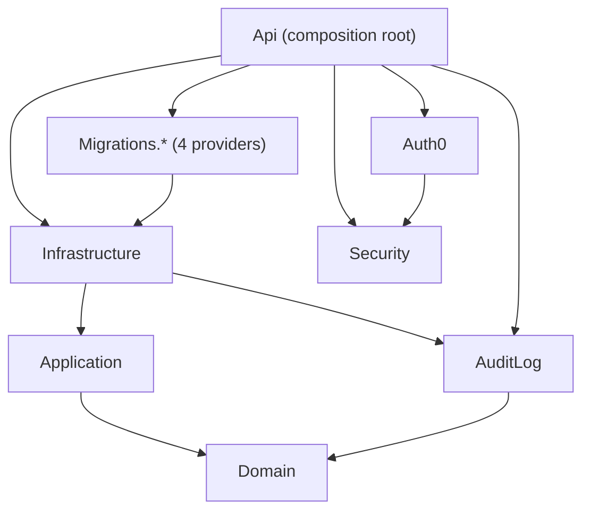

# 📁 Project Structure

A high-level map of the repo — expand a project to see its top-level folders. For the exact, current layout, use your editor's file explorer or GitHub's file browser; this doc only tracks stable, top-level organization so it doesn't drift as components are added.

- **`.github/workflows/`** — CI/CD pipelines (PR checks, releases, cleanup)
- **`.husky/`** — Git hooks (commit-msg, pre-commit)
- **`badges/`** — Auto-generated release badge images
- **`docs/`** — Architecture, security, privacy, configuration docs
- **`scripts/`** — Repo automation (badges, README version sync)

<strong><code>RefTestManagement.Api/</code></strong> — 🔷 .NET Web API (.NET 10) — entry point, GraphQL, background services

- `BackgroundServices/` — Hosted services: job worker, expiration, privacy retention, audit cleanup, permission sync; timer-driven ones derive from `PollingBackgroundService`. The job worker dispatches handlers through `IJobHandler`; queue queries, claims, persistence and retention deletion are implemented in Infrastructure behind an Application port. Export-request cleanup scheduling is hosted here; its database operations are in Infrastructure.
- `Controllers/` — Auth0 login/callback endpoints
- `Graphql/` — Mutations, Queries, Subscriptions, Types, ReadModels
- `Services/` — Host-side services, including the Redis-backed privacy rate limiter and participant session lease

- **`RefTestManagement.AuditLog/`** — 📋 Domain-event–driven audit log library (Marten-style event store)
- **`RefTestManagement.Auth0/`** — 🔐 Auth0 Management API client (M2M token, role-based user discovery)
- **`RefTestManagement.Application/`** — 🔷 Ports (`Abstractions/`: email, PDF, report, translation, session, subscription, privacy-erasure, IHF question-bank, job-queue and export-request cleanup services), job payloads, configuration models and use cases
- **`RefTestManagement.Domain/`** — 🔷 Domain entities: RefTest, RefTestTitle, Job, and their domain events
- **`RefTestManagement.Security/`** — 🔐 Permission constants, authorization handlers, dynamic policy provider
- **`RefTestManagement.Infrastructure/`** — 🔷 EF Core DbContext, job-queue persistence/claims/retention, export-request cleanup, PDF/Excel/email service implementations and subscriptions; `AddInfrastructureServices()` registers the adapters
- **`RefTestManagement.Migrations.SqlServer/`, `.PostgreSQL/`, `.SQLite/`, `.MySQL/`** — 🗄️ Provider-specific EF Core migrations
- **`RefTestManagement.UnitTests/`** — 🧪 xUnit tests, including the architecture dependency tests

<strong><code>RefTestManagement.Ui/</code></strong> — 🅰️ Angular frontend

- `src/app/`
  - `auth/` — Guards, permission directive, PermissionsService
  - `home/` — Landing page
  - `audit-logs/` — Audit log viewer
  - `ref-tests/` — RefTest creation, detail view, and list management
  - `ref-test/` — RefTest-taking experience (welcome, take, results)
  - `privacy/` — GDPR privacy notice and consent UI
  - `shared/` — Shared components, pipes, utilities
- `graphql/` — GraphQL operations (queries/mutations/subscriptions) by feature
- `public/` — Static assets, i18n translation files, PWA manifest

- **`package.json`** — Root dependencies (semantic-release, husky)
- **`README.md`**

## Project dependencies

Arrows are `ProjectReference`s. The rule and its known violations are recorded in [ADR 0001](adr/0001-layered-architecture.md) and enforced by `RefTestManagement.UnitTests/ArchitectureDependencyTests.cs`. Shared state across replicas is described in [ADR 0002](adr/0002-multi-replica-state.md).

## Key Directories

| Directory                                                        | Purpose                                                                       |
| ---------------------------------------------------------------- | ----------------------------------------------------------------------------- |
| `RefTestManagement.AuditLog`                                     | Audit log library — interceptor, entity, options, DI extension. Depends on `Domain` for the event abstractions, never the reverse |
| `RefTestManagement.Api/Graphql`                                  | GraphQL schema, queries, mutations, and type definitions                      |
| `RefTestManagement.Api/Graphql/Mutations/Approval`               | Approve/reject mutations (requires `ref-tests:approve`)                       |
| `RefTestManagement.Auth0`                                        | Auth0 Management API client — resolves approvers by permission at runtime     |
| `RefTestManagement.Application/Abstractions`                     | Ports implemented by Infrastructure, including `IRefTestUnitOfWork`, `IJobQueueStore` and `IPersonalDataExportRequestCleanup` |
| `RefTestManagement.Application/RefTests`                         | Use-case handlers called by GraphQL resolvers and job handlers, including creation, report requests, privacy-notice acceptance, completion, approval, rejection, reset, revive, updates, on-request emails and deletion |
| `RefTestManagement.Infrastructure/IhfRules`                      | IHF Rules question-bank GraphQL client (StrawberryShake schema, queries) and its service |
| `RefTestManagement.Security`                                     | Permission constants, authorization handlers and policy provider              |
| `RefTestManagement.Infrastructure/Services`                      | PDF/Excel generation, email delivery (Brevo), approval notifications          |
| `RefTestManagement.Infrastructure/Services/Reports`              | Excel and PDF renderers for the RefTest report; `RefTestReportService` only orchestrates and emails them |
| `RefTestManagement.Infrastructure/Privacy`                       | Consent-withdrawal and data-export challenges, participant token adapters, and EF-backed export-request cleanup. Withdrawal stays behind its Application port: every step is a serializable transaction under EF's retry strategy |
| `RefTestManagement.Infrastructure/Jobs`                          | EF-backed job queue store and background job handlers keyed by job type; `AddJobHandlers()` registers the handlers |
| `RefTestManagement.UnitTests`                                    | Unit tests for audit/log redaction, job state machine, RefTest anonymization  |
| `RefTestManagement.Ui/src/app/ref-tests`                         | RefTest creation, detail view, and management UI                              |
| `RefTestManagement.Ui/src/app/ref-tests/list`                    | List view with mobile/desktop layouts, filters and operations                 |
| `RefTestManagement.Ui/src/app/ref-tests/list/services`           | Business logic services for data, filters, state and operations               |
| `RefTestManagement.Ui/src/app/ref-tests/list/components/dialogs` | All bulk-action dialogs incl. approve & reject                                |
| `RefTestManagement.Ui/src/app/audit-logs`                        | Audit log list page with filters, expandable change diffs and entity linking  |
| `RefTestManagement.Ui/src/app/auth`                              | Auth guard, permission guard, `HasPermission` directive, `PermissionsService` |
| `RefTestManagement.Ui/src/app/ref-test`                          | RefTest-taking experience (welcome, take, results)                            |
| `RefTestManagement.Ui/src/app/privacy`                           | Privacy notice display and consent-withdrawal UI                              |
| `RefTestManagement.Ui/graphql/ref-tests/mutations`               | All management mutations incl. `approve-ref-tests` and `reject-ref-tests`     |
| `.github/workflows`                                              | CI/CD pipelines for automated testing and deployment                          |
