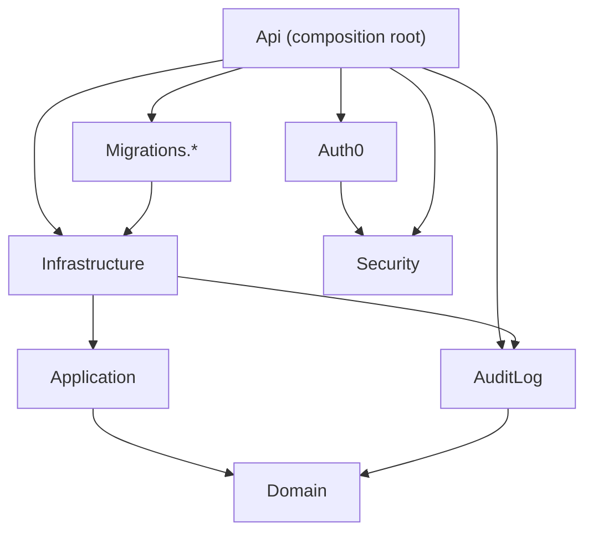

# ADR 0001: Layered backend architecture

- **Status:** Accepted
- **Date:** 2026-10-08, updated 2026-10-09 after the R1 architecture remediation (WP1–WP12)
- **Enforced by:** `RefTestManagement.UnitTests/ArchitectureDependencyTests.cs`, `DomainDependencyTests.cs`,
  `InfrastructureRegistrationTests.cs` and `TranslationParityTests.cs`

## Context

The backend is split into several projects. When this ADR was first written, the code did not respect the layers
their names suggest: use cases lived in GraphQL mutations and `Api/Services`, the ports Api used were declared in
Infrastructure next to their implementations, Application held the IHF client but no use cases, and only the Domain
layer had dependency tests. The R1 remediation moved the code to match the rule below; this revision records the
result, what is still out of line, and the trade-offs accepted on the way.

## Decision

Dependencies point inward: Domain ← Application ← Infrastructure / Api, with Api as the composition root and
GraphQL transport only.

| Project          | May reference (projects)            | Responsibility                                                                                                                       |
| ---------------- | ----------------------------------- | ------------------------------------------------------------------------------------------------------------------------------------ |
| `Domain`         | none; no NuGet packages             | Entities, invariants, domain events                                                                                                  |
| `Application`    | `Domain`                            | Use-case handlers (`Application/RefTests`), ports (`Application/Abstractions`), configuration models, job payloads; no EF Core, ASP.NET Core, HotChocolate, HTTP clients, Redis or document libraries |
| `AuditLog`       | `Domain`                            | Domain-event audit trail (EF Core interceptor)                                                                                       |
| `Infrastructure` | `Domain`, `Application`, `AuditLog` | Adapters: EF Core and the unit of work, job handlers, email, PDF/Excel renderers, subscriptions, IHF client, privacy services        |
| `Migrations.*`   | `Infrastructure`                    | Provider-specific EF Core migrations                                                                                                 |
| `Security`       | none                                | Permission constants, authorization handlers and policy provider                                                                     |
| `Auth0`          | `Security`                          | Auth0 Management API client                                                                                                          |
| `Api`            | anything                            | Composition root: hosting, DI wiring, validated configuration, GraphQL transport, controllers, hosted services                      |

Rules:

1. Application declares the ports it needs in `Application/Abstractions`. Infrastructure implements them and
   registers them in `AddInfrastructureServices()` / `AddJobHandlers()`. Api wires them together.
2. GraphQL mutations and queries are transport adapters: authorize, map input, call an Application use case through
   `IRefTestUnitOfWork`, map the result. Queries may read through EF Core directly.
3. A new project must be added to `ArchitectureDependencyTests` with the references its layer may use. The test
   fails until that happens.
4. Infrastructure may not declare new public interfaces; a port belongs in Application. The test's allow-list may
   only shrink.

## Resolved violations

| Former violation                                                                 | Fixed in        | Now enforced by                                                  |
| -------------------------------------------------------------------------------- | --------------- | ---------------------------------------------------------------- |
| Application referenced `StrawberryShake.Server` and `Microsoft.Extensions.Http`   | WP4a            | `ApplicationDoesNotReferenceInfrastructurePackages`              |
| Ports were declared in Infrastructure                                             | WP3b, WP7a      | `InfrastructureDeclaresNoNewPublicInterfaces`                    |
| Every port needs a registration                                                   | WP3c            | `EveryApplicationPortHasAnInfrastructureRegistration`            |
| Use cases lived in GraphQL mutations and `Api/Services`                           | WP5b–WP8a       | Handler tests against fakes of `IRefTestUnitOfWork`              |
| Job handlers lived in Api                                                         | WP8b            | Interface allow-list (`IJobHandler` is the only addition)        |

## Known violations

| Violation                                                                                                   | Why it stays                                                                                     |
| ----------------------------------------------------------------------------------------------------------- | ------------------------------------------------------------------------------------------------ |
| Participant start, save-progress and expire flows still run inline in `RefTestLifecycleMutations`           | Small, single-entity updates; move them when they gain logic                                     |
| `ApprovalNotificationEmailJobHandler` stays in `Api/BackgroundServices/JobHandlers`                         | It needs Auth0 and `Permissions`, which Infrastructure may not reference                         |
| `IJobPersistenceContext`, `IJobEnqueueService` and `IJobHandler` are public interfaces in Infrastructure     | They expose EF Core `DbSet`s or are worker-internal; listed in the allow-list                    |

## Accepted trade-offs

- **Domain events carry their audit projection** (`ActionName`, `GetChanges()`). Moving it into AuditLog would need
  a switch over every event type; the event already knows what changed.
- **Translations stay in C#** (`TranslationService`). Moving 1,200 lines to resource files changes no behaviour;
  the real risk, a missing locale, is caught by `TranslationParityTests`.
- **One test project.** Unit and integration tests (SQLite, Redis containers) share `RefTestManagement.UnitTests`;
  the full suite runs in about two minutes, so a split does not pay for the churn.
- **Jobs queued before `Job.RefTestId` existed** are still matched on their payload when a RefTest's jobs are
  cancelled. Remove the fallback once no pending job has a null `RefTestId`.

## Consequences

- The declared project graph, Application's packages and Infrastructure's public interfaces are checked on every
  test run, so a wrong-direction reference fails CI immediately.
- The README and `docs/PROJECT-STRUCTURE.md` describe the actual graph. Update them together with this ADR when the
  graph changes.
- Multi-replica concerns (shared state, event delivery, email retries) are recorded in
  [ADR 0002](0002-multi-replica-state.md).
