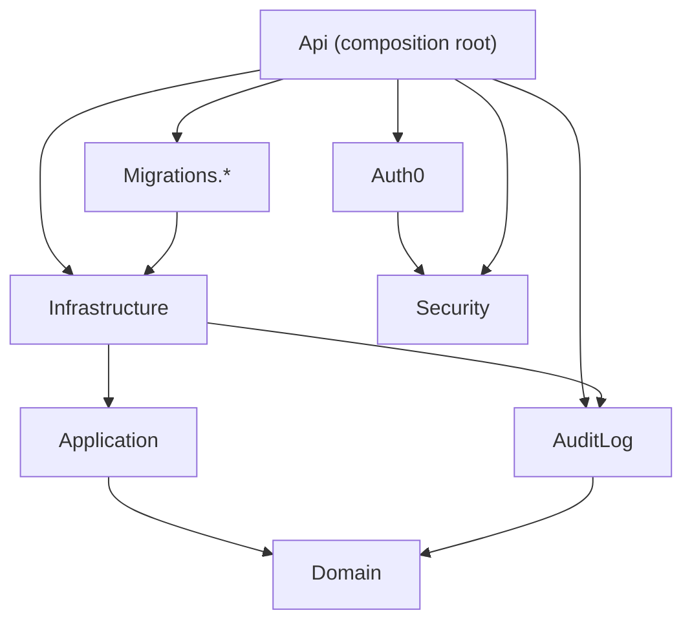

# ADR 0001: Layered backend architecture

- **Status:** Accepted
- **Date:** 2026-10-08
- **Enforced by:** `RefTestManagement.UnitTests/ArchitectureDependencyTests.cs` and `DomainDependencyTests.cs`

## Context

The backend is split into several projects, but the code does not always respect the layers their names suggest:

- `RefTestManagement.Application` holds configuration models, job payloads and the StrawberryShake IHF client. It contains no use cases.
- The use-case logic (creating, starting, completing, approving, resetting and emailing RefTests) lives in the GraphQL mutation classes and in `RefTestManagement.Api/Services`. It is coupled to HotChocolate, `IHttpContextAccessor` and the EF Core context.
- The interfaces that Api depends on (`IJobEnqueueService`, `IEmailService`, `IRefTestSubscriptionService`, and others) are declared in Infrastructure, next to their implementations.
- Before this ADR, only the Domain layer had dependency tests, so nothing stopped wrong-direction references from creeping into other layers.

## Decision

Dependencies point inward: Domain ← Application ← Infrastructure / Api, with Api as the composition root only.

| Project          | May reference (projects)            | Responsibility                                                                                                             |
| ---------------- | ----------------------------------- | -------------------------------------------------------------------------------------------------------------------------- |
| `Domain`         | none; no NuGet packages             | Entities, invariants, domain events                                                                                        |
| `Application`    | `Domain`                            | Use cases and the ports (interfaces) they need; no EF Core, ASP.NET Core, HotChocolate, HTTP clients or document libraries |
| `AuditLog`       | `Domain`                            | Domain-event audit trail (EF Core interceptor)                                                                             |
| `Infrastructure` | `Domain`, `Application`, `AuditLog` | Adapters: EF Core, email, PDF/Excel, subscriptions, external clients                                                       |
| `Migrations.*`   | `Infrastructure`                    | Provider-specific EF Core migrations                                                                                       |
| `Security`       | none                                | Permission constants, authorization handlers and policy provider                                                           |
| `Auth0`          | `Security`                          | Auth0 Management API client                                                                                                |
| `Api`            | anything                            | Composition root: hosting, DI wiring, GraphQL transport, controllers                                                       |

Rules:

1. Application declares the ports it needs. Infrastructure implements them. Api wires them together.
2. GraphQL mutations and queries are transport adapters: authorize, map input, call an Application use case, map the result.
3. A new project must be added to `ArchitectureDependencyTests` with the references its layer may use. The test fails until that happens.

## Known violations

These are tolerated for now and tracked as remediation work. The architecture tests record the package-level ones in an allow-list that may only shrink: a test fails when an entry is no longer needed.

| Violation                                                                                                      | Enforced                | Planned fix                                                       |
| -------------------------------------------------------------------------------------------------------------- | ----------------------- | ----------------------------------------------------------------- |
| Application references `StrawberryShake.Server` and `Microsoft.Extensions.Http` for the IHF client             | Allow-list in the tests | WP2: move the client to Infrastructure behind an Application port |
| Ports (`IJobEnqueueService`, `IEmailService`, `IRefTestSubscriptionService`, …) are declared in Infrastructure | Not yet (type-level)    | WP2: move the interfaces to Application                           |
| Use cases live in GraphQL mutations and `Api/Services`                                                         | Not yet (type-level)    | WP3: Application command handlers with a current-user abstraction |
| Subscription events are published by hand from mutations, separately from domain events                        | Not yet                 | WP4: one event pipeline                                           |
| Job handlers and background services live in Api                                                               | Not yet                 | WP5: separate the worker from the web host                        |

## Consequences

- The declared project graph is checked on every test run, so a wrong-direction `ProjectReference` fails CI immediately.
- Type-level rules (where interfaces live, what mutations may call) are not enforced yet. Extend the tests to cover them when WP2 and WP3 land.
- The README and `docs/PROJECT-STRUCTURE.md` describe the actual graph. Update them together with this ADR when the graph changes.
